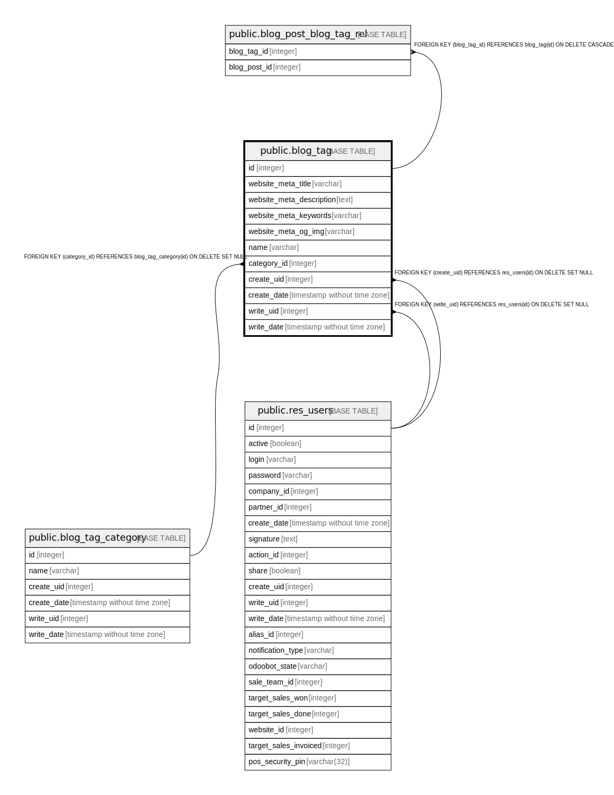

# public.blog_tag

## Description

Blog Tag

## Columns

| Name | Type | Default | Nullable | Children | Parents | Comment |
| ---- | ---- | ------- | -------- | -------- | ------- | ------- |
| id | integer | nextval('blog_tag_id_seq'::regclass) | false | [public.blog_post_blog_tag_rel](public.blog_post_blog_tag_rel.md) |  |  |
| website_meta_title | varchar |  | true |  |  | Website meta title |
| website_meta_description | text |  | true |  |  | Website meta description |
| website_meta_keywords | varchar |  | true |  |  | Website meta keywords |
| website_meta_og_img | varchar |  | true |  |  | Website opengraph image |
| name | varchar |  | false |  |  | Name |
| category_id | integer |  | true |  | [public.blog_tag_category](public.blog_tag_category.md) | Category |
| create_uid | integer |  | true |  | [public.res_users](public.res_users.md) | Created by |
| create_date | timestamp without time zone |  | true |  |  | Created on |
| write_uid | integer |  | true |  | [public.res_users](public.res_users.md) | Last Updated by |
| write_date | timestamp without time zone |  | true |  |  | Last Updated on |

## Constraints

| Name | Type | Definition | Comment |
| ---- | ---- | ---------- | ------- |
| blog_tag_create_uid_fkey | FOREIGN KEY | FOREIGN KEY (create_uid) REFERENCES res_users(id) ON DELETE SET NULL |  |
| blog_tag_write_uid_fkey | FOREIGN KEY | FOREIGN KEY (write_uid) REFERENCES res_users(id) ON DELETE SET NULL |  |
| blog_tag_category_id_fkey | FOREIGN KEY | FOREIGN KEY (category_id) REFERENCES blog_tag_category(id) ON DELETE SET NULL |  |
| blog_tag_pkey | PRIMARY KEY | PRIMARY KEY (id) |  |
| blog_tag_name_uniq | UNIQUE | UNIQUE (name) | unique (name) |

## Indexes

| Name | Definition |
| ---- | ---------- |
| blog_tag_pkey | CREATE UNIQUE INDEX blog_tag_pkey ON public.blog_tag USING btree (id) |
| blog_tag_category_id_index | CREATE INDEX blog_tag_category_id_index ON public.blog_tag USING btree (category_id) |
| blog_tag_name_uniq | CREATE UNIQUE INDEX blog_tag_name_uniq ON public.blog_tag USING btree (name) |

## Relations

---

> Generated by [tbls](https://github.com/k1LoW/tbls)
