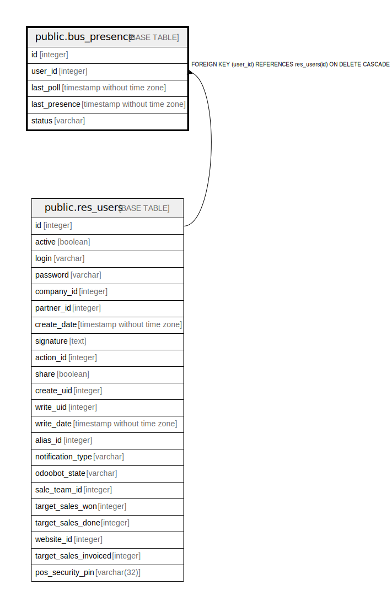

# public.bus_presence

## Description

User Presence

## Columns

| Name | Type | Default | Nullable | Children | Parents | Comment |
| ---- | ---- | ------- | -------- | -------- | ------- | ------- |
| id | integer | nextval('bus_presence_id_seq'::regclass) | false |  |  |  |
| user_id | integer |  | false |  | [public.res_users](public.res_users.md) | Users |
| last_poll | timestamp without time zone |  | true |  |  | Last Poll |
| last_presence | timestamp without time zone |  | true |  |  | Last Presence |
| status | varchar |  | true |  |  | IM Status |

## Constraints

| Name | Type | Definition | Comment |
| ---- | ---- | ---------- | ------- |
| bus_presence_user_id_fkey | FOREIGN KEY | FOREIGN KEY (user_id) REFERENCES res_users(id) ON DELETE CASCADE |  |
| bus_presence_pkey | PRIMARY KEY | PRIMARY KEY (id) |  |
| bus_presence_bus_user_presence_unique | UNIQUE | UNIQUE (user_id) | unique(user_id) |

## Indexes

| Name | Definition |
| ---- | ---------- |
| bus_presence_pkey | CREATE UNIQUE INDEX bus_presence_pkey ON public.bus_presence USING btree (id) |
| bus_presence_user_id_index | CREATE INDEX bus_presence_user_id_index ON public.bus_presence USING btree (user_id) |
| bus_presence_bus_user_presence_unique | CREATE UNIQUE INDEX bus_presence_bus_user_presence_unique ON public.bus_presence USING btree (user_id) |

## Relations

---

> Generated by [tbls](https://github.com/k1LoW/tbls)
