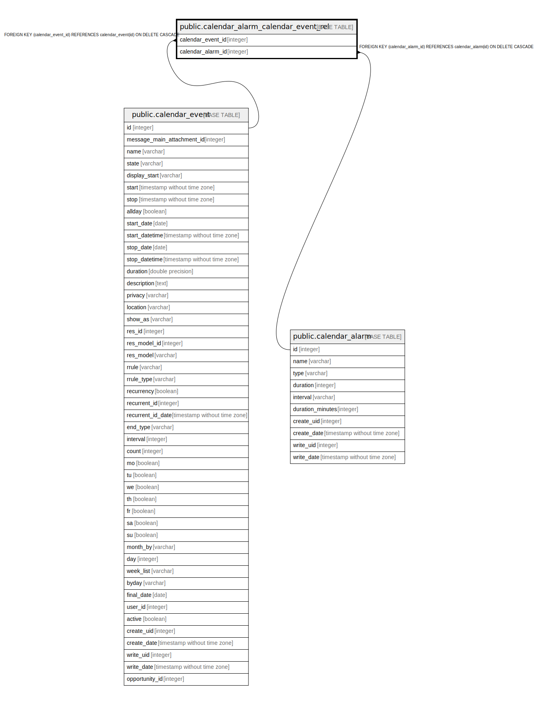

# public.calendar_alarm_calendar_event_rel

## Description

RELATION BETWEEN calendar_event AND calendar_alarm

## Columns

| Name | Type | Default | Nullable | Children | Parents | Comment |
| ---- | ---- | ------- | -------- | -------- | ------- | ------- |
| calendar_event_id | integer |  | false |  | [public.calendar_event](public.calendar_event.md) |  |
| calendar_alarm_id | integer |  | false |  | [public.calendar_alarm](public.calendar_alarm.md) |  |

## Constraints

| Name | Type | Definition |
| ---- | ---- | ---------- |
| calendar_alarm_calendar_event_rel_calendar_alarm_id_fkey | FOREIGN KEY | FOREIGN KEY (calendar_alarm_id) REFERENCES calendar_alarm(id) ON DELETE CASCADE |
| calendar_alarm_calendar_event_rel_calendar_event_id_fkey | FOREIGN KEY | FOREIGN KEY (calendar_event_id) REFERENCES calendar_event(id) ON DELETE CASCADE |
| calendar_alarm_calendar_event_calendar_event_id_calendar_al_key | UNIQUE | UNIQUE (calendar_event_id, calendar_alarm_id) |

## Indexes

| Name | Definition |
| ---- | ---------- |
| calendar_alarm_calendar_event_calendar_event_id_calendar_al_key | CREATE UNIQUE INDEX calendar_alarm_calendar_event_calendar_event_id_calendar_al_key ON public.calendar_alarm_calendar_event_rel USING btree (calendar_event_id, calendar_alarm_id) |
| calendar_alarm_calendar_event_rel_calendar_event_id_idx | CREATE INDEX calendar_alarm_calendar_event_rel_calendar_event_id_idx ON public.calendar_alarm_calendar_event_rel USING btree (calendar_event_id) |
| calendar_alarm_calendar_event_rel_calendar_alarm_id_idx | CREATE INDEX calendar_alarm_calendar_event_rel_calendar_alarm_id_idx ON public.calendar_alarm_calendar_event_rel USING btree (calendar_alarm_id) |

## Relations

---

> Generated by [tbls](https://github.com/k1LoW/tbls)
