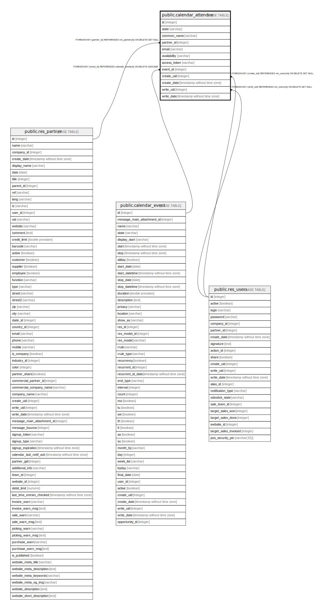

# public.calendar_attendee

## Description

Calendar Attendee Information

## Columns

| Name | Type | Default | Nullable | Children | Parents | Comment |
| ---- | ---- | ------- | -------- | -------- | ------- | ------- |
| id | integer | nextval('calendar_attendee_id_seq'::regclass) | false |  |  |  |
| state | varchar |  | true |  |  | Status |
| common_name | varchar |  | true |  |  | Common name |
| partner_id | integer |  | true |  | [public.res_partner](public.res_partner.md) | Contact |
| email | varchar |  | true |  |  | Email |
| availability | varchar |  | true |  |  | Free/Busy |
| access_token | varchar |  | true |  |  | Invitation Token |
| event_id | integer |  | true |  | [public.calendar_event](public.calendar_event.md) | Meeting linked |
| create_uid | integer |  | true |  | [public.res_users](public.res_users.md) | Created by |
| create_date | timestamp without time zone |  | true |  |  | Created on |
| write_uid | integer |  | true |  | [public.res_users](public.res_users.md) | Last Updated by |
| write_date | timestamp without time zone |  | true |  |  | Last Updated on |

## Constraints

| Name | Type | Definition |
| ---- | ---- | ---------- |
| calendar_attendee_create_uid_fkey | FOREIGN KEY | FOREIGN KEY (create_uid) REFERENCES res_users(id) ON DELETE SET NULL |
| calendar_attendee_write_uid_fkey | FOREIGN KEY | FOREIGN KEY (write_uid) REFERENCES res_users(id) ON DELETE SET NULL |
| calendar_attendee_partner_id_fkey | FOREIGN KEY | FOREIGN KEY (partner_id) REFERENCES res_partner(id) ON DELETE SET NULL |
| calendar_attendee_pkey | PRIMARY KEY | PRIMARY KEY (id) |
| calendar_attendee_event_id_fkey | FOREIGN KEY | FOREIGN KEY (event_id) REFERENCES calendar_event(id) ON DELETE CASCADE |

## Indexes

| Name | Definition |
| ---- | ---------- |
| calendar_attendee_pkey | CREATE UNIQUE INDEX calendar_attendee_pkey ON public.calendar_attendee USING btree (id) |

## Relations

---

> Generated by [tbls](https://github.com/k1LoW/tbls)
