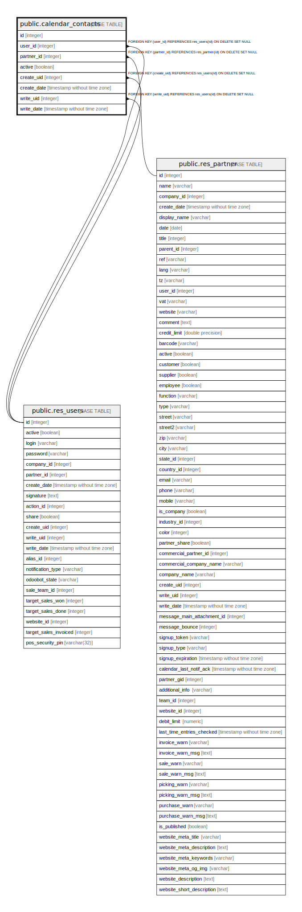

# public.calendar_contacts

## Description

Calendar Contacts

## Columns

| Name | Type | Default | Nullable | Children | Parents | Comment |
| ---- | ---- | ------- | -------- | -------- | ------- | ------- |
| id | integer | nextval('calendar_contacts_id_seq'::regclass) | false |  |  |  |
| user_id | integer |  | false |  | [public.res_users](public.res_users.md) | Me |
| partner_id | integer |  | false |  | [public.res_partner](public.res_partner.md) | Employee |
| active | boolean |  | true |  |  | Active |
| create_uid | integer |  | true |  | [public.res_users](public.res_users.md) | Created by |
| create_date | timestamp without time zone |  | true |  |  | Created on |
| write_uid | integer |  | true |  | [public.res_users](public.res_users.md) | Last Updated by |
| write_date | timestamp without time zone |  | true |  |  | Last Updated on |

## Constraints

| Name | Type | Definition | Comment |
| ---- | ---- | ---------- | ------- |
| calendar_contacts_create_uid_fkey | FOREIGN KEY | FOREIGN KEY (create_uid) REFERENCES res_users(id) ON DELETE SET NULL |  |
| calendar_contacts_user_id_fkey | FOREIGN KEY | FOREIGN KEY (user_id) REFERENCES res_users(id) ON DELETE SET NULL |  |
| calendar_contacts_write_uid_fkey | FOREIGN KEY | FOREIGN KEY (write_uid) REFERENCES res_users(id) ON DELETE SET NULL |  |
| calendar_contacts_partner_id_fkey | FOREIGN KEY | FOREIGN KEY (partner_id) REFERENCES res_partner(id) ON DELETE SET NULL |  |
| calendar_contacts_pkey | PRIMARY KEY | PRIMARY KEY (id) |  |
| calendar_contacts_user_id_partner_id_unique | UNIQUE | UNIQUE (user_id, partner_id) | UNIQUE(user_id,partner_id) |

## Indexes

| Name | Definition |
| ---- | ---------- |
| calendar_contacts_pkey | CREATE UNIQUE INDEX calendar_contacts_pkey ON public.calendar_contacts USING btree (id) |
| calendar_contacts_user_id_partner_id_unique | CREATE UNIQUE INDEX calendar_contacts_user_id_partner_id_unique ON public.calendar_contacts USING btree (user_id, partner_id) |

## Relations

---

> Generated by [tbls](https://github.com/k1LoW/tbls)
