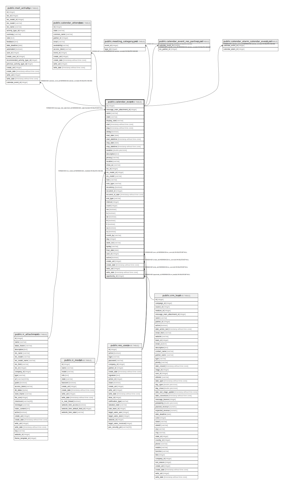

# public.calendar_event

## Description

Event

## Columns

| Name | Type | Default | Nullable | Children | Parents | Comment |
| ---- | ---- | ------- | -------- | -------- | ------- | ------- |
| id | integer | nextval('calendar_event_id_seq'::regclass) | false | [public.mail_activity](public.mail_activity.md) [public.calendar_attendee](public.calendar_attendee.md) [public.meeting_category_rel](public.meeting_category_rel.md) [public.calendar_event_res_partner_rel](public.calendar_event_res_partner_rel.md) [public.calendar_alarm_calendar_event_rel](public.calendar_alarm_calendar_event_rel.md) |  |  |
| message_main_attachment_id | integer |  | true |  | [public.ir_attachment](public.ir_attachment.md) | Main Attachment |
| name | varchar |  | false |  |  | Meeting Subject |
| state | varchar |  | true |  |  | Status |
| display_start | varchar |  | true |  |  | Date |
| start | timestamp without time zone |  | false |  |  | Start |
| stop | timestamp without time zone |  | false |  |  | Stop |
| allday | boolean |  | true |  |  | All Day |
| start_date | date |  | true |  |  | Start Date |
| start_datetime | timestamp without time zone |  | true |  |  | Start DateTime |
| stop_date | date |  | true |  |  | End Date |
| stop_datetime | timestamp without time zone |  | true |  |  | End Datetime |
| duration | double precision |  | true |  |  | Duration |
| description | text |  | true |  |  | Description |
| privacy | varchar |  | true |  |  | Privacy |
| location | varchar |  | true |  |  | Location |
| show_as | varchar |  | true |  |  | Show Time as |
| res_id | integer |  | true |  |  | Document ID |
| res_model_id | integer |  | true |  | [public.ir_model](public.ir_model.md) | Document Model |
| res_model | varchar |  | true |  |  | Document Model Name |
| rrule | varchar |  | true |  |  | Recurrent Rule |
| rrule_type | varchar |  | true |  |  | Recurrence |
| recurrency | boolean |  | true |  |  | Recurrent |
| recurrent_id | integer |  | true |  |  | Recurrent ID |
| recurrent_id_date | timestamp without time zone |  | true |  |  | Recurrent ID date |
| end_type | varchar |  | true |  |  | Recurrence Termination |
| interval | integer |  | true |  |  | Repeat Every |
| count | integer |  | true |  |  | Repeat |
| mo | boolean |  | true |  |  | Mon |
| tu | boolean |  | true |  |  | Tue |
| we | boolean |  | true |  |  | Wed |
| th | boolean |  | true |  |  | Thu |
| fr | boolean |  | true |  |  | Fri |
| sa | boolean |  | true |  |  | Sat |
| su | boolean |  | true |  |  | Sun |
| month_by | varchar |  | true |  |  | Option |
| day | integer |  | true |  |  | Date of month |
| week_list | varchar |  | true |  |  | Weekday |
| byday | varchar |  | true |  |  | By day |
| final_date | date |  | true |  |  | Repeat Until |
| user_id | integer |  | true |  | [public.res_users](public.res_users.md) | Owner |
| active | boolean |  | true |  |  | Active |
| create_uid | integer |  | true |  | [public.res_users](public.res_users.md) | Created by |
| create_date | timestamp without time zone |  | true |  |  | Created on |
| write_uid | integer |  | true |  | [public.res_users](public.res_users.md) | Last Updated by |
| write_date | timestamp without time zone |  | true |  |  | Last Updated on |
| opportunity_id | integer |  | true |  | [public.crm_lead](public.crm_lead.md) | Opportunity |

## Constraints

| Name | Type | Definition |
| ---- | ---- | ---------- |
| calendar_event_create_uid_fkey | FOREIGN KEY | FOREIGN KEY (create_uid) REFERENCES res_users(id) ON DELETE SET NULL |
| calendar_event_user_id_fkey | FOREIGN KEY | FOREIGN KEY (user_id) REFERENCES res_users(id) ON DELETE SET NULL |
| calendar_event_write_uid_fkey | FOREIGN KEY | FOREIGN KEY (write_uid) REFERENCES res_users(id) ON DELETE SET NULL |
| calendar_event_res_model_id_fkey | FOREIGN KEY | FOREIGN KEY (res_model_id) REFERENCES ir_model(id) ON DELETE CASCADE |
| calendar_event_message_main_attachment_id_fkey | FOREIGN KEY | FOREIGN KEY (message_main_attachment_id) REFERENCES ir_attachment(id) ON DELETE SET NULL |
| calendar_event_pkey | PRIMARY KEY | PRIMARY KEY (id) |
| calendar_event_opportunity_id_fkey | FOREIGN KEY | FOREIGN KEY (opportunity_id) REFERENCES crm_lead(id) ON DELETE SET NULL |

## Indexes

| Name | Definition |
| ---- | ---------- |
| calendar_event_pkey | CREATE UNIQUE INDEX calendar_event_pkey ON public.calendar_event USING btree (id) |
| calendar_event_message_main_attachment_id_index | CREATE INDEX calendar_event_message_main_attachment_id_index ON public.calendar_event USING btree (message_main_attachment_id) |

## Relations

---

> Generated by [tbls](https://github.com/k1LoW/tbls)
