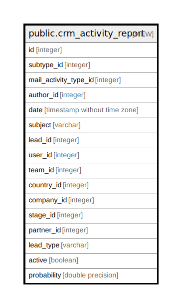

# public.crm_activity_report

## Description

<details>
<summary><strong>Table Definition</strong></summary>

```sql
CREATE VIEW crm_activity_report AS (
 SELECT m.id,
    m.subtype_id,
    m.mail_activity_type_id,
    m.author_id,
    m.date,
    m.subject,
    l.id AS lead_id,
    l.user_id,
    l.team_id,
    l.country_id,
    l.company_id,
    l.stage_id,
    l.partner_id,
    l.type AS lead_type,
    l.active,
    l.probability
   FROM (mail_message m
     JOIN crm_lead l ON ((m.res_id = l.id)))
  WHERE (((m.model)::text = 'crm.lead'::text) AND (m.mail_activity_type_id IS NOT NULL))
)
```

</details>

## Columns

| Name | Type | Default | Nullable | Children | Parents | Comment |
| ---- | ---- | ------- | -------- | -------- | ------- | ------- |
| id | integer |  | true |  |  |  |
| subtype_id | integer |  | true |  |  |  |
| mail_activity_type_id | integer |  | true |  |  |  |
| author_id | integer |  | true |  |  |  |
| date | timestamp without time zone |  | true |  |  |  |
| subject | varchar |  | true |  |  |  |
| lead_id | integer |  | true |  |  |  |
| user_id | integer |  | true |  |  |  |
| team_id | integer |  | true |  |  |  |
| country_id | integer |  | true |  |  |  |
| company_id | integer |  | true |  |  |  |
| stage_id | integer |  | true |  |  |  |
| partner_id | integer |  | true |  |  |  |
| lead_type | varchar |  | true |  |  |  |
| active | boolean |  | true |  |  |  |
| probability | double precision |  | true |  |  |  |

## Relations



---

> Generated by [tbls](https://github.com/k1LoW/tbls)
