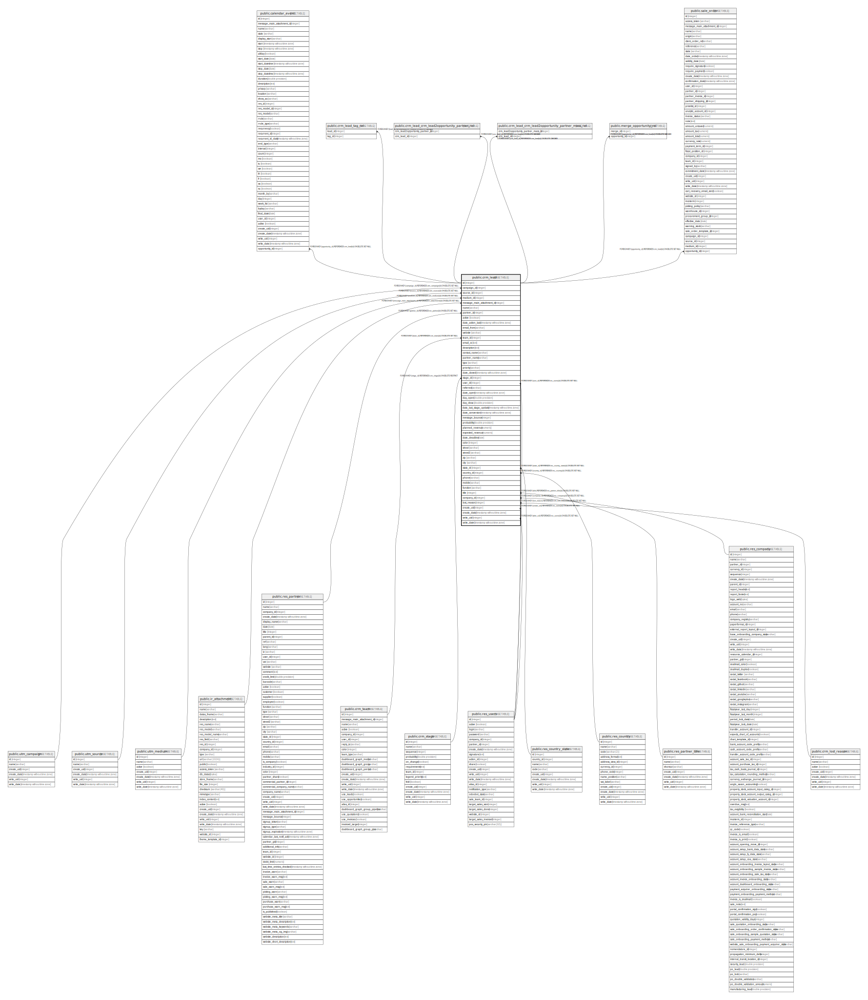

# public.crm_lead

## Description

Lead/Opportunity

## Columns

| Name | Type | Default | Nullable | Children | Parents | Comment |
| ---- | ---- | ------- | -------- | -------- | ------- | ------- |
| id | integer | nextval('crm_lead_id_seq'::regclass) | false | [public.calendar_event](public.calendar_event.md) [public.crm_lead_tag_rel](public.crm_lead_tag_rel.md) [public.crm_lead_crm_lead2opportunity_partner_rel](public.crm_lead_crm_lead2opportunity_partner_rel.md) [public.crm_lead_crm_lead2opportunity_partner_mass_rel](public.crm_lead_crm_lead2opportunity_partner_mass_rel.md) [public.merge_opportunity_rel](public.merge_opportunity_rel.md) [public.sale_order](public.sale_order.md) |  |  |
| campaign_id | integer |  | true |  | [public.utm_campaign](public.utm_campaign.md) | Campaign |
| source_id | integer |  | true |  | [public.utm_source](public.utm_source.md) | Source |
| medium_id | integer |  | true |  | [public.utm_medium](public.utm_medium.md) | Medium |
| message_main_attachment_id | integer |  | true |  | [public.ir_attachment](public.ir_attachment.md) | Main Attachment |
| name | varchar |  | false |  |  | Opportunity |
| partner_id | integer |  | true |  | [public.res_partner](public.res_partner.md) | Customer |
| active | boolean |  | true |  |  | Active |
| date_action_last | timestamp without time zone |  | true |  |  | Last Action |
| email_from | varchar |  | true |  |  | Email |
| website | varchar |  | true |  |  | Website |
| team_id | integer |  | true |  | [public.crm_team](public.crm_team.md) | Sales Team |
| email_cc | text |  | true |  |  | Global CC |
| description | text |  | true |  |  | Notes |
| contact_name | varchar |  | true |  |  | Contact Name |
| partner_name | varchar |  | true |  |  | Customer Name |
| type | varchar |  | false |  |  | Type |
| priority | varchar |  | true |  |  | Priority |
| date_closed | timestamp without time zone |  | true |  |  | Closed Date |
| stage_id | integer |  | true |  | [public.crm_stage](public.crm_stage.md) | Stage |
| user_id | integer |  | true |  | [public.res_users](public.res_users.md) | Salesperson |
| referred | varchar |  | true |  |  | Referred By |
| date_open | timestamp without time zone |  | true |  |  | Assignation Date |
| day_open | double precision |  | true |  |  | Days to Assign |
| day_close | double precision |  | true |  |  | Days to Close |
| date_last_stage_update | timestamp without time zone |  | true |  |  | Last Stage Update |
| date_conversion | timestamp without time zone |  | true |  |  | Conversion Date |
| message_bounce | integer |  | true |  |  | Bounce |
| probability | double precision |  | true |  |  | Probability |
| planned_revenue | numeric |  | true |  |  | Expected Revenue |
| expected_revenue | numeric |  | true |  |  | Prorated Revenue |
| date_deadline | date |  | true |  |  | Expected Closing |
| color | integer |  | true |  |  | Color Index |
| street | varchar |  | true |  |  | Street |
| street2 | varchar |  | true |  |  | Street2 |
| zip | varchar |  | true |  |  | Zip |
| city | varchar |  | true |  |  | City |
| state_id | integer |  | true |  | [public.res_country_state](public.res_country_state.md) | State |
| country_id | integer |  | true |  | [public.res_country](public.res_country.md) | Country |
| phone | varchar |  | true |  |  | Phone |
| mobile | varchar |  | true |  |  | Mobile |
| function | varchar |  | true |  |  | Job Position |
| title | integer |  | true |  | [public.res_partner_title](public.res_partner_title.md) | Title |
| company_id | integer |  | true |  | [public.res_company](public.res_company.md) | Company |
| lost_reason | integer |  | true |  | [public.crm_lost_reason](public.crm_lost_reason.md) | Lost Reason |
| create_uid | integer |  | true |  | [public.res_users](public.res_users.md) | Created by |
| create_date | timestamp without time zone |  | true |  |  | Created on |
| write_uid | integer |  | true |  | [public.res_users](public.res_users.md) | Last Updated by |
| write_date | timestamp without time zone |  | true |  |  | Last Updated on |

## Constraints

| Name | Type | Definition | Comment |
| ---- | ---- | ---------- | ------- |
| crm_lead_check_probability | CHECK | CHECK (((probability >= (0)::double precision) AND (probability <= (100)::double precision))) | check(probability >= 0 and probability <= 100) |
| crm_lead_create_uid_fkey | FOREIGN KEY | FOREIGN KEY (create_uid) REFERENCES res_users(id) ON DELETE SET NULL |  |
| crm_lead_user_id_fkey | FOREIGN KEY | FOREIGN KEY (user_id) REFERENCES res_users(id) ON DELETE SET NULL |  |
| crm_lead_write_uid_fkey | FOREIGN KEY | FOREIGN KEY (write_uid) REFERENCES res_users(id) ON DELETE SET NULL |  |
| crm_lead_company_id_fkey | FOREIGN KEY | FOREIGN KEY (company_id) REFERENCES res_company(id) ON DELETE SET NULL |  |
| crm_lead_partner_id_fkey | FOREIGN KEY | FOREIGN KEY (partner_id) REFERENCES res_partner(id) ON DELETE SET NULL |  |
| crm_lead_message_main_attachment_id_fkey | FOREIGN KEY | FOREIGN KEY (message_main_attachment_id) REFERENCES ir_attachment(id) ON DELETE SET NULL |  |
| crm_lead_country_id_fkey | FOREIGN KEY | FOREIGN KEY (country_id) REFERENCES res_country(id) ON DELETE SET NULL |  |
| crm_lead_state_id_fkey | FOREIGN KEY | FOREIGN KEY (state_id) REFERENCES res_country_state(id) ON DELETE SET NULL |  |
| crm_lead_title_fkey | FOREIGN KEY | FOREIGN KEY (title) REFERENCES res_partner_title(id) ON DELETE SET NULL |  |
| crm_lead_medium_id_fkey | FOREIGN KEY | FOREIGN KEY (medium_id) REFERENCES utm_medium(id) ON DELETE SET NULL |  |
| crm_lead_campaign_id_fkey | FOREIGN KEY | FOREIGN KEY (campaign_id) REFERENCES utm_campaign(id) ON DELETE SET NULL |  |
| crm_lead_source_id_fkey | FOREIGN KEY | FOREIGN KEY (source_id) REFERENCES utm_source(id) ON DELETE SET NULL |  |
| crm_lead_team_id_fkey | FOREIGN KEY | FOREIGN KEY (team_id) REFERENCES crm_team(id) ON DELETE SET NULL |  |
| crm_lead_stage_id_fkey | FOREIGN KEY | FOREIGN KEY (stage_id) REFERENCES crm_stage(id) ON DELETE RESTRICT |  |
| crm_lead_pkey | PRIMARY KEY | PRIMARY KEY (id) |  |
| crm_lead_lost_reason_fkey | FOREIGN KEY | FOREIGN KEY (lost_reason) REFERENCES crm_lost_reason(id) ON DELETE SET NULL |  |

## Indexes

| Name | Definition |
| ---- | ---------- |
| crm_lead_pkey | CREATE UNIQUE INDEX crm_lead_pkey ON public.crm_lead USING btree (id) |
| crm_lead_message_main_attachment_id_index | CREATE INDEX crm_lead_message_main_attachment_id_index ON public.crm_lead USING btree (message_main_attachment_id) |
| crm_lead_name_index | CREATE INDEX crm_lead_name_index ON public.crm_lead USING btree (name) |
| crm_lead_partner_id_index | CREATE INDEX crm_lead_partner_id_index ON public.crm_lead USING btree (partner_id) |
| crm_lead_email_from_index | CREATE INDEX crm_lead_email_from_index ON public.crm_lead USING btree (email_from) |
| crm_lead_website_index | CREATE INDEX crm_lead_website_index ON public.crm_lead USING btree (website) |
| crm_lead_team_id_index | CREATE INDEX crm_lead_team_id_index ON public.crm_lead USING btree (team_id) |
| crm_lead_partner_name_index | CREATE INDEX crm_lead_partner_name_index ON public.crm_lead USING btree (partner_name) |
| crm_lead_type_index | CREATE INDEX crm_lead_type_index ON public.crm_lead USING btree (type) |
| crm_lead_priority_index | CREATE INDEX crm_lead_priority_index ON public.crm_lead USING btree (priority) |
| crm_lead_stage_id_index | CREATE INDEX crm_lead_stage_id_index ON public.crm_lead USING btree (stage_id) |
| crm_lead_date_last_stage_update_index | CREATE INDEX crm_lead_date_last_stage_update_index ON public.crm_lead USING btree (date_last_stage_update) |
| crm_lead_company_id_index | CREATE INDEX crm_lead_company_id_index ON public.crm_lead USING btree (company_id) |
| crm_lead_lost_reason_index | CREATE INDEX crm_lead_lost_reason_index ON public.crm_lead USING btree (lost_reason) |
| crm_lead_user_id_team_id_type_index | CREATE INDEX crm_lead_user_id_team_id_type_index ON public.crm_lead USING btree (user_id, team_id, type) |

## Relations

---

> Generated by [tbls](https://github.com/k1LoW/tbls)
