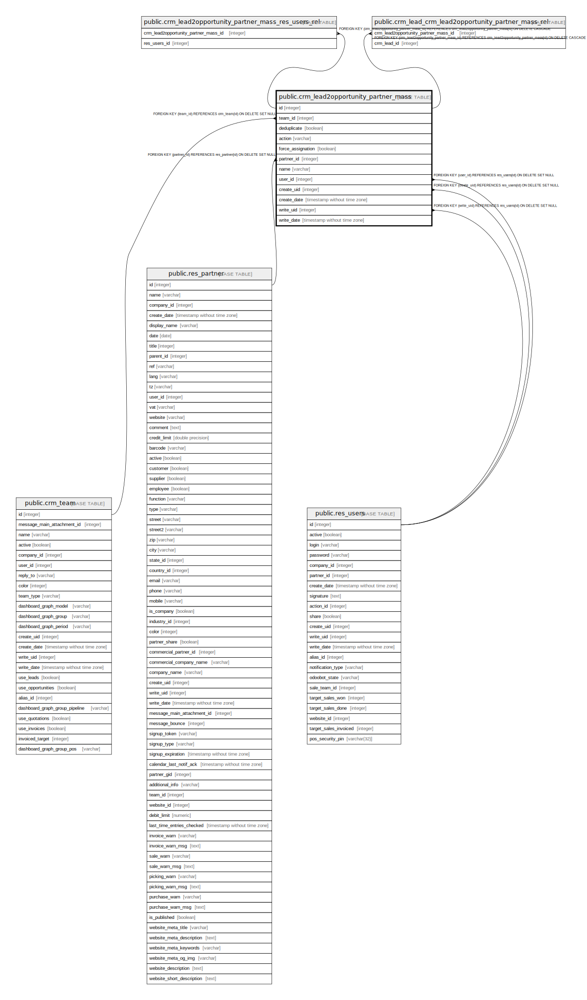

# public.crm_lead2opportunity_partner_mass

## Description

Convert Lead to Opportunity (in mass)

## Columns

| Name | Type | Default | Nullable | Children | Parents | Comment |
| ---- | ---- | ------- | -------- | -------- | ------- | ------- |
| id | integer | nextval('crm_lead2opportunity_partner_mass_id_seq'::regclass) | false | [public.crm_lead2opportunity_partner_mass_res_users_rel](public.crm_lead2opportunity_partner_mass_res_users_rel.md) [public.crm_lead_crm_lead2opportunity_partner_mass_rel](public.crm_lead_crm_lead2opportunity_partner_mass_rel.md) |  |  |
| team_id | integer |  | true |  | [public.crm_team](public.crm_team.md) | Sales Team |
| deduplicate | boolean |  | true |  |  | Apply deduplication |
| action | varchar |  | false |  |  | Related Customer |
| force_assignation | boolean |  | true |  |  | Force assignation |
| partner_id | integer |  | true |  | [public.res_partner](public.res_partner.md) | Customer |
| name | varchar |  | false |  |  | Conversion Action |
| user_id | integer |  | true |  | [public.res_users](public.res_users.md) | Salesperson |
| create_uid | integer |  | true |  | [public.res_users](public.res_users.md) | Created by |
| create_date | timestamp without time zone |  | true |  |  | Created on |
| write_uid | integer |  | true |  | [public.res_users](public.res_users.md) | Last Updated by |
| write_date | timestamp without time zone |  | true |  |  | Last Updated on |

## Constraints

| Name | Type | Definition |
| ---- | ---- | ---------- |
| crm_lead2opportunity_partner_mass_create_uid_fkey | FOREIGN KEY | FOREIGN KEY (create_uid) REFERENCES res_users(id) ON DELETE SET NULL |
| crm_lead2opportunity_partner_mass_user_id_fkey | FOREIGN KEY | FOREIGN KEY (user_id) REFERENCES res_users(id) ON DELETE SET NULL |
| crm_lead2opportunity_partner_mass_write_uid_fkey | FOREIGN KEY | FOREIGN KEY (write_uid) REFERENCES res_users(id) ON DELETE SET NULL |
| crm_lead2opportunity_partner_mass_partner_id_fkey | FOREIGN KEY | FOREIGN KEY (partner_id) REFERENCES res_partner(id) ON DELETE SET NULL |
| crm_lead2opportunity_partner_mass_team_id_fkey | FOREIGN KEY | FOREIGN KEY (team_id) REFERENCES crm_team(id) ON DELETE SET NULL |
| crm_lead2opportunity_partner_mass_pkey | PRIMARY KEY | PRIMARY KEY (id) |

## Indexes

| Name | Definition |
| ---- | ---------- |
| crm_lead2opportunity_partner_mass_pkey | CREATE UNIQUE INDEX crm_lead2opportunity_partner_mass_pkey ON public.crm_lead2opportunity_partner_mass USING btree (id) |
| crm_lead2opportunity_partner_mass_team_id_index | CREATE INDEX crm_lead2opportunity_partner_mass_team_id_index ON public.crm_lead2opportunity_partner_mass USING btree (team_id) |
| crm_lead2opportunity_partner_mass_user_id_index | CREATE INDEX crm_lead2opportunity_partner_mass_user_id_index ON public.crm_lead2opportunity_partner_mass USING btree (user_id) |

## Relations

---

> Generated by [tbls](https://github.com/k1LoW/tbls)
