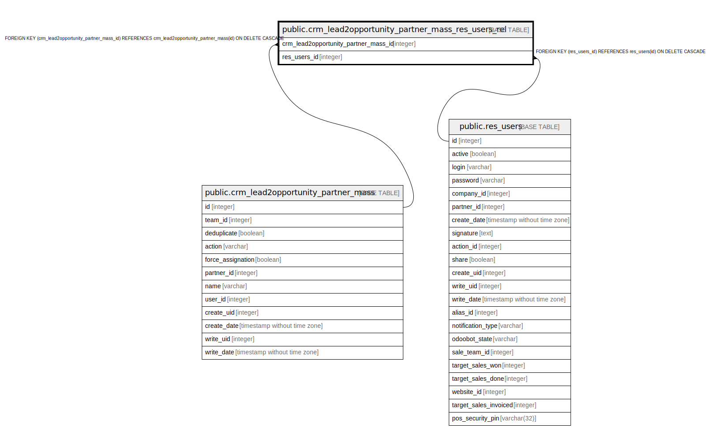

# public.crm_lead2opportunity_partner_mass_res_users_rel

## Description

RELATION BETWEEN crm_lead2opportunity_partner_mass AND res_users

## Columns

| Name | Type | Default | Nullable | Children | Parents | Comment |
| ---- | ---- | ------- | -------- | -------- | ------- | ------- |
| crm_lead2opportunity_partner_mass_id | integer |  | false |  | [public.crm_lead2opportunity_partner_mass](public.crm_lead2opportunity_partner_mass.md) |  |
| res_users_id | integer |  | false |  | [public.res_users](public.res_users.md) |  |

## Constraints

| Name | Type | Definition |
| ---- | ---- | ---------- |
| crm_lead2opportunity_partner_mass_res_users_r_res_users_id_fkey | FOREIGN KEY | FOREIGN KEY (res_users_id) REFERENCES res_users(id) ON DELETE CASCADE |
| crm_lead2opportunity_partner__crm_lead2opportunity_partner_fkey | FOREIGN KEY | FOREIGN KEY (crm_lead2opportunity_partner_mass_id) REFERENCES crm_lead2opportunity_partner_mass(id) ON DELETE CASCADE |
| crm_lead2opportunity_partner__crm_lead2opportunity_partner__key | UNIQUE | UNIQUE (crm_lead2opportunity_partner_mass_id, res_users_id) |

## Indexes

| Name | Definition |
| ---- | ---------- |
| crm_lead2opportunity_partner__crm_lead2opportunity_partner__key | CREATE UNIQUE INDEX crm_lead2opportunity_partner__crm_lead2opportunity_partner__key ON public.crm_lead2opportunity_partner_mass_res_users_rel USING btree (crm_lead2opportunity_partner_mass_id, res_users_id) |
| crm_lead2opportunity_partner__crm_lead2opportunity_partner__idx | CREATE INDEX crm_lead2opportunity_partner__crm_lead2opportunity_partner__idx ON public.crm_lead2opportunity_partner_mass_res_users_rel USING btree (crm_lead2opportunity_partner_mass_id) |
| crm_lead2opportunity_partner_mass_res_users_re_res_users_id_idx | CREATE INDEX crm_lead2opportunity_partner_mass_res_users_re_res_users_id_idx ON public.crm_lead2opportunity_partner_mass_res_users_rel USING btree (res_users_id) |

## Relations

---

> Generated by [tbls](https://github.com/k1LoW/tbls)
