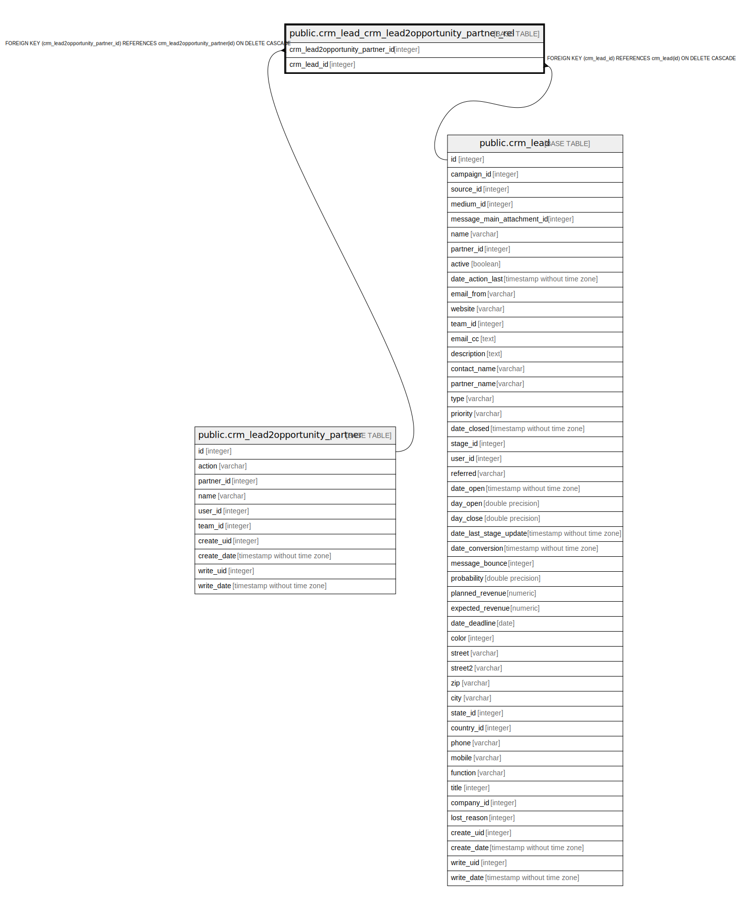

# public.crm_lead_crm_lead2opportunity_partner_rel

## Description

RELATION BETWEEN crm_lead2opportunity_partner AND crm_lead

## Columns

| Name | Type | Default | Nullable | Children | Parents | Comment |
| ---- | ---- | ------- | -------- | -------- | ------- | ------- |
| crm_lead2opportunity_partner_id | integer |  | false |  | [public.crm_lead2opportunity_partner](public.crm_lead2opportunity_partner.md) |  |
| crm_lead_id | integer |  | false |  | [public.crm_lead](public.crm_lead.md) |  |

## Constraints

| Name | Type | Definition |
| ---- | ---- | ---------- |
| crm_lead_crm_lead2opportunity_partner_rel_crm_lead_id_fkey | FOREIGN KEY | FOREIGN KEY (crm_lead_id) REFERENCES crm_lead(id) ON DELETE CASCADE |
| crm_lead_crm_lead2opportunity_crm_lead2opportunity_partner_fkey | FOREIGN KEY | FOREIGN KEY (crm_lead2opportunity_partner_id) REFERENCES crm_lead2opportunity_partner(id) ON DELETE CASCADE |
| crm_lead_crm_lead2opportunity_crm_lead2opportunity_partner__key | UNIQUE | UNIQUE (crm_lead2opportunity_partner_id, crm_lead_id) |

## Indexes

| Name | Definition |
| ---- | ---------- |
| crm_lead_crm_lead2opportunity_crm_lead2opportunity_partner__key | CREATE UNIQUE INDEX crm_lead_crm_lead2opportunity_crm_lead2opportunity_partner__key ON public.crm_lead_crm_lead2opportunity_partner_rel USING btree (crm_lead2opportunity_partner_id, crm_lead_id) |
| crm_lead_crm_lead2opportunity_crm_lead2opportunity_partner__idx | CREATE INDEX crm_lead_crm_lead2opportunity_crm_lead2opportunity_partner__idx ON public.crm_lead_crm_lead2opportunity_partner_rel USING btree (crm_lead2opportunity_partner_id) |
| crm_lead_crm_lead2opportunity_partner_rel_crm_lead_id_idx | CREATE INDEX crm_lead_crm_lead2opportunity_partner_rel_crm_lead_id_idx ON public.crm_lead_crm_lead2opportunity_partner_rel USING btree (crm_lead_id) |

## Relations

---

> Generated by [tbls](https://github.com/k1LoW/tbls)
