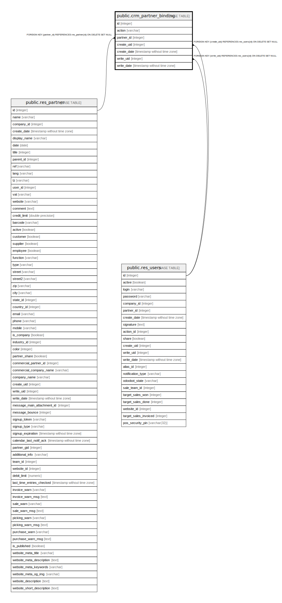

# public.crm_partner_binding

## Description

Partner linking/binding in CRM wizard

## Columns

| Name | Type | Default | Nullable | Children | Parents | Comment |
| ---- | ---- | ------- | -------- | -------- | ------- | ------- |
| id | integer | nextval('crm_partner_binding_id_seq'::regclass) | false |  |  |  |
| action | varchar |  | false |  |  | Related Customer |
| partner_id | integer |  | true |  | [public.res_partner](public.res_partner.md) | Customer |
| create_uid | integer |  | true |  | [public.res_users](public.res_users.md) | Created by |
| create_date | timestamp without time zone |  | true |  |  | Created on |
| write_uid | integer |  | true |  | [public.res_users](public.res_users.md) | Last Updated by |
| write_date | timestamp without time zone |  | true |  |  | Last Updated on |

## Constraints

| Name | Type | Definition |
| ---- | ---- | ---------- |
| crm_partner_binding_create_uid_fkey | FOREIGN KEY | FOREIGN KEY (create_uid) REFERENCES res_users(id) ON DELETE SET NULL |
| crm_partner_binding_write_uid_fkey | FOREIGN KEY | FOREIGN KEY (write_uid) REFERENCES res_users(id) ON DELETE SET NULL |
| crm_partner_binding_partner_id_fkey | FOREIGN KEY | FOREIGN KEY (partner_id) REFERENCES res_partner(id) ON DELETE SET NULL |
| crm_partner_binding_pkey | PRIMARY KEY | PRIMARY KEY (id) |

## Indexes

| Name | Definition |
| ---- | ---------- |
| crm_partner_binding_pkey | CREATE UNIQUE INDEX crm_partner_binding_pkey ON public.crm_partner_binding USING btree (id) |

## Relations

---

> Generated by [tbls](https://github.com/k1LoW/tbls)
