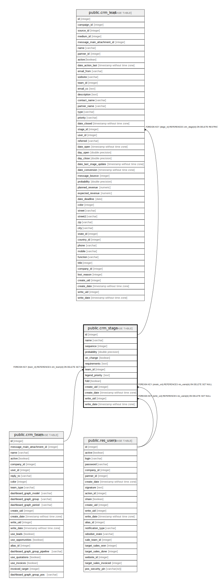

# public.crm_stage

## Description

CRM Stages

## Columns

| Name | Type | Default | Nullable | Children | Parents | Comment |
| ---- | ---- | ------- | -------- | -------- | ------- | ------- |
| id | integer | nextval('crm_stage_id_seq'::regclass) | false | [public.crm_lead](public.crm_lead.md) |  |  |
| name | varchar |  | false |  |  | Stage Name |
| sequence | integer |  | true |  |  | Sequence |
| probability | double precision |  | false |  |  | Probability (%) |
| on_change | boolean |  | true |  |  | Change Probability Automatically |
| requirements | text |  | true |  |  | Requirements |
| team_id | integer |  | true |  | [public.crm_team](public.crm_team.md) | Sales Team |
| legend_priority | text |  | true |  |  | Priority Management Explanation |
| fold | boolean |  | true |  |  | Folded in Pipeline |
| create_uid | integer |  | true |  | [public.res_users](public.res_users.md) | Created by |
| create_date | timestamp without time zone |  | true |  |  | Created on |
| write_uid | integer |  | true |  | [public.res_users](public.res_users.md) | Last Updated by |
| write_date | timestamp without time zone |  | true |  |  | Last Updated on |

## Constraints

| Name | Type | Definition |
| ---- | ---- | ---------- |
| crm_stage_create_uid_fkey | FOREIGN KEY | FOREIGN KEY (create_uid) REFERENCES res_users(id) ON DELETE SET NULL |
| crm_stage_write_uid_fkey | FOREIGN KEY | FOREIGN KEY (write_uid) REFERENCES res_users(id) ON DELETE SET NULL |
| crm_stage_team_id_fkey | FOREIGN KEY | FOREIGN KEY (team_id) REFERENCES crm_team(id) ON DELETE SET NULL |
| crm_stage_pkey | PRIMARY KEY | PRIMARY KEY (id) |

## Indexes

| Name | Definition |
| ---- | ---------- |
| crm_stage_pkey | CREATE UNIQUE INDEX crm_stage_pkey ON public.crm_stage USING btree (id) |

## Relations

---

> Generated by [tbls](https://github.com/k1LoW/tbls)
