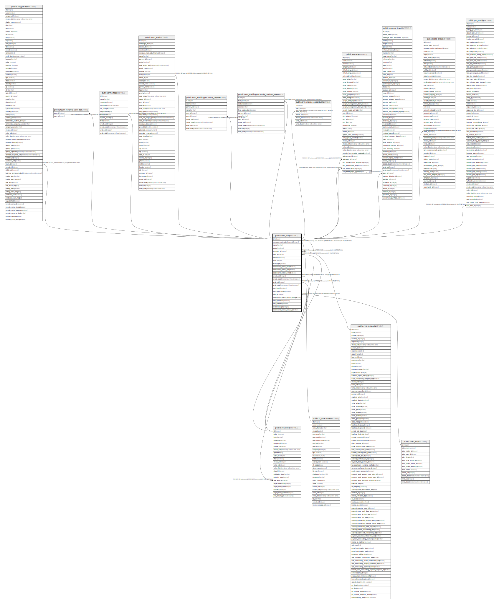

# public.crm_team

## Description

Sales Team

## Columns

| Name | Type | Default | Nullable | Children | Parents | Comment |
| ---- | ---- | ------- | -------- | -------- | ------- | ------- |
| id | integer | nextval('crm_team_id_seq'::regclass) | false | [public.res_users](public.res_users.md) [public.res_partner](public.res_partner.md) [public.team_favorite_user_rel](public.team_favorite_user_rel.md) [public.crm_stage](public.crm_stage.md) [public.crm_lead](public.crm_lead.md) [public.crm_lead2opportunity_partner](public.crm_lead2opportunity_partner.md) [public.crm_lead2opportunity_partner_mass](public.crm_lead2opportunity_partner_mass.md) [public.crm_merge_opportunity](public.crm_merge_opportunity.md) [public.website](public.website.md) [public.account_invoice](public.account_invoice.md) [public.sale_order](public.sale_order.md) [public.pos_config](public.pos_config.md) |  |  |
| message_main_attachment_id | integer |  | true |  | [public.ir_attachment](public.ir_attachment.md) | Main Attachment |
| name | varchar |  | false |  |  | Sales Team |
| active | boolean |  | true |  |  | Active |
| company_id | integer |  | true |  | [public.res_company](public.res_company.md) | Company |
| user_id | integer |  | true |  | [public.res_users](public.res_users.md) | Team Leader |
| reply_to | varchar |  | true |  |  | Reply-To |
| color | integer |  | true |  |  | Color Index |
| team_type | varchar |  | false |  |  | Team Type |
| dashboard_graph_model | varchar |  | true |  |  | Content |
| dashboard_graph_group | varchar |  | true |  |  | Group by |
| dashboard_graph_period | varchar |  | true |  |  | Scale |
| create_uid | integer |  | true |  | [public.res_users](public.res_users.md) | Created by |
| create_date | timestamp without time zone |  | true |  |  | Created on |
| write_uid | integer |  | true |  | [public.res_users](public.res_users.md) | Last Updated by |
| write_date | timestamp without time zone |  | true |  |  | Last Updated on |
| use_leads | boolean |  | true |  |  | Leads |
| use_opportunities | boolean |  | true |  |  | Pipeline |
| alias_id | integer |  | false |  | [public.mail_alias](public.mail_alias.md) | Alias |
| dashboard_graph_group_pipeline | varchar |  | true |  |  | Grouping Method |
| use_quotations | boolean |  | true |  |  | Quotations |
| use_invoices | boolean |  | true |  |  | Set Invoicing Target |
| invoiced_target | integer |  | true |  |  | Invoicing Target |
| dashboard_graph_group_pos | varchar |  | true |  |  | POS Grouping |

## Constraints

| Name | Type | Definition |
| ---- | ---- | ---------- |
| crm_team_create_uid_fkey | FOREIGN KEY | FOREIGN KEY (create_uid) REFERENCES res_users(id) ON DELETE SET NULL |
| crm_team_user_id_fkey | FOREIGN KEY | FOREIGN KEY (user_id) REFERENCES res_users(id) ON DELETE SET NULL |
| crm_team_write_uid_fkey | FOREIGN KEY | FOREIGN KEY (write_uid) REFERENCES res_users(id) ON DELETE SET NULL |
| crm_team_company_id_fkey | FOREIGN KEY | FOREIGN KEY (company_id) REFERENCES res_company(id) ON DELETE SET NULL |
| crm_team_message_main_attachment_id_fkey | FOREIGN KEY | FOREIGN KEY (message_main_attachment_id) REFERENCES ir_attachment(id) ON DELETE SET NULL |
| crm_team_alias_id_fkey | FOREIGN KEY | FOREIGN KEY (alias_id) REFERENCES mail_alias(id) ON DELETE RESTRICT |
| crm_team_pkey | PRIMARY KEY | PRIMARY KEY (id) |

## Indexes

| Name | Definition |
| ---- | ---------- |
| crm_team_pkey | CREATE UNIQUE INDEX crm_team_pkey ON public.crm_team USING btree (id) |
| crm_team_message_main_attachment_id_index | CREATE INDEX crm_team_message_main_attachment_id_index ON public.crm_team USING btree (message_main_attachment_id) |

## Relations

---

> Generated by [tbls](https://github.com/k1LoW/tbls)
