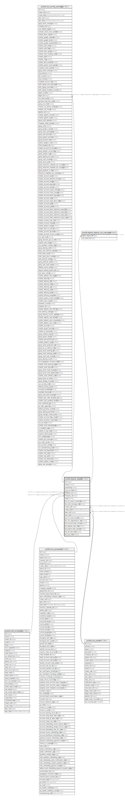

# public.digest_digest

## Description

Digest

## Columns

| Name | Type | Default | Nullable | Children | Parents | Comment |
| ---- | ---- | ------- | -------- | -------- | ------- | ------- |
| id | integer | nextval('digest_digest_id_seq'::regclass) | false | [public.res_config_settings](public.res_config_settings.md) [public.digest_digest_res_users_rel](public.digest_digest_res_users_rel.md) |  |  |
| name | varchar |  | false |  |  | Name |
| periodicity | varchar |  | false |  |  | Periodicity |
| next_run_date | date |  | true |  |  | Next Send Date |
| template_id | integer |  | false |  | [public.mail_template](public.mail_template.md) | Email Template |
| company_id | integer |  | true |  | [public.res_company](public.res_company.md) | Company |
| state | varchar |  | true |  |  | Status |
| kpi_res_users_connected | boolean |  | true |  |  | Connected Users |
| kpi_mail_message_total | boolean |  | true |  |  | Messages |
| create_uid | integer |  | true |  | [public.res_users](public.res_users.md) | Created by |
| create_date | timestamp without time zone |  | true |  |  | Created on |
| write_uid | integer |  | true |  | [public.res_users](public.res_users.md) | Last Updated by |
| write_date | timestamp without time zone |  | true |  |  | Last Updated on |
| kpi_crm_lead_created | boolean |  | true |  |  | New Leads/Opportunities |
| kpi_crm_opportunities_won | boolean |  | true |  |  | Opportunities Won |
| kpi_account_total_revenue | boolean |  | true |  |  | Revenue |
| kpi_website_sale_total | boolean |  | true |  |  | eCommerce Sales |
| kpi_project_task_opened | boolean |  | true |  |  | Open Tasks |
| kpi_all_sale_total | boolean |  | true |  |  | All Sales |
| kpi_pos_total | boolean |  | true |  |  | POS Sales |

## Constraints

| Name | Type | Definition |
| ---- | ---- | ---------- |
| digest_digest_create_uid_fkey | FOREIGN KEY | FOREIGN KEY (create_uid) REFERENCES res_users(id) ON DELETE SET NULL |
| digest_digest_write_uid_fkey | FOREIGN KEY | FOREIGN KEY (write_uid) REFERENCES res_users(id) ON DELETE SET NULL |
| digest_digest_company_id_fkey | FOREIGN KEY | FOREIGN KEY (company_id) REFERENCES res_company(id) ON DELETE SET NULL |
| digest_digest_template_id_fkey | FOREIGN KEY | FOREIGN KEY (template_id) REFERENCES mail_template(id) ON DELETE SET NULL |
| digest_digest_pkey | PRIMARY KEY | PRIMARY KEY (id) |

## Indexes

| Name | Definition |
| ---- | ---------- |
| digest_digest_pkey | CREATE UNIQUE INDEX digest_digest_pkey ON public.digest_digest USING btree (id) |

## Relations

---

> Generated by [tbls](https://github.com/k1LoW/tbls)
