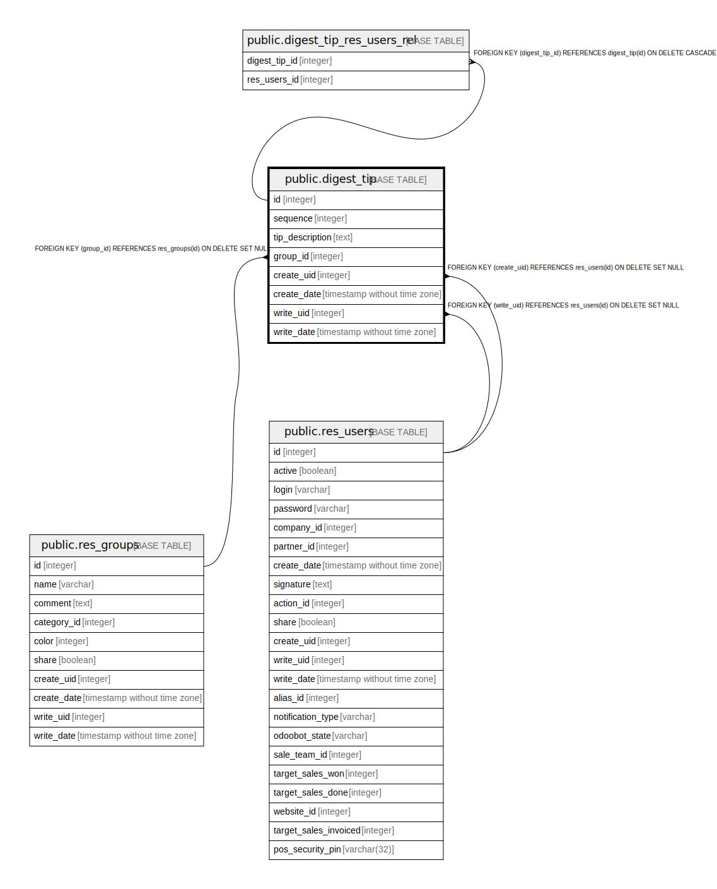

# public.digest_tip

## Description

Digest Tips

## Columns

| Name | Type | Default | Nullable | Children | Parents | Comment |
| ---- | ---- | ------- | -------- | -------- | ------- | ------- |
| id | integer | nextval('digest_tip_id_seq'::regclass) | false | [public.digest_tip_res_users_rel](public.digest_tip_res_users_rel.md) |  |  |
| sequence | integer |  | true |  |  | Sequence |
| tip_description | text |  | true |  |  | Tip description |
| group_id | integer |  | true |  | [public.res_groups](public.res_groups.md) | Authorized Group |
| create_uid | integer |  | true |  | [public.res_users](public.res_users.md) | Created by |
| create_date | timestamp without time zone |  | true |  |  | Created on |
| write_uid | integer |  | true |  | [public.res_users](public.res_users.md) | Last Updated by |
| write_date | timestamp without time zone |  | true |  |  | Last Updated on |

## Constraints

| Name | Type | Definition |
| ---- | ---- | ---------- |
| digest_tip_create_uid_fkey | FOREIGN KEY | FOREIGN KEY (create_uid) REFERENCES res_users(id) ON DELETE SET NULL |
| digest_tip_write_uid_fkey | FOREIGN KEY | FOREIGN KEY (write_uid) REFERENCES res_users(id) ON DELETE SET NULL |
| digest_tip_group_id_fkey | FOREIGN KEY | FOREIGN KEY (group_id) REFERENCES res_groups(id) ON DELETE SET NULL |
| digest_tip_pkey | PRIMARY KEY | PRIMARY KEY (id) |

## Indexes

| Name | Definition |
| ---- | ---------- |
| digest_tip_pkey | CREATE UNIQUE INDEX digest_tip_pkey ON public.digest_tip USING btree (id) |

## Relations

---

> Generated by [tbls](https://github.com/k1LoW/tbls)
