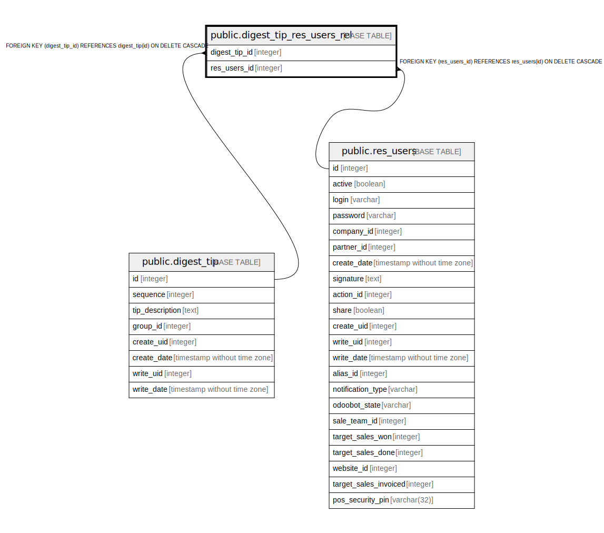

# public.digest_tip_res_users_rel

## Description

RELATION BETWEEN digest_tip AND res_users

## Columns

| Name | Type | Default | Nullable | Children | Parents | Comment |
| ---- | ---- | ------- | -------- | -------- | ------- | ------- |
| digest_tip_id | integer |  | false |  | [public.digest_tip](public.digest_tip.md) |  |
| res_users_id | integer |  | false |  | [public.res_users](public.res_users.md) |  |

## Constraints

| Name | Type | Definition |
| ---- | ---- | ---------- |
| digest_tip_res_users_rel_res_users_id_fkey | FOREIGN KEY | FOREIGN KEY (res_users_id) REFERENCES res_users(id) ON DELETE CASCADE |
| digest_tip_res_users_rel_digest_tip_id_fkey | FOREIGN KEY | FOREIGN KEY (digest_tip_id) REFERENCES digest_tip(id) ON DELETE CASCADE |
| digest_tip_res_users_rel_digest_tip_id_res_users_id_key | UNIQUE | UNIQUE (digest_tip_id, res_users_id) |

## Indexes

| Name | Definition |
| ---- | ---------- |
| digest_tip_res_users_rel_digest_tip_id_res_users_id_key | CREATE UNIQUE INDEX digest_tip_res_users_rel_digest_tip_id_res_users_id_key ON public.digest_tip_res_users_rel USING btree (digest_tip_id, res_users_id) |
| digest_tip_res_users_rel_digest_tip_id_idx | CREATE INDEX digest_tip_res_users_rel_digest_tip_id_idx ON public.digest_tip_res_users_rel USING btree (digest_tip_id) |
| digest_tip_res_users_rel_res_users_id_idx | CREATE INDEX digest_tip_res_users_rel_res_users_id_idx ON public.digest_tip_res_users_rel USING btree (res_users_id) |

## Relations

---

> Generated by [tbls](https://github.com/k1LoW/tbls)
