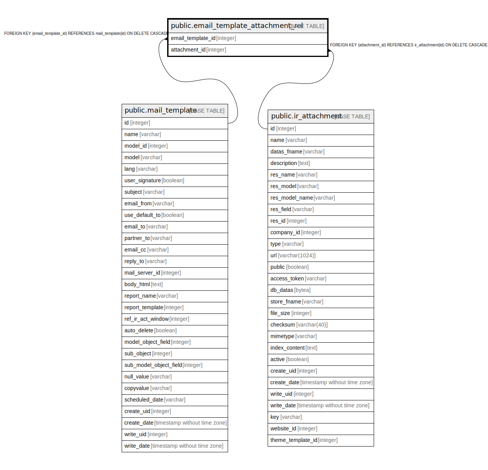

# public.email_template_attachment_rel

## Description

RELATION BETWEEN mail_template AND ir_attachment

## Columns

| Name | Type | Default | Nullable | Children | Parents | Comment |
| ---- | ---- | ------- | -------- | -------- | ------- | ------- |
| email_template_id | integer |  | false |  | [public.mail_template](public.mail_template.md) |  |
| attachment_id | integer |  | false |  | [public.ir_attachment](public.ir_attachment.md) |  |

## Constraints

| Name | Type | Definition |
| ---- | ---- | ---------- |
| email_template_attachment_rel_attachment_id_fkey | FOREIGN KEY | FOREIGN KEY (attachment_id) REFERENCES ir_attachment(id) ON DELETE CASCADE |
| email_template_attachment_rel_email_template_id_fkey | FOREIGN KEY | FOREIGN KEY (email_template_id) REFERENCES mail_template(id) ON DELETE CASCADE |
| email_template_attachment_rel_email_template_id_attachment__key | UNIQUE | UNIQUE (email_template_id, attachment_id) |

## Indexes

| Name | Definition |
| ---- | ---------- |
| email_template_attachment_rel_email_template_id_attachment__key | CREATE UNIQUE INDEX email_template_attachment_rel_email_template_id_attachment__key ON public.email_template_attachment_rel USING btree (email_template_id, attachment_id) |
| email_template_attachment_rel_email_template_id_idx | CREATE INDEX email_template_attachment_rel_email_template_id_idx ON public.email_template_attachment_rel USING btree (email_template_id) |
| email_template_attachment_rel_attachment_id_idx | CREATE INDEX email_template_attachment_rel_attachment_id_idx ON public.email_template_attachment_rel USING btree (attachment_id) |

## Relations

---

> Generated by [tbls](https://github.com/k1LoW/tbls)
