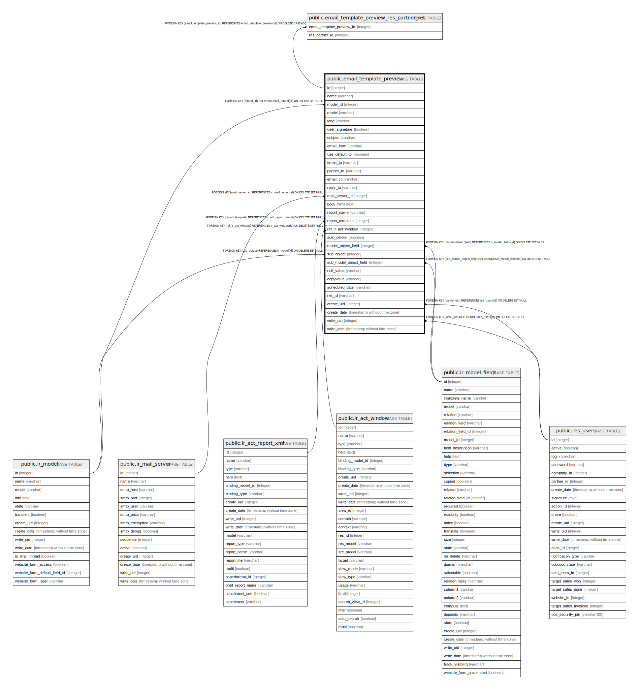

# public.email_template_preview

## Description

Email Template Preview

## Columns

| Name | Type | Default | Nullable | Children | Parents | Comment |
| ---- | ---- | ------- | -------- | -------- | ------- | ------- |
| id | integer | nextval('email_template_preview_id_seq'::regclass) | false | [public.email_template_preview_res_partner_rel](public.email_template_preview_res_partner_rel.md) |  |  |
| name | varchar |  | true |  |  | Name |
| model_id | integer |  | true |  | [public.ir_model](public.ir_model.md) | Applies to |
| model | varchar |  | true |  |  | Related Document Model |
| lang | varchar |  | true |  |  | Language |
| user_signature | boolean |  | true |  |  | Add Signature |
| subject | varchar |  | true |  |  | Subject |
| email_from | varchar |  | true |  |  | From |
| use_default_to | boolean |  | true |  |  | Default recipients |
| email_to | varchar |  | true |  |  | To (Emails) |
| partner_to | varchar |  | true |  |  | To (Partners) |
| email_cc | varchar |  | true |  |  | Cc |
| reply_to | varchar |  | true |  |  | Reply-To |
| mail_server_id | integer |  | true |  | [public.ir_mail_server](public.ir_mail_server.md) | Outgoing Mail Server |
| body_html | text |  | true |  |  | Body |
| report_name | varchar |  | true |  |  | Report Filename |
| report_template | integer |  | true |  | [public.ir_act_report_xml](public.ir_act_report_xml.md) | Optional report to print and attach |
| ref_ir_act_window | integer |  | true |  | [public.ir_act_window](public.ir_act_window.md) | Sidebar action |
| auto_delete | boolean |  | true |  |  | Auto Delete |
| model_object_field | integer |  | true |  | [public.ir_model_fields](public.ir_model_fields.md) | Field |
| sub_object | integer |  | true |  | [public.ir_model](public.ir_model.md) | Sub-model |
| sub_model_object_field | integer |  | true |  | [public.ir_model_fields](public.ir_model_fields.md) | Sub-field |
| null_value | varchar |  | true |  |  | Default Value |
| copyvalue | varchar |  | true |  |  | Placeholder Expression |
| scheduled_date | varchar |  | true |  |  | Scheduled Date |
| res_id | varchar |  | true |  |  | Sample Document |
| create_uid | integer |  | true |  | [public.res_users](public.res_users.md) | Created by |
| create_date | timestamp without time zone |  | true |  |  | Created on |
| write_uid | integer |  | true |  | [public.res_users](public.res_users.md) | Last Updated by |
| write_date | timestamp without time zone |  | true |  |  | Last Updated on |

## Constraints

| Name | Type | Definition |
| ---- | ---- | ---------- |
| email_template_preview_ref_ir_act_window_fkey | FOREIGN KEY | FOREIGN KEY (ref_ir_act_window) REFERENCES ir_act_window(id) ON DELETE SET NULL |
| email_template_preview_report_template_fkey | FOREIGN KEY | FOREIGN KEY (report_template) REFERENCES ir_act_report_xml(id) ON DELETE SET NULL |
| email_template_preview_create_uid_fkey | FOREIGN KEY | FOREIGN KEY (create_uid) REFERENCES res_users(id) ON DELETE SET NULL |
| email_template_preview_write_uid_fkey | FOREIGN KEY | FOREIGN KEY (write_uid) REFERENCES res_users(id) ON DELETE SET NULL |
| email_template_preview_model_id_fkey | FOREIGN KEY | FOREIGN KEY (model_id) REFERENCES ir_model(id) ON DELETE SET NULL |
| email_template_preview_sub_object_fkey | FOREIGN KEY | FOREIGN KEY (sub_object) REFERENCES ir_model(id) ON DELETE SET NULL |
| email_template_preview_model_object_field_fkey | FOREIGN KEY | FOREIGN KEY (model_object_field) REFERENCES ir_model_fields(id) ON DELETE SET NULL |
| email_template_preview_sub_model_object_field_fkey | FOREIGN KEY | FOREIGN KEY (sub_model_object_field) REFERENCES ir_model_fields(id) ON DELETE SET NULL |
| email_template_preview_mail_server_id_fkey | FOREIGN KEY | FOREIGN KEY (mail_server_id) REFERENCES ir_mail_server(id) ON DELETE SET NULL |
| email_template_preview_pkey | PRIMARY KEY | PRIMARY KEY (id) |

## Indexes

| Name | Definition |
| ---- | ---------- |
| email_template_preview_pkey | CREATE UNIQUE INDEX email_template_preview_pkey ON public.email_template_preview USING btree (id) |
| email_template_preview_model_index | CREATE INDEX email_template_preview_model_index ON public.email_template_preview USING btree (model) |

## Relations

---

> Generated by [tbls](https://github.com/k1LoW/tbls)
