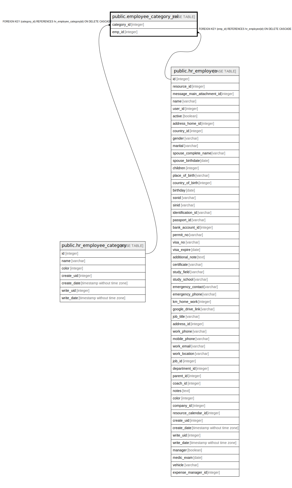

# public.employee_category_rel

## Description

RELATION BETWEEN hr_employee_category AND hr_employee

## Columns

| Name | Type | Default | Nullable | Children | Parents | Comment |
| ---- | ---- | ------- | -------- | -------- | ------- | ------- |
| category_id | integer |  | false |  | [public.hr_employee_category](public.hr_employee_category.md) |  |
| emp_id | integer |  | false |  | [public.hr_employee](public.hr_employee.md) |  |

## Constraints

| Name | Type | Definition |
| ---- | ---- | ---------- |
| employee_category_rel_category_id_fkey | FOREIGN KEY | FOREIGN KEY (category_id) REFERENCES hr_employee_category(id) ON DELETE CASCADE |
| employee_category_rel_category_id_emp_id_key | UNIQUE | UNIQUE (category_id, emp_id) |
| employee_category_rel_emp_id_fkey | FOREIGN KEY | FOREIGN KEY (emp_id) REFERENCES hr_employee(id) ON DELETE CASCADE |

## Indexes

| Name | Definition |
| ---- | ---------- |
| employee_category_rel_category_id_emp_id_key | CREATE UNIQUE INDEX employee_category_rel_category_id_emp_id_key ON public.employee_category_rel USING btree (category_id, emp_id) |
| employee_category_rel_category_id_idx | CREATE INDEX employee_category_rel_category_id_idx ON public.employee_category_rel USING btree (category_id) |
| employee_category_rel_emp_id_idx | CREATE INDEX employee_category_rel_emp_id_idx ON public.employee_category_rel USING btree (emp_id) |

## Relations

---

> Generated by [tbls](https://github.com/k1LoW/tbls)
