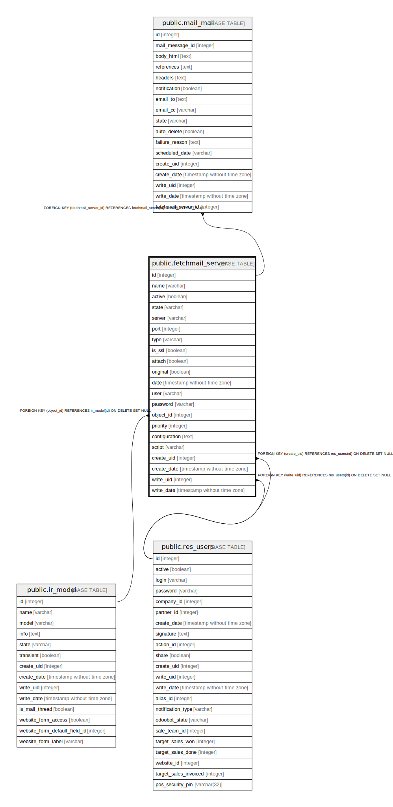

# public.fetchmail_server

## Description

Incoming Mail Server

## Columns

| Name | Type | Default | Nullable | Children | Parents | Comment |
| ---- | ---- | ------- | -------- | -------- | ------- | ------- |
| id | integer | nextval('fetchmail_server_id_seq'::regclass) | false | [public.mail_mail](public.mail_mail.md) |  |  |
| name | varchar |  | false |  |  | Name |
| active | boolean |  | true |  |  | Active |
| state | varchar |  | true |  |  | Status |
| server | varchar |  | true |  |  | Server Name |
| port | integer |  | true |  |  | Port |
| type | varchar |  | false |  |  | Server Type |
| is_ssl | boolean |  | true |  |  | SSL/TLS |
| attach | boolean |  | true |  |  | Keep Attachments |
| original | boolean |  | true |  |  | Keep Original |
| date | timestamp without time zone |  | true |  |  | Last Fetch Date |
| user | varchar |  | true |  |  | Username |
| password | varchar |  | true |  |  | Password |
| object_id | integer |  | true |  | [public.ir_model](public.ir_model.md) | Create a New Record |
| priority | integer |  | true |  |  | Server Priority |
| configuration | text |  | true |  |  | Configuration |
| script | varchar |  | true |  |  | Script |
| create_uid | integer |  | true |  | [public.res_users](public.res_users.md) | Created by |
| create_date | timestamp without time zone |  | true |  |  | Created on |
| write_uid | integer |  | true |  | [public.res_users](public.res_users.md) | Last Updated by |
| write_date | timestamp without time zone |  | true |  |  | Last Updated on |

## Constraints

| Name | Type | Definition |
| ---- | ---- | ---------- |
| fetchmail_server_create_uid_fkey | FOREIGN KEY | FOREIGN KEY (create_uid) REFERENCES res_users(id) ON DELETE SET NULL |
| fetchmail_server_write_uid_fkey | FOREIGN KEY | FOREIGN KEY (write_uid) REFERENCES res_users(id) ON DELETE SET NULL |
| fetchmail_server_object_id_fkey | FOREIGN KEY | FOREIGN KEY (object_id) REFERENCES ir_model(id) ON DELETE SET NULL |
| fetchmail_server_pkey | PRIMARY KEY | PRIMARY KEY (id) |

## Indexes

| Name | Definition |
| ---- | ---------- |
| fetchmail_server_pkey | CREATE UNIQUE INDEX fetchmail_server_pkey ON public.fetchmail_server USING btree (id) |
| fetchmail_server_state_index | CREATE INDEX fetchmail_server_state_index ON public.fetchmail_server USING btree (state) |
| fetchmail_server_type_index | CREATE INDEX fetchmail_server_type_index ON public.fetchmail_server USING btree (type) |

## Relations

---

> Generated by [tbls](https://github.com/k1LoW/tbls)
