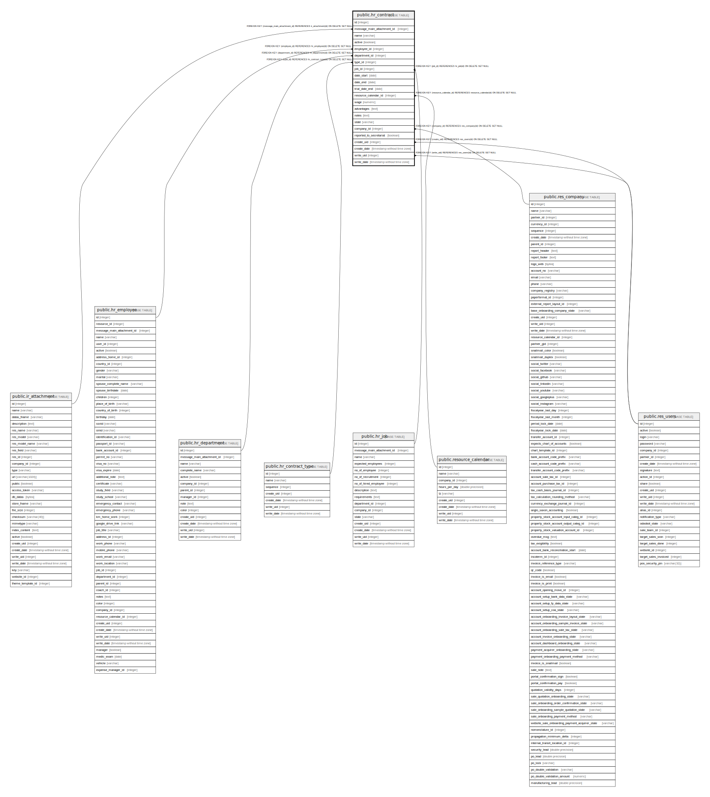

# public.hr_contract

## Description

Contract

## Columns

| Name | Type | Default | Nullable | Children | Parents | Comment |
| ---- | ---- | ------- | -------- | -------- | ------- | ------- |
| id | integer | nextval('hr_contract_id_seq'::regclass) | false |  |  |  |
| message_main_attachment_id | integer |  | true |  | [public.ir_attachment](public.ir_attachment.md) | Main Attachment |
| name | varchar |  | false |  |  | Contract Reference |
| active | boolean |  | true |  |  | Active |
| employee_id | integer |  | true |  | [public.hr_employee](public.hr_employee.md) | Employee |
| department_id | integer |  | true |  | [public.hr_department](public.hr_department.md) | Department |
| type_id | integer |  | false |  | [public.hr_contract_type](public.hr_contract_type.md) | Employee Category |
| job_id | integer |  | true |  | [public.hr_job](public.hr_job.md) | Job Position |
| date_start | date |  | false |  |  | Start Date |
| date_end | date |  | true |  |  | End Date |
| trial_date_end | date |  | true |  |  | End of Trial Period |
| resource_calendar_id | integer |  | true |  | [public.resource_calendar](public.resource_calendar.md) | Working Schedule |
| wage | numeric |  | false |  |  | Wage |
| advantages | text |  | true |  |  | Advantages |
| notes | text |  | true |  |  | Notes |
| state | varchar |  | true |  |  | Status |
| company_id | integer |  | true |  | [public.res_company](public.res_company.md) | Company |
| reported_to_secretariat | boolean |  | true |  |  | Social Secretariat |
| create_uid | integer |  | true |  | [public.res_users](public.res_users.md) | Created by |
| create_date | timestamp without time zone |  | true |  |  | Created on |
| write_uid | integer |  | true |  | [public.res_users](public.res_users.md) | Last Updated by |
| write_date | timestamp without time zone |  | true |  |  | Last Updated on |

## Constraints

| Name | Type | Definition |
| ---- | ---- | ---------- |
| hr_contract_create_uid_fkey | FOREIGN KEY | FOREIGN KEY (create_uid) REFERENCES res_users(id) ON DELETE SET NULL |
| hr_contract_write_uid_fkey | FOREIGN KEY | FOREIGN KEY (write_uid) REFERENCES res_users(id) ON DELETE SET NULL |
| hr_contract_company_id_fkey | FOREIGN KEY | FOREIGN KEY (company_id) REFERENCES res_company(id) ON DELETE SET NULL |
| hr_contract_message_main_attachment_id_fkey | FOREIGN KEY | FOREIGN KEY (message_main_attachment_id) REFERENCES ir_attachment(id) ON DELETE SET NULL |
| hr_contract_resource_calendar_id_fkey | FOREIGN KEY | FOREIGN KEY (resource_calendar_id) REFERENCES resource_calendar(id) ON DELETE SET NULL |
| hr_contract_job_id_fkey | FOREIGN KEY | FOREIGN KEY (job_id) REFERENCES hr_job(id) ON DELETE SET NULL |
| hr_contract_employee_id_fkey | FOREIGN KEY | FOREIGN KEY (employee_id) REFERENCES hr_employee(id) ON DELETE SET NULL |
| hr_contract_department_id_fkey | FOREIGN KEY | FOREIGN KEY (department_id) REFERENCES hr_department(id) ON DELETE SET NULL |
| hr_contract_type_id_fkey | FOREIGN KEY | FOREIGN KEY (type_id) REFERENCES hr_contract_type(id) ON DELETE SET NULL |
| hr_contract_pkey | PRIMARY KEY | PRIMARY KEY (id) |

## Indexes

| Name | Definition |
| ---- | ---------- |
| hr_contract_pkey | CREATE UNIQUE INDEX hr_contract_pkey ON public.hr_contract USING btree (id) |
| hr_contract_message_main_attachment_id_index | CREATE INDEX hr_contract_message_main_attachment_id_index ON public.hr_contract USING btree (message_main_attachment_id) |

## Relations

---

> Generated by [tbls](https://github.com/k1LoW/tbls)
