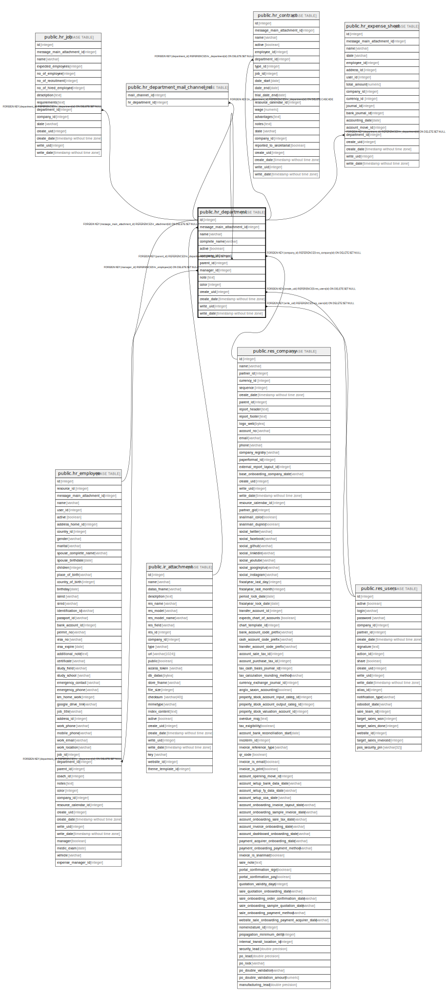

# public.hr_department

## Description

HR Department

## Columns

| Name | Type | Default | Nullable | Children | Parents | Comment |
| ---- | ---- | ------- | -------- | -------- | ------- | ------- |
| id | integer | nextval('hr_department_id_seq'::regclass) | false | [public.hr_job](public.hr_job.md) [public.hr_employee](public.hr_employee.md) [public.hr_department](public.hr_department.md) [public.hr_department_mail_channel_rel](public.hr_department_mail_channel_rel.md) [public.hr_contract](public.hr_contract.md) [public.hr_expense_sheet](public.hr_expense_sheet.md) |  |  |
| message_main_attachment_id | integer |  | true |  | [public.ir_attachment](public.ir_attachment.md) | Main Attachment |
| name | varchar |  | false |  |  | Department Name |
| complete_name | varchar |  | true |  |  | Complete Name |
| active | boolean |  | true |  |  | Active |
| company_id | integer |  | true |  | [public.res_company](public.res_company.md) | Company |
| parent_id | integer |  | true |  | [public.hr_department](public.hr_department.md) | Parent Department |
| manager_id | integer |  | true |  | [public.hr_employee](public.hr_employee.md) | Manager |
| note | text |  | true |  |  | Note |
| color | integer |  | true |  |  | Color Index |
| create_uid | integer |  | true |  | [public.res_users](public.res_users.md) | Created by |
| create_date | timestamp without time zone |  | true |  |  | Created on |
| write_uid | integer |  | true |  | [public.res_users](public.res_users.md) | Last Updated by |
| write_date | timestamp without time zone |  | true |  |  | Last Updated on |

## Constraints

| Name | Type | Definition |
| ---- | ---- | ---------- |
| hr_department_create_uid_fkey | FOREIGN KEY | FOREIGN KEY (create_uid) REFERENCES res_users(id) ON DELETE SET NULL |
| hr_department_write_uid_fkey | FOREIGN KEY | FOREIGN KEY (write_uid) REFERENCES res_users(id) ON DELETE SET NULL |
| hr_department_company_id_fkey | FOREIGN KEY | FOREIGN KEY (company_id) REFERENCES res_company(id) ON DELETE SET NULL |
| hr_department_message_main_attachment_id_fkey | FOREIGN KEY | FOREIGN KEY (message_main_attachment_id) REFERENCES ir_attachment(id) ON DELETE SET NULL |
| hr_department_manager_id_fkey | FOREIGN KEY | FOREIGN KEY (manager_id) REFERENCES hr_employee(id) ON DELETE SET NULL |
| hr_department_parent_id_fkey | FOREIGN KEY | FOREIGN KEY (parent_id) REFERENCES hr_department(id) ON DELETE SET NULL |
| hr_department_pkey | PRIMARY KEY | PRIMARY KEY (id) |

## Indexes

| Name | Definition |
| ---- | ---------- |
| hr_department_pkey | CREATE UNIQUE INDEX hr_department_pkey ON public.hr_department USING btree (id) |
| hr_department_message_main_attachment_id_index | CREATE INDEX hr_department_message_main_attachment_id_index ON public.hr_department USING btree (message_main_attachment_id) |
| hr_department_company_id_index | CREATE INDEX hr_department_company_id_index ON public.hr_department USING btree (company_id) |
| hr_department_parent_id_index | CREATE INDEX hr_department_parent_id_index ON public.hr_department USING btree (parent_id) |

## Relations

---

> Generated by [tbls](https://github.com/k1LoW/tbls)
