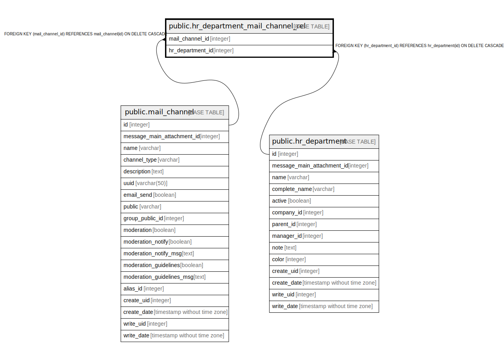

# public.hr_department_mail_channel_rel

## Description

RELATION BETWEEN mail_channel AND hr_department

## Columns

| Name | Type | Default | Nullable | Children | Parents | Comment |
| ---- | ---- | ------- | -------- | -------- | ------- | ------- |
| mail_channel_id | integer |  | false |  | [public.mail_channel](public.mail_channel.md) |  |
| hr_department_id | integer |  | false |  | [public.hr_department](public.hr_department.md) |  |

## Constraints

| Name | Type | Definition |
| ---- | ---- | ---------- |
| hr_department_mail_channel_rel_mail_channel_id_fkey | FOREIGN KEY | FOREIGN KEY (mail_channel_id) REFERENCES mail_channel(id) ON DELETE CASCADE |
| hr_department_mail_channel_rel_hr_department_id_fkey | FOREIGN KEY | FOREIGN KEY (hr_department_id) REFERENCES hr_department(id) ON DELETE CASCADE |
| hr_department_mail_channel_re_mail_channel_id_hr_department_key | UNIQUE | UNIQUE (mail_channel_id, hr_department_id) |

## Indexes

| Name | Definition |
| ---- | ---------- |
| hr_department_mail_channel_re_mail_channel_id_hr_department_key | CREATE UNIQUE INDEX hr_department_mail_channel_re_mail_channel_id_hr_department_key ON public.hr_department_mail_channel_rel USING btree (mail_channel_id, hr_department_id) |
| hr_department_mail_channel_rel_mail_channel_id_idx | CREATE INDEX hr_department_mail_channel_rel_mail_channel_id_idx ON public.hr_department_mail_channel_rel USING btree (mail_channel_id) |
| hr_department_mail_channel_rel_hr_department_id_idx | CREATE INDEX hr_department_mail_channel_rel_hr_department_id_idx ON public.hr_department_mail_channel_rel USING btree (hr_department_id) |

## Relations

---

> Generated by [tbls](https://github.com/k1LoW/tbls)
