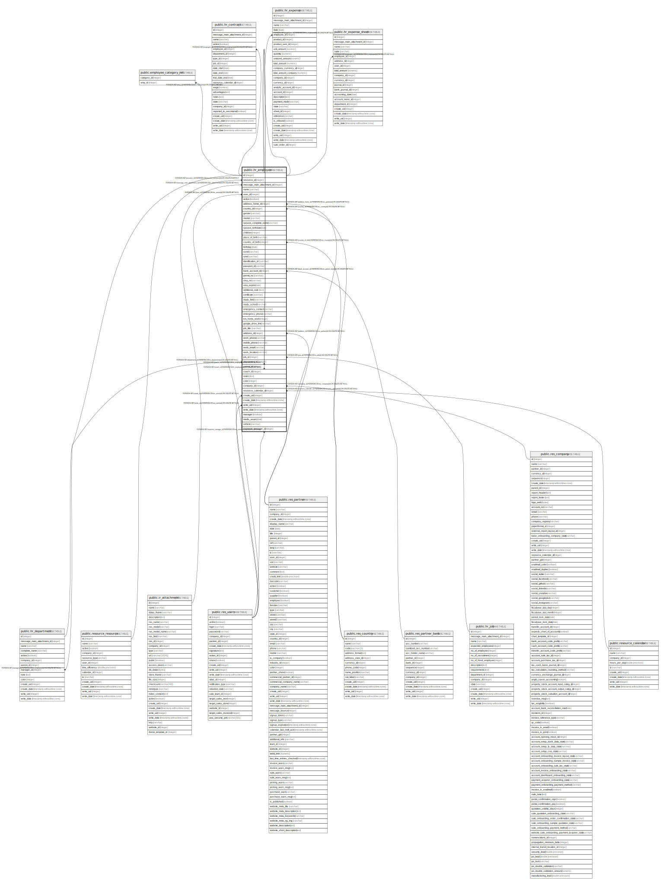

# public.hr_employee

## Description

Employee

## Columns

| Name | Type | Default | Nullable | Children | Parents | Comment |
| ---- | ---- | ------- | -------- | -------- | ------- | ------- |
| id | integer | nextval('hr_employee_id_seq'::regclass) | false | [public.employee_category_rel](public.employee_category_rel.md) [public.hr_employee](public.hr_employee.md) [public.hr_department](public.hr_department.md) [public.hr_contract](public.hr_contract.md) [public.hr_expense](public.hr_expense.md) [public.hr_expense_sheet](public.hr_expense_sheet.md) |  |  |
| resource_id | integer |  | false |  | [public.resource_resource](public.resource_resource.md) | Resource |
| message_main_attachment_id | integer |  | true |  | [public.ir_attachment](public.ir_attachment.md) | Main Attachment |
| name | varchar |  | true |  |  | Name |
| user_id | integer |  | true |  | [public.res_users](public.res_users.md) | User |
| active | boolean |  | true |  |  | Active |
| address_home_id | integer |  | true |  | [public.res_partner](public.res_partner.md) | Private Address |
| country_id | integer |  | true |  | [public.res_country](public.res_country.md) | Nationality (Country) |
| gender | varchar |  | true |  |  | Gender |
| marital | varchar |  | true |  |  | Marital Status |
| spouse_complete_name | varchar |  | true |  |  | Spouse Complete Name |
| spouse_birthdate | date |  | true |  |  | Spouse Birthdate |
| children | integer |  | true |  |  | Number of Children |
| place_of_birth | varchar |  | true |  |  | Place of Birth |
| country_of_birth | integer |  | true |  | [public.res_country](public.res_country.md) | Country of Birth |
| birthday | date |  | true |  |  | Date of Birth |
| ssnid | varchar |  | true |  |  | SSN No |
| sinid | varchar |  | true |  |  | SIN No |
| identification_id | varchar |  | true |  |  | Identification No |
| passport_id | varchar |  | true |  |  | Passport No |
| bank_account_id | integer |  | true |  | [public.res_partner_bank](public.res_partner_bank.md) | Bank Account Number |
| permit_no | varchar |  | true |  |  | Work Permit No |
| visa_no | varchar |  | true |  |  | Visa No |
| visa_expire | date |  | true |  |  | Visa Expire Date |
| additional_note | text |  | true |  |  | Additional Note |
| certificate | varchar |  | true |  |  | Certificate Level |
| study_field | varchar |  | true |  |  | Field of Study |
| study_school | varchar |  | true |  |  | School |
| emergency_contact | varchar |  | true |  |  | Emergency Contact |
| emergency_phone | varchar |  | true |  |  | Emergency Phone |
| km_home_work | integer |  | true |  |  | Km home-work |
| google_drive_link | varchar |  | true |  |  | Employee Documents |
| job_title | varchar |  | true |  |  | Job Title |
| address_id | integer |  | true |  | [public.res_partner](public.res_partner.md) | Work Address |
| work_phone | varchar |  | true |  |  | Work Phone |
| mobile_phone | varchar |  | true |  |  | Work Mobile |
| work_email | varchar |  | true |  |  | Work Email |
| work_location | varchar |  | true |  |  | Work Location |
| job_id | integer |  | true |  | [public.hr_job](public.hr_job.md) | Job Position |
| department_id | integer |  | true |  | [public.hr_department](public.hr_department.md) | Department |
| parent_id | integer |  | true |  | [public.hr_employee](public.hr_employee.md) | Manager |
| coach_id | integer |  | true |  | [public.hr_employee](public.hr_employee.md) | Coach |
| notes | text |  | true |  |  | Notes |
| color | integer |  | true |  |  | Color Index |
| company_id | integer |  | true |  | [public.res_company](public.res_company.md) | Company |
| resource_calendar_id | integer |  | true |  | [public.resource_calendar](public.resource_calendar.md) | Working Hours |
| create_uid | integer |  | true |  | [public.res_users](public.res_users.md) | Created by |
| create_date | timestamp without time zone |  | true |  |  | Created on |
| write_uid | integer |  | true |  | [public.res_users](public.res_users.md) | Last Updated by |
| write_date | timestamp without time zone |  | true |  |  | Last Updated on |
| manager | boolean |  | true |  |  | Is a Manager |
| medic_exam | date |  | true |  |  | Medical Examination Date |
| vehicle | varchar |  | true |  |  | Company Vehicle |
| expense_manager_id | integer |  | true |  | [public.res_users](public.res_users.md) | Expense Responsible |

## Constraints

| Name | Type | Definition |
| ---- | ---- | ---------- |
| hr_employee_create_uid_fkey | FOREIGN KEY | FOREIGN KEY (create_uid) REFERENCES res_users(id) ON DELETE SET NULL |
| hr_employee_expense_manager_id_fkey | FOREIGN KEY | FOREIGN KEY (expense_manager_id) REFERENCES res_users(id) ON DELETE SET NULL |
| hr_employee_user_id_fkey | FOREIGN KEY | FOREIGN KEY (user_id) REFERENCES res_users(id) ON DELETE SET NULL |
| hr_employee_write_uid_fkey | FOREIGN KEY | FOREIGN KEY (write_uid) REFERENCES res_users(id) ON DELETE SET NULL |
| hr_employee_company_id_fkey | FOREIGN KEY | FOREIGN KEY (company_id) REFERENCES res_company(id) ON DELETE SET NULL |
| hr_employee_address_home_id_fkey | FOREIGN KEY | FOREIGN KEY (address_home_id) REFERENCES res_partner(id) ON DELETE SET NULL |
| hr_employee_address_id_fkey | FOREIGN KEY | FOREIGN KEY (address_id) REFERENCES res_partner(id) ON DELETE SET NULL |
| hr_employee_message_main_attachment_id_fkey | FOREIGN KEY | FOREIGN KEY (message_main_attachment_id) REFERENCES ir_attachment(id) ON DELETE SET NULL |
| hr_employee_country_id_fkey | FOREIGN KEY | FOREIGN KEY (country_id) REFERENCES res_country(id) ON DELETE SET NULL |
| hr_employee_country_of_birth_fkey | FOREIGN KEY | FOREIGN KEY (country_of_birth) REFERENCES res_country(id) ON DELETE SET NULL |
| hr_employee_bank_account_id_fkey | FOREIGN KEY | FOREIGN KEY (bank_account_id) REFERENCES res_partner_bank(id) ON DELETE SET NULL |
| hr_employee_resource_calendar_id_fkey | FOREIGN KEY | FOREIGN KEY (resource_calendar_id) REFERENCES resource_calendar(id) ON DELETE SET NULL |
| hr_employee_resource_id_fkey | FOREIGN KEY | FOREIGN KEY (resource_id) REFERENCES resource_resource(id) ON DELETE RESTRICT |
| hr_employee_job_id_fkey | FOREIGN KEY | FOREIGN KEY (job_id) REFERENCES hr_job(id) ON DELETE SET NULL |
| hr_employee_coach_id_fkey | FOREIGN KEY | FOREIGN KEY (coach_id) REFERENCES hr_employee(id) ON DELETE SET NULL |
| hr_employee_parent_id_fkey | FOREIGN KEY | FOREIGN KEY (parent_id) REFERENCES hr_employee(id) ON DELETE SET NULL |
| hr_employee_pkey | PRIMARY KEY | PRIMARY KEY (id) |
| hr_employee_department_id_fkey | FOREIGN KEY | FOREIGN KEY (department_id) REFERENCES hr_department(id) ON DELETE SET NULL |

## Indexes

| Name | Definition |
| ---- | ---------- |
| hr_employee_pkey | CREATE UNIQUE INDEX hr_employee_pkey ON public.hr_employee USING btree (id) |
| hr_employee_resource_id_index | CREATE INDEX hr_employee_resource_id_index ON public.hr_employee USING btree (resource_id) |
| hr_employee_message_main_attachment_id_index | CREATE INDEX hr_employee_message_main_attachment_id_index ON public.hr_employee USING btree (message_main_attachment_id) |
| hr_employee_company_id_index | CREATE INDEX hr_employee_company_id_index ON public.hr_employee USING btree (company_id) |
| hr_employee_resource_calendar_id_index | CREATE INDEX hr_employee_resource_calendar_id_index ON public.hr_employee USING btree (resource_calendar_id) |

## Relations

---

> Generated by [tbls](https://github.com/k1LoW/tbls)
