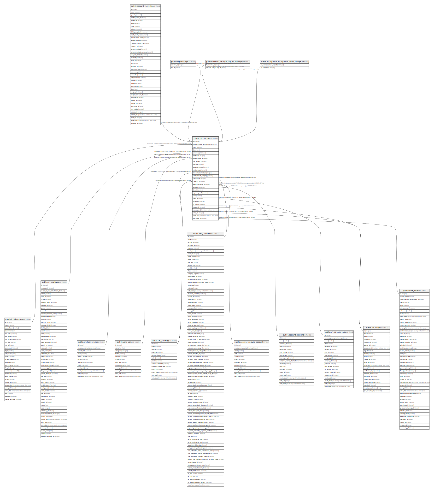

# public.hr_expense

## Description

Expense

## Columns

| Name | Type | Default | Nullable | Children | Parents | Comment |
| ---- | ---- | ------- | -------- | -------- | ------- | ------- |
| id | integer | nextval('hr_expense_id_seq'::regclass) | false | [public.account_move_line](public.account_move_line.md) [public.expense_tax](public.expense_tax.md) [public.account_analytic_tag_hr_expense_rel](public.account_analytic_tag_hr_expense_rel.md) [public.hr_expense_hr_expense_refuse_wizard_rel](public.hr_expense_hr_expense_refuse_wizard_rel.md) |  |  |
| message_main_attachment_id | integer |  | true |  | [public.ir_attachment](public.ir_attachment.md) | Main Attachment |
| name | varchar |  | false |  |  | Description |
| date | date |  | true |  |  | Date |
| employee_id | integer |  | false |  | [public.hr_employee](public.hr_employee.md) | Employee |
| product_id | integer |  | false |  | [public.product_product](public.product_product.md) | Product |
| product_uom_id | integer |  | false |  | [public.uom_uom](public.uom_uom.md) | Unit of Measure |
| unit_amount | numeric |  | false |  |  | Unit Price |
| quantity | numeric |  | false |  |  | Quantity |
| untaxed_amount | numeric |  | true |  |  | Subtotal |
| total_amount | numeric |  | true |  |  | Total |
| company_currency_id | integer |  | true |  | [public.res_currency](public.res_currency.md) | Report Company Currency |
| total_amount_company | numeric |  | true |  |  | Total (Company Currency) |
| company_id | integer |  | true |  | [public.res_company](public.res_company.md) | Company |
| currency_id | integer |  | true |  | [public.res_currency](public.res_currency.md) | Currency |
| analytic_account_id | integer |  | true |  | [public.account_analytic_account](public.account_analytic_account.md) | Analytic Account |
| account_id | integer |  | true |  | [public.account_account](public.account_account.md) | Account |
| description | text |  | true |  |  | Notes... |
| payment_mode | varchar |  | true |  |  | Paid By |
| state | varchar |  | true |  |  | Status |
| sheet_id | integer |  | true |  | [public.hr_expense_sheet](public.hr_expense_sheet.md) | Expense Report |
| reference | varchar |  | true |  |  | Bill Reference |
| is_refused | boolean |  | true |  |  | Explicitely Refused by manager or acccountant |
| create_uid | integer |  | true |  | [public.res_users](public.res_users.md) | Created by |
| create_date | timestamp without time zone |  | true |  |  | Created on |
| write_uid | integer |  | true |  | [public.res_users](public.res_users.md) | Last Updated by |
| write_date | timestamp without time zone |  | true |  |  | Last Updated on |
| sale_order_id | integer |  | true |  | [public.sale_order](public.sale_order.md) | Sale Order |

## Constraints

| Name | Type | Definition |
| ---- | ---- | ---------- |
| hr_expense_create_uid_fkey | FOREIGN KEY | FOREIGN KEY (create_uid) REFERENCES res_users(id) ON DELETE SET NULL |
| hr_expense_write_uid_fkey | FOREIGN KEY | FOREIGN KEY (write_uid) REFERENCES res_users(id) ON DELETE SET NULL |
| hr_expense_company_currency_id_fkey | FOREIGN KEY | FOREIGN KEY (company_currency_id) REFERENCES res_currency(id) ON DELETE SET NULL |
| hr_expense_currency_id_fkey | FOREIGN KEY | FOREIGN KEY (currency_id) REFERENCES res_currency(id) ON DELETE SET NULL |
| hr_expense_company_id_fkey | FOREIGN KEY | FOREIGN KEY (company_id) REFERENCES res_company(id) ON DELETE SET NULL |
| hr_expense_message_main_attachment_id_fkey | FOREIGN KEY | FOREIGN KEY (message_main_attachment_id) REFERENCES ir_attachment(id) ON DELETE SET NULL |
| hr_expense_product_uom_id_fkey | FOREIGN KEY | FOREIGN KEY (product_uom_id) REFERENCES uom_uom(id) ON DELETE SET NULL |
| hr_expense_analytic_account_id_fkey | FOREIGN KEY | FOREIGN KEY (analytic_account_id) REFERENCES account_analytic_account(id) ON DELETE SET NULL |
| hr_expense_product_id_fkey | FOREIGN KEY | FOREIGN KEY (product_id) REFERENCES product_product(id) ON DELETE SET NULL |
| hr_expense_account_id_fkey | FOREIGN KEY | FOREIGN KEY (account_id) REFERENCES account_account(id) ON DELETE SET NULL |
| hr_expense_sale_order_id_fkey | FOREIGN KEY | FOREIGN KEY (sale_order_id) REFERENCES sale_order(id) ON DELETE SET NULL |
| hr_expense_employee_id_fkey | FOREIGN KEY | FOREIGN KEY (employee_id) REFERENCES hr_employee(id) ON DELETE SET NULL |
| hr_expense_pkey | PRIMARY KEY | PRIMARY KEY (id) |
| hr_expense_sheet_id_fkey | FOREIGN KEY | FOREIGN KEY (sheet_id) REFERENCES hr_expense_sheet(id) ON DELETE SET NULL |

## Indexes

| Name | Definition |
| ---- | ---------- |
| hr_expense_pkey | CREATE UNIQUE INDEX hr_expense_pkey ON public.hr_expense USING btree (id) |
| hr_expense_message_main_attachment_id_index | CREATE INDEX hr_expense_message_main_attachment_id_index ON public.hr_expense USING btree (message_main_attachment_id) |
| hr_expense_state_index | CREATE INDEX hr_expense_state_index ON public.hr_expense USING btree (state) |

## Relations

---

> Generated by [tbls](https://github.com/k1LoW/tbls)
