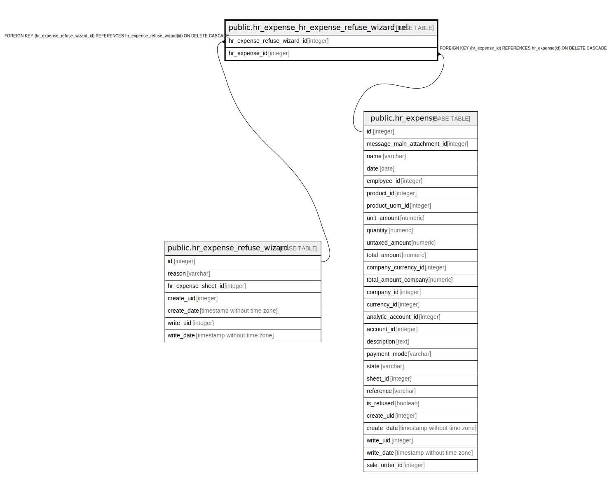

# public.hr_expense_hr_expense_refuse_wizard_rel

## Description

RELATION BETWEEN hr_expense_refuse_wizard AND hr_expense

## Columns

| Name | Type | Default | Nullable | Children | Parents | Comment |
| ---- | ---- | ------- | -------- | -------- | ------- | ------- |
| hr_expense_refuse_wizard_id | integer |  | false |  | [public.hr_expense_refuse_wizard](public.hr_expense_refuse_wizard.md) |  |
| hr_expense_id | integer |  | false |  | [public.hr_expense](public.hr_expense.md) |  |

## Constraints

| Name | Type | Definition |
| ---- | ---- | ---------- |
| hr_expense_hr_expense_refuse_wizard_rel_hr_expense_id_fkey | FOREIGN KEY | FOREIGN KEY (hr_expense_id) REFERENCES hr_expense(id) ON DELETE CASCADE |
| hr_expense_hr_expense_refuse_w_hr_expense_refuse_wizard_id_fkey | FOREIGN KEY | FOREIGN KEY (hr_expense_refuse_wizard_id) REFERENCES hr_expense_refuse_wizard(id) ON DELETE CASCADE |
| hr_expense_hr_expense_refuse__hr_expense_refuse_wizard_id_h_key | UNIQUE | UNIQUE (hr_expense_refuse_wizard_id, hr_expense_id) |

## Indexes

| Name | Definition |
| ---- | ---------- |
| hr_expense_hr_expense_refuse__hr_expense_refuse_wizard_id_h_key | CREATE UNIQUE INDEX hr_expense_hr_expense_refuse__hr_expense_refuse_wizard_id_h_key ON public.hr_expense_hr_expense_refuse_wizard_rel USING btree (hr_expense_refuse_wizard_id, hr_expense_id) |
| hr_expense_hr_expense_refuse_wi_hr_expense_refuse_wizard_id_idx | CREATE INDEX hr_expense_hr_expense_refuse_wi_hr_expense_refuse_wizard_id_idx ON public.hr_expense_hr_expense_refuse_wizard_rel USING btree (hr_expense_refuse_wizard_id) |
| hr_expense_hr_expense_refuse_wizard_rel_hr_expense_id_idx | CREATE INDEX hr_expense_hr_expense_refuse_wizard_rel_hr_expense_id_idx ON public.hr_expense_hr_expense_refuse_wizard_rel USING btree (hr_expense_id) |

## Relations

---

> Generated by [tbls](https://github.com/k1LoW/tbls)
