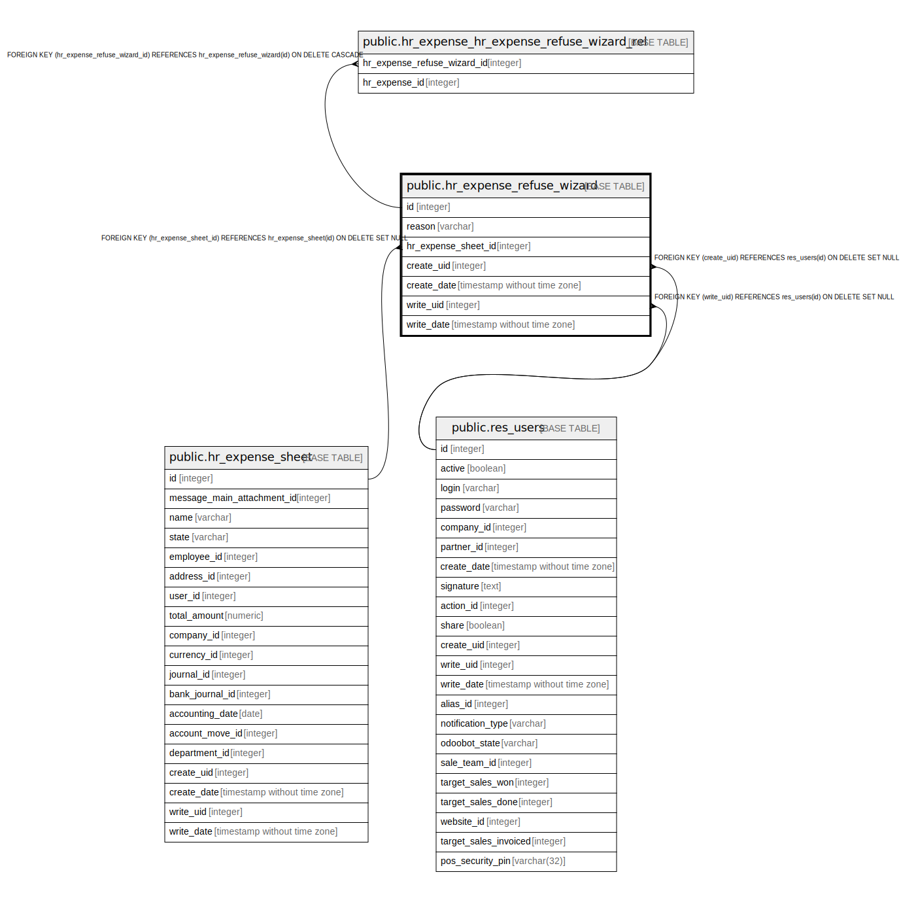

# public.hr_expense_refuse_wizard

## Description

Expense Refuse Reason Wizard

## Columns

| Name | Type | Default | Nullable | Children | Parents | Comment |
| ---- | ---- | ------- | -------- | -------- | ------- | ------- |
| id | integer | nextval('hr_expense_refuse_wizard_id_seq'::regclass) | false | [public.hr_expense_hr_expense_refuse_wizard_rel](public.hr_expense_hr_expense_refuse_wizard_rel.md) |  |  |
| reason | varchar |  | false |  |  | Reason |
| hr_expense_sheet_id | integer |  | true |  | [public.hr_expense_sheet](public.hr_expense_sheet.md) | Hr Expense Sheet |
| create_uid | integer |  | true |  | [public.res_users](public.res_users.md) | Created by |
| create_date | timestamp without time zone |  | true |  |  | Created on |
| write_uid | integer |  | true |  | [public.res_users](public.res_users.md) | Last Updated by |
| write_date | timestamp without time zone |  | true |  |  | Last Updated on |

## Constraints

| Name | Type | Definition |
| ---- | ---- | ---------- |
| hr_expense_refuse_wizard_create_uid_fkey | FOREIGN KEY | FOREIGN KEY (create_uid) REFERENCES res_users(id) ON DELETE SET NULL |
| hr_expense_refuse_wizard_write_uid_fkey | FOREIGN KEY | FOREIGN KEY (write_uid) REFERENCES res_users(id) ON DELETE SET NULL |
| hr_expense_refuse_wizard_hr_expense_sheet_id_fkey | FOREIGN KEY | FOREIGN KEY (hr_expense_sheet_id) REFERENCES hr_expense_sheet(id) ON DELETE SET NULL |
| hr_expense_refuse_wizard_pkey | PRIMARY KEY | PRIMARY KEY (id) |

## Indexes

| Name | Definition |
| ---- | ---------- |
| hr_expense_refuse_wizard_pkey | CREATE UNIQUE INDEX hr_expense_refuse_wizard_pkey ON public.hr_expense_refuse_wizard USING btree (id) |

## Relations

---

> Generated by [tbls](https://github.com/k1LoW/tbls)
