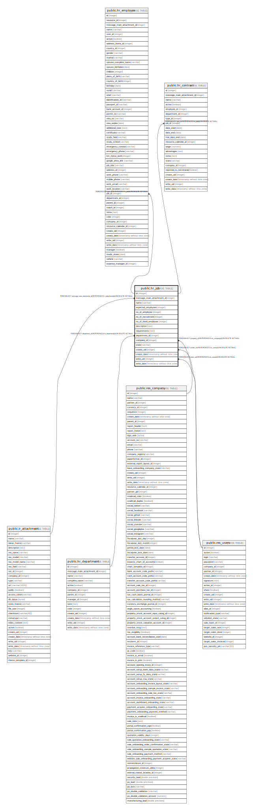

# public.hr_job

## Description

Job Position

## Columns

| Name | Type | Default | Nullable | Children | Parents | Comment |
| ---- | ---- | ------- | -------- | -------- | ------- | ------- |
| id | integer | nextval('hr_job_id_seq'::regclass) | false | [public.hr_employee](public.hr_employee.md) [public.hr_contract](public.hr_contract.md) |  |  |
| message_main_attachment_id | integer |  | true |  | [public.ir_attachment](public.ir_attachment.md) | Main Attachment |
| name | varchar |  | false |  |  | Job Position |
| expected_employees | integer |  | true |  |  | Total Forecasted Employees |
| no_of_employee | integer |  | true |  |  | Current Number of Employees |
| no_of_recruitment | integer |  | true |  |  | Expected New Employees |
| no_of_hired_employee | integer |  | true |  |  | Hired Employees |
| description | text |  | true |  |  | Job Description |
| requirements | text |  | true |  |  | Requirements |
| department_id | integer |  | true |  | [public.hr_department](public.hr_department.md) | Department |
| company_id | integer |  | true |  | [public.res_company](public.res_company.md) | Company |
| state | varchar |  | false |  |  | Status |
| create_uid | integer |  | true |  | [public.res_users](public.res_users.md) | Created by |
| create_date | timestamp without time zone |  | true |  |  | Created on |
| write_uid | integer |  | true |  | [public.res_users](public.res_users.md) | Last Updated by |
| write_date | timestamp without time zone |  | true |  |  | Last Updated on |

## Constraints

| Name | Type | Definition | Comment |
| ---- | ---- | ---------- | ------- |
| hr_job_create_uid_fkey | FOREIGN KEY | FOREIGN KEY (create_uid) REFERENCES res_users(id) ON DELETE SET NULL |  |
| hr_job_write_uid_fkey | FOREIGN KEY | FOREIGN KEY (write_uid) REFERENCES res_users(id) ON DELETE SET NULL |  |
| hr_job_company_id_fkey | FOREIGN KEY | FOREIGN KEY (company_id) REFERENCES res_company(id) ON DELETE SET NULL |  |
| hr_job_message_main_attachment_id_fkey | FOREIGN KEY | FOREIGN KEY (message_main_attachment_id) REFERENCES ir_attachment(id) ON DELETE SET NULL |  |
| hr_job_pkey | PRIMARY KEY | PRIMARY KEY (id) |  |
| hr_job_name_company_uniq | UNIQUE | UNIQUE (name, company_id, department_id) | unique(name, company_id, department_id) |
| hr_job_department_id_fkey | FOREIGN KEY | FOREIGN KEY (department_id) REFERENCES hr_department(id) ON DELETE SET NULL |  |

## Indexes

| Name | Definition |
| ---- | ---------- |
| hr_job_pkey | CREATE UNIQUE INDEX hr_job_pkey ON public.hr_job USING btree (id) |
| hr_job_message_main_attachment_id_index | CREATE INDEX hr_job_message_main_attachment_id_index ON public.hr_job USING btree (message_main_attachment_id) |
| hr_job_name_index | CREATE INDEX hr_job_name_index ON public.hr_job USING btree (name) |
| hr_job_name_company_uniq | CREATE UNIQUE INDEX hr_job_name_company_uniq ON public.hr_job USING btree (name, company_id, department_id) |

## Relations

---

> Generated by [tbls](https://github.com/k1LoW/tbls)
