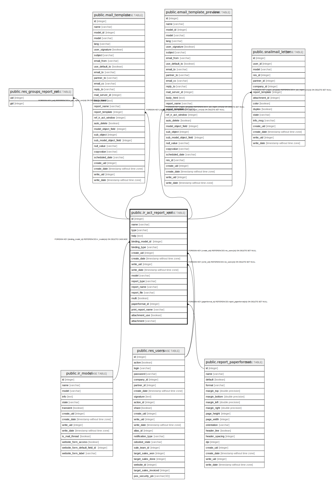

# public.ir_act_report_xml

## Description

## Columns

| Name | Type | Default | Nullable | Children | Parents | Comment |
| ---- | ---- | ------- | -------- | -------- | ------- | ------- |
| id | integer | nextval('ir_actions_id_seq'::regclass) | false | [public.res_groups_report_rel](public.res_groups_report_rel.md) [public.mail_template](public.mail_template.md) [public.email_template_preview](public.email_template_preview.md) [public.snailmail_letter](public.snailmail_letter.md) |  |  |
| name | varchar |  | false |  |  |  |
| type | varchar |  | false |  |  |  |
| help | text |  | true |  |  |  |
| binding_model_id | integer |  | true |  | [public.ir_model](public.ir_model.md) |  |
| binding_type | varchar |  | false |  |  |  |
| create_uid | integer |  | true |  | [public.res_users](public.res_users.md) |  |
| create_date | timestamp without time zone |  | true |  |  |  |
| write_uid | integer |  | true |  | [public.res_users](public.res_users.md) |  |
| write_date | timestamp without time zone |  | true |  |  |  |
| model | varchar |  | false |  |  | Model Name |
| report_type | varchar |  | false |  |  | Report Type |
| report_name | varchar |  | false |  |  | Template Name |
| report_file | varchar |  | true |  |  | Report File |
| multi | boolean |  | true |  |  | On Multiple Doc. |
| paperformat_id | integer |  | true |  | [public.report_paperformat](public.report_paperformat.md) | Paper Format |
| print_report_name | varchar |  | true |  |  | Printed Report Name |
| attachment_use | boolean |  | true |  |  | Reload from Attachment |
| attachment | varchar |  | true |  |  | Save as Attachment Prefix |

## Constraints

| Name | Type | Definition |
| ---- | ---- | ---------- |
| ir_act_report_xml_pkey | PRIMARY KEY | PRIMARY KEY (id) |
| ir_act_report_xml_create_uid_fkey | FOREIGN KEY | FOREIGN KEY (create_uid) REFERENCES res_users(id) ON DELETE SET NULL |
| ir_act_report_xml_write_uid_fkey | FOREIGN KEY | FOREIGN KEY (write_uid) REFERENCES res_users(id) ON DELETE SET NULL |
| ir_act_report_xml_binding_model_id_fkey | FOREIGN KEY | FOREIGN KEY (binding_model_id) REFERENCES ir_model(id) ON DELETE CASCADE |
| ir_act_report_xml_paperformat_id_fkey | FOREIGN KEY | FOREIGN KEY (paperformat_id) REFERENCES report_paperformat(id) ON DELETE SET NULL |

## Indexes

| Name | Definition |
| ---- | ---------- |
| ir_act_report_xml_pkey | CREATE UNIQUE INDEX ir_act_report_xml_pkey ON public.ir_act_report_xml USING btree (id) |

## Relations

---

> Generated by [tbls](https://github.com/k1LoW/tbls)
