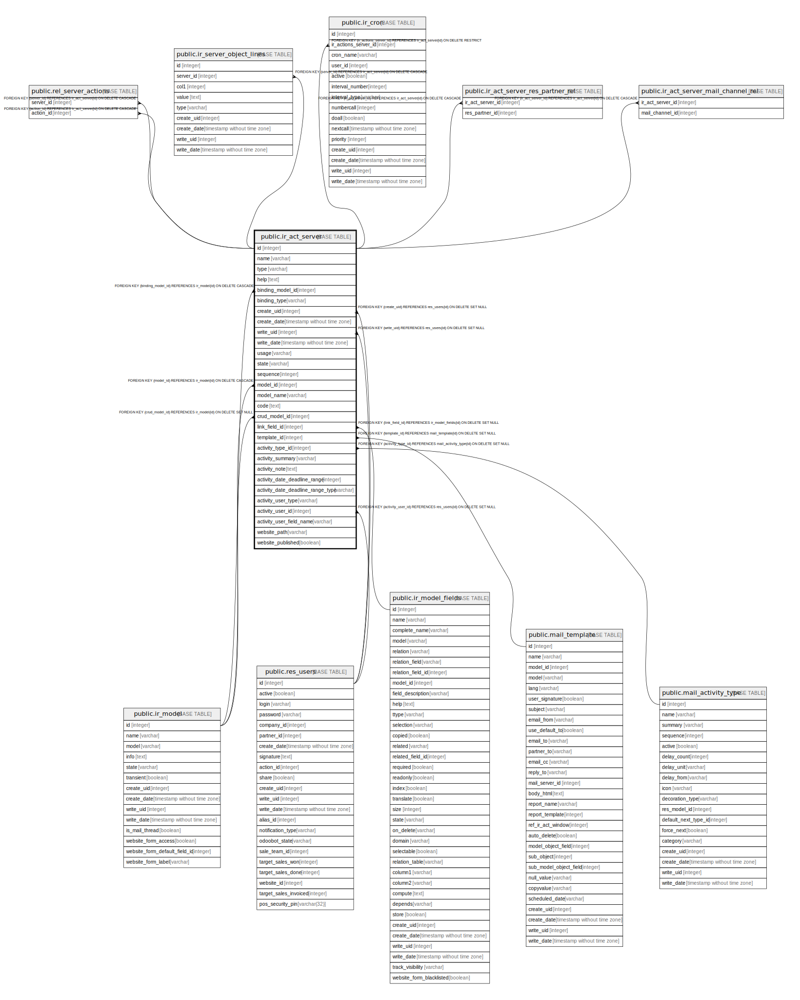

# public.ir_act_server

## Description

## Columns

| Name | Type | Default | Nullable | Children | Parents | Comment |
| ---- | ---- | ------- | -------- | -------- | ------- | ------- |
| id | integer | nextval('ir_actions_id_seq'::regclass) | false | [public.rel_server_actions](public.rel_server_actions.md) [public.ir_server_object_lines](public.ir_server_object_lines.md) [public.ir_cron](public.ir_cron.md) [public.ir_act_server_res_partner_rel](public.ir_act_server_res_partner_rel.md) [public.ir_act_server_mail_channel_rel](public.ir_act_server_mail_channel_rel.md) |  |  |
| name | varchar |  | false |  |  |  |
| type | varchar |  | false |  |  |  |
| help | text |  | true |  |  |  |
| binding_model_id | integer |  | true |  | [public.ir_model](public.ir_model.md) |  |
| binding_type | varchar |  | false |  |  |  |
| create_uid | integer |  | true |  | [public.res_users](public.res_users.md) |  |
| create_date | timestamp without time zone |  | true |  |  |  |
| write_uid | integer |  | true |  | [public.res_users](public.res_users.md) |  |
| write_date | timestamp without time zone |  | true |  |  |  |
| usage | varchar |  | false |  |  | Usage |
| state | varchar |  | false |  |  | Action To Do |
| sequence | integer |  | true |  |  | Sequence |
| model_id | integer |  | false |  | [public.ir_model](public.ir_model.md) | Model |
| model_name | varchar |  | true |  |  | Model Name |
| code | text |  | true |  |  | Python Code |
| crud_model_id | integer |  | true |  | [public.ir_model](public.ir_model.md) | Create/Write Target Model |
| link_field_id | integer |  | true |  | [public.ir_model_fields](public.ir_model_fields.md) | Link using field |
| template_id | integer |  | true |  | [public.mail_template](public.mail_template.md) | Email Template |
| activity_type_id | integer |  | true |  | [public.mail_activity_type](public.mail_activity_type.md) | Activity |
| activity_summary | varchar |  | true |  |  | Summary |
| activity_note | text |  | true |  |  | Note |
| activity_date_deadline_range | integer |  | true |  |  | Due Date In |
| activity_date_deadline_range_type | varchar |  | true |  |  | Due type |
| activity_user_type | varchar |  | false |  |  | Activity User Type |
| activity_user_id | integer |  | true |  | [public.res_users](public.res_users.md) | Responsible |
| activity_user_field_name | varchar |  | true |  |  | User field name |
| website_path | varchar |  | true |  |  | Website Path |
| website_published | boolean |  | true |  |  | Available on the Website |

## Constraints

| Name | Type | Definition |
| ---- | ---- | ---------- |
| ir_act_server_pkey | PRIMARY KEY | PRIMARY KEY (id) |
| ir_act_server_activity_user_id_fkey | FOREIGN KEY | FOREIGN KEY (activity_user_id) REFERENCES res_users(id) ON DELETE SET NULL |
| ir_act_server_create_uid_fkey | FOREIGN KEY | FOREIGN KEY (create_uid) REFERENCES res_users(id) ON DELETE SET NULL |
| ir_act_server_write_uid_fkey | FOREIGN KEY | FOREIGN KEY (write_uid) REFERENCES res_users(id) ON DELETE SET NULL |
| ir_act_server_binding_model_id_fkey | FOREIGN KEY | FOREIGN KEY (binding_model_id) REFERENCES ir_model(id) ON DELETE CASCADE |
| ir_act_server_crud_model_id_fkey | FOREIGN KEY | FOREIGN KEY (crud_model_id) REFERENCES ir_model(id) ON DELETE SET NULL |
| ir_act_server_model_id_fkey | FOREIGN KEY | FOREIGN KEY (model_id) REFERENCES ir_model(id) ON DELETE CASCADE |
| ir_act_server_link_field_id_fkey | FOREIGN KEY | FOREIGN KEY (link_field_id) REFERENCES ir_model_fields(id) ON DELETE SET NULL |
| ir_act_server_activity_type_id_fkey | FOREIGN KEY | FOREIGN KEY (activity_type_id) REFERENCES mail_activity_type(id) ON DELETE SET NULL |
| ir_act_server_template_id_fkey | FOREIGN KEY | FOREIGN KEY (template_id) REFERENCES mail_template(id) ON DELETE SET NULL |

## Indexes

| Name | Definition |
| ---- | ---------- |
| ir_act_server_pkey | CREATE UNIQUE INDEX ir_act_server_pkey ON public.ir_act_server USING btree (id) |

## Relations

---

> Generated by [tbls](https://github.com/k1LoW/tbls)
