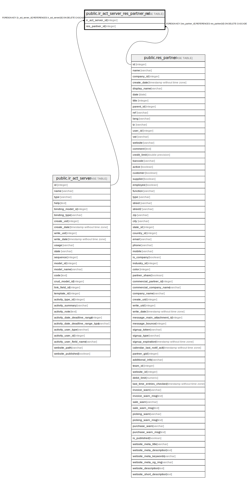

# public.ir_act_server_res_partner_rel

## Description

RELATION BETWEEN ir_act_server AND res_partner

## Columns

| Name | Type | Default | Nullable | Children | Parents | Comment |
| ---- | ---- | ------- | -------- | -------- | ------- | ------- |
| ir_act_server_id | integer |  | false |  | [public.ir_act_server](public.ir_act_server.md) |  |
| res_partner_id | integer |  | false |  | [public.res_partner](public.res_partner.md) |  |

## Constraints

| Name | Type | Definition |
| ---- | ---- | ---------- |
| ir_act_server_res_partner_rel_ir_act_server_id_fkey | FOREIGN KEY | FOREIGN KEY (ir_act_server_id) REFERENCES ir_act_server(id) ON DELETE CASCADE |
| ir_act_server_res_partner_rel_res_partner_id_fkey | FOREIGN KEY | FOREIGN KEY (res_partner_id) REFERENCES res_partner(id) ON DELETE CASCADE |
| ir_act_server_res_partner_rel_ir_act_server_id_res_partner__key | UNIQUE | UNIQUE (ir_act_server_id, res_partner_id) |

## Indexes

| Name | Definition |
| ---- | ---------- |
| ir_act_server_res_partner_rel_ir_act_server_id_res_partner__key | CREATE UNIQUE INDEX ir_act_server_res_partner_rel_ir_act_server_id_res_partner__key ON public.ir_act_server_res_partner_rel USING btree (ir_act_server_id, res_partner_id) |
| ir_act_server_res_partner_rel_ir_act_server_id_idx | CREATE INDEX ir_act_server_res_partner_rel_ir_act_server_id_idx ON public.ir_act_server_res_partner_rel USING btree (ir_act_server_id) |
| ir_act_server_res_partner_rel_res_partner_id_idx | CREATE INDEX ir_act_server_res_partner_rel_res_partner_id_idx ON public.ir_act_server_res_partner_rel USING btree (res_partner_id) |

## Relations

---

> Generated by [tbls](https://github.com/k1LoW/tbls)
