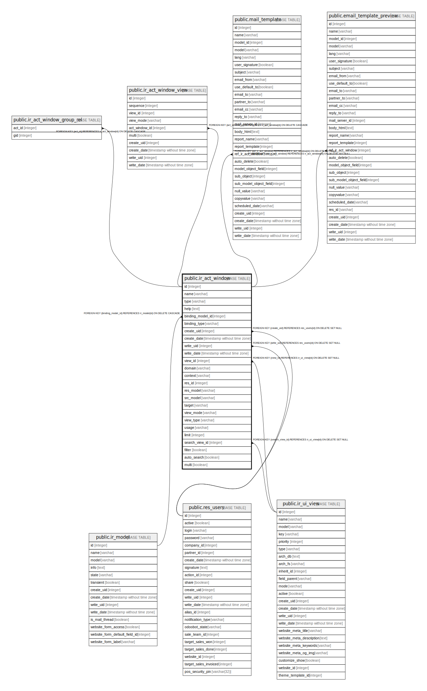

# public.ir_act_window

## Description

## Columns

| Name | Type | Default | Nullable | Children | Parents | Comment |
| ---- | ---- | ------- | -------- | -------- | ------- | ------- |
| id | integer | nextval('ir_actions_id_seq'::regclass) | false | [public.ir_act_window_group_rel](public.ir_act_window_group_rel.md) [public.ir_act_window_view](public.ir_act_window_view.md) [public.mail_template](public.mail_template.md) [public.email_template_preview](public.email_template_preview.md) |  |  |
| name | varchar |  | false |  |  |  |
| type | varchar |  | false |  |  |  |
| help | text |  | true |  |  |  |
| binding_model_id | integer |  | true |  | [public.ir_model](public.ir_model.md) |  |
| binding_type | varchar |  | false |  |  |  |
| create_uid | integer |  | true |  | [public.res_users](public.res_users.md) |  |
| create_date | timestamp without time zone |  | true |  |  |  |
| write_uid | integer |  | true |  | [public.res_users](public.res_users.md) |  |
| write_date | timestamp without time zone |  | true |  |  |  |
| view_id | integer |  | true |  | [public.ir_ui_view](public.ir_ui_view.md) | View Ref. |
| domain | varchar |  | true |  |  | Domain Value |
| context | varchar |  | false |  |  | Context Value |
| res_id | integer |  | true |  |  | Record ID |
| res_model | varchar |  | false |  |  | Destination Model |
| src_model | varchar |  | true |  |  | Source Model |
| target | varchar |  | true |  |  | Target Window |
| view_mode | varchar |  | false |  |  | View Mode |
| view_type | varchar |  | false |  |  | View Type |
| usage | varchar |  | true |  |  | Action Usage |
| limit | integer |  | true |  |  | Limit |
| search_view_id | integer |  | true |  | [public.ir_ui_view](public.ir_ui_view.md) | Search View Ref. |
| filter | boolean |  | true |  |  | Filter |
| auto_search | boolean |  | true |  |  | Auto Search |
| multi | boolean |  | true |  |  | Restrict to lists |

## Constraints

| Name | Type | Definition |
| ---- | ---- | ---------- |
| ir_act_window_pkey | PRIMARY KEY | PRIMARY KEY (id) |
| ir_act_window_create_uid_fkey | FOREIGN KEY | FOREIGN KEY (create_uid) REFERENCES res_users(id) ON DELETE SET NULL |
| ir_act_window_write_uid_fkey | FOREIGN KEY | FOREIGN KEY (write_uid) REFERENCES res_users(id) ON DELETE SET NULL |
| ir_act_window_binding_model_id_fkey | FOREIGN KEY | FOREIGN KEY (binding_model_id) REFERENCES ir_model(id) ON DELETE CASCADE |
| ir_act_window_search_view_id_fkey | FOREIGN KEY | FOREIGN KEY (search_view_id) REFERENCES ir_ui_view(id) ON DELETE SET NULL |
| ir_act_window_view_id_fkey | FOREIGN KEY | FOREIGN KEY (view_id) REFERENCES ir_ui_view(id) ON DELETE SET NULL |

## Indexes

| Name | Definition |
| ---- | ---------- |
| ir_act_window_pkey | CREATE UNIQUE INDEX ir_act_window_pkey ON public.ir_act_window USING btree (id) |

## Relations

---

> Generated by [tbls](https://github.com/k1LoW/tbls)
