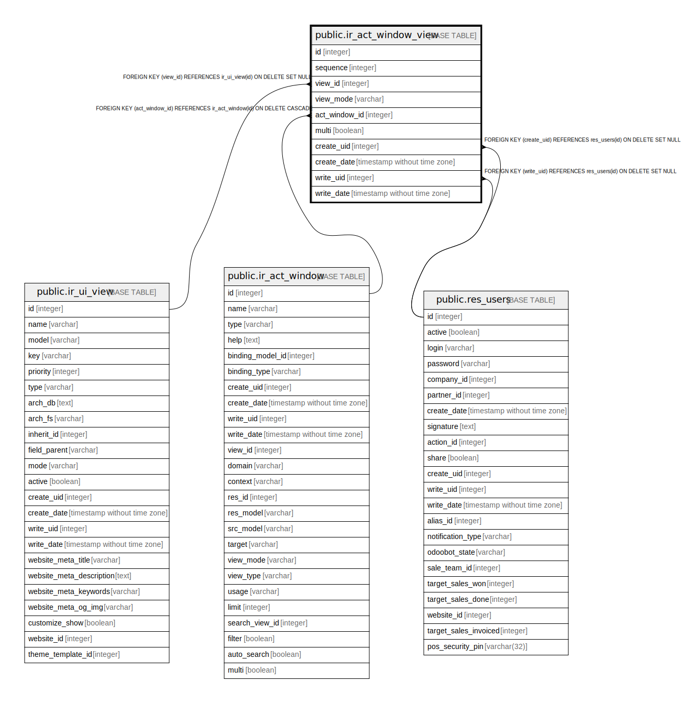

# public.ir_act_window_view

## Description

Action Window View

## Columns

| Name | Type | Default | Nullable | Children | Parents | Comment |
| ---- | ---- | ------- | -------- | -------- | ------- | ------- |
| id | integer | nextval('ir_act_window_view_id_seq'::regclass) | false |  |  |  |
| sequence | integer |  | true |  |  | Sequence |
| view_id | integer |  | true |  | [public.ir_ui_view](public.ir_ui_view.md) | View |
| view_mode | varchar |  | false |  |  | View Type |
| act_window_id | integer |  | true |  | [public.ir_act_window](public.ir_act_window.md) | Action |
| multi | boolean |  | true |  |  | On Multiple Doc. |
| create_uid | integer |  | true |  | [public.res_users](public.res_users.md) | Created by |
| create_date | timestamp without time zone |  | true |  |  | Created on |
| write_uid | integer |  | true |  | [public.res_users](public.res_users.md) | Last Updated by |
| write_date | timestamp without time zone |  | true |  |  | Last Updated on |

## Constraints

| Name | Type | Definition |
| ---- | ---- | ---------- |
| ir_act_window_view_act_window_id_fkey | FOREIGN KEY | FOREIGN KEY (act_window_id) REFERENCES ir_act_window(id) ON DELETE CASCADE |
| ir_act_window_view_create_uid_fkey | FOREIGN KEY | FOREIGN KEY (create_uid) REFERENCES res_users(id) ON DELETE SET NULL |
| ir_act_window_view_write_uid_fkey | FOREIGN KEY | FOREIGN KEY (write_uid) REFERENCES res_users(id) ON DELETE SET NULL |
| ir_act_window_view_view_id_fkey | FOREIGN KEY | FOREIGN KEY (view_id) REFERENCES ir_ui_view(id) ON DELETE SET NULL |
| ir_act_window_view_pkey | PRIMARY KEY | PRIMARY KEY (id) |

## Indexes

| Name | Definition |
| ---- | ---------- |
| ir_act_window_view_pkey | CREATE UNIQUE INDEX ir_act_window_view_pkey ON public.ir_act_window_view USING btree (id) |
| act_window_view_unique_mode_per_action | CREATE UNIQUE INDEX act_window_view_unique_mode_per_action ON public.ir_act_window_view USING btree (act_window_id, view_mode) |

## Relations

---

> Generated by [tbls](https://github.com/k1LoW/tbls)
