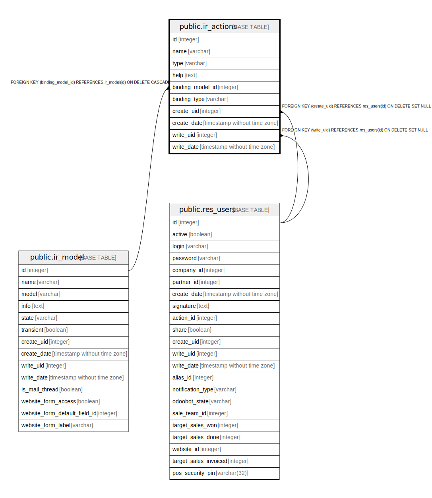

# public.ir_actions

## Description

## Columns

| Name | Type | Default | Nullable | Children | Parents | Comment |
| ---- | ---- | ------- | -------- | -------- | ------- | ------- |
| id | integer | nextval('ir_actions_id_seq'::regclass) | false |  |  |  |
| name | varchar |  | false |  |  | Name |
| type | varchar |  | false |  |  | Action Type |
| help | text |  | true |  |  | Action Description |
| binding_model_id | integer |  | true |  | [public.ir_model](public.ir_model.md) | Binding Model |
| binding_type | varchar |  | false |  |  | Binding Type |
| create_uid | integer |  | true |  | [public.res_users](public.res_users.md) | Created by |
| create_date | timestamp without time zone |  | true |  |  | Created on |
| write_uid | integer |  | true |  | [public.res_users](public.res_users.md) | Last Updated by |
| write_date | timestamp without time zone |  | true |  |  | Last Updated on |

## Constraints

| Name | Type | Definition |
| ---- | ---- | ---------- |
| ir_actions_pkey | PRIMARY KEY | PRIMARY KEY (id) |
| ir_actions_create_uid_fkey | FOREIGN KEY | FOREIGN KEY (create_uid) REFERENCES res_users(id) ON DELETE SET NULL |
| ir_actions_write_uid_fkey | FOREIGN KEY | FOREIGN KEY (write_uid) REFERENCES res_users(id) ON DELETE SET NULL |
| ir_actions_binding_model_id_fkey | FOREIGN KEY | FOREIGN KEY (binding_model_id) REFERENCES ir_model(id) ON DELETE CASCADE |

## Indexes

| Name | Definition |
| ---- | ---------- |
| ir_actions_pkey | CREATE UNIQUE INDEX ir_actions_pkey ON public.ir_actions USING btree (id) |

## Relations

---

> Generated by [tbls](https://github.com/k1LoW/tbls)
