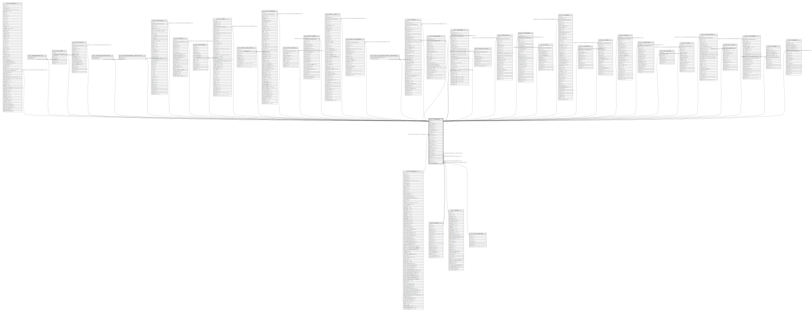

# public.ir_attachment

## Description

Attachment

## Columns

| Name | Type | Default | Nullable | Children | Parents | Comment |
| ---- | ---- | ------- | -------- | -------- | ------- | ------- |
| id | integer | nextval('ir_attachment_id_seq'::regclass) | false | [public.res_partner](public.res_partner.md) [public.message_attachment_rel](public.message_attachment_rel.md) [public.mail_blacklist](public.mail_blacklist.md) [public.mail_channel](public.mail_channel.md) [public.email_template_attachment_rel](public.email_template_attachment_rel.md) [public.mail_compose_message_ir_attachments_rel](public.mail_compose_message_ir_attachments_rel.md) [public.calendar_event](public.calendar_event.md) [public.crm_team](public.crm_team.md) [public.snailmail_letter](public.snailmail_letter.md) [public.crm_lead](public.crm_lead.md) [public.account_analytic_account](public.account_analytic_account.md) [public.product_template](public.product_template.md) [public.product_product](public.product_product.md) [public.account_payment](public.account_payment.md) [public.account_invoice](public.account_invoice.md) [public.account_bank_statement](public.account_bank_statement.md) [public.account_invoice_import_wizard_ir_attachment_rel](public.account_invoice_import_wizard_ir_attachment_rel.md) [public.sale_order](public.sale_order.md) [public.project_project](public.project_project.md) [public.project_task](public.project_task.md) [public.stock_production_lot](public.stock_production_lot.md) [public.stock_picking](public.stock_picking.md) [public.purchase_order](public.purchase_order.md) [public.hr_job](public.hr_job.md) [public.hr_employee](public.hr_employee.md) [public.hr_department](public.hr_department.md) [public.hr_contract](public.hr_contract.md) [public.hr_expense](public.hr_expense.md) [public.hr_expense_sheet](public.hr_expense_sheet.md) [public.mrp_document](public.mrp_document.md) [public.mrp_bom](public.mrp_bom.md) [public.mrp_production](public.mrp_production.md) [public.mrp_unbuild](public.mrp_unbuild.md) [public.mrp_workorder](public.mrp_workorder.md) [public.blog_blog](public.blog_blog.md) [public.blog_post](public.blog_post.md) |  |  |
| name | varchar |  | false |  |  | Name |
| datas_fname | varchar |  | true |  |  | Filename |
| description | text |  | true |  |  | Description |
| res_name | varchar |  | true |  |  | Resource Name |
| res_model | varchar |  | true |  |  | Resource Model |
| res_model_name | varchar |  | true |  |  | Res Model Name |
| res_field | varchar |  | true |  |  | Resource Field |
| res_id | integer |  | true |  |  | Resource ID |
| company_id | integer |  | true |  | [public.res_company](public.res_company.md) | Company |
| type | varchar |  | false |  |  | Type |
| url | varchar(1024) |  | true |  |  | Url |
| public | boolean |  | true |  |  | Is public document |
| access_token | varchar |  | true |  |  | Access Token |
| db_datas | bytea |  | true |  |  | Database Data |
| store_fname | varchar |  | true |  |  | Stored Filename |
| file_size | integer |  | true |  |  | File Size |
| checksum | varchar(40) |  | true |  |  | Checksum/SHA1 |
| mimetype | varchar |  | true |  |  | Mime Type |
| index_content | text |  | true |  |  | Indexed Content |
| active | boolean |  | true |  |  | Active |
| create_uid | integer |  | true |  | [public.res_users](public.res_users.md) | Created by |
| create_date | timestamp without time zone |  | true |  |  | Created on |
| write_uid | integer |  | true |  | [public.res_users](public.res_users.md) | Last Updated by |
| write_date | timestamp without time zone |  | true |  |  | Last Updated on |
| key | varchar |  | true |  |  | Key |
| website_id | integer |  | true |  | [public.website](public.website.md) | Website |
| theme_template_id | integer |  | true |  | [public.theme_ir_attachment](public.theme_ir_attachment.md) | Theme Template |

## Constraints

| Name | Type | Definition |
| ---- | ---- | ---------- |
| ir_attachment_create_uid_fkey | FOREIGN KEY | FOREIGN KEY (create_uid) REFERENCES res_users(id) ON DELETE SET NULL |
| ir_attachment_write_uid_fkey | FOREIGN KEY | FOREIGN KEY (write_uid) REFERENCES res_users(id) ON DELETE SET NULL |
| ir_attachment_company_id_fkey | FOREIGN KEY | FOREIGN KEY (company_id) REFERENCES res_company(id) ON DELETE SET NULL |
| ir_attachment_pkey | PRIMARY KEY | PRIMARY KEY (id) |
| ir_attachment_website_id_fkey | FOREIGN KEY | FOREIGN KEY (website_id) REFERENCES website(id) ON DELETE SET NULL |
| ir_attachment_theme_template_id_fkey | FOREIGN KEY | FOREIGN KEY (theme_template_id) REFERENCES theme_ir_attachment(id) ON DELETE SET NULL |

## Indexes

| Name | Definition |
| ---- | ---------- |
| ir_attachment_pkey | CREATE UNIQUE INDEX ir_attachment_pkey ON public.ir_attachment USING btree (id) |
| ir_attachment_res_model_name_index | CREATE INDEX ir_attachment_res_model_name_index ON public.ir_attachment USING btree (res_model_name) |
| ir_attachment_url_index | CREATE INDEX ir_attachment_url_index ON public.ir_attachment USING btree (url) |
| ir_attachment_checksum_index | CREATE INDEX ir_attachment_checksum_index ON public.ir_attachment USING btree (checksum) |
| ir_attachment_res_idx | CREATE INDEX ir_attachment_res_idx ON public.ir_attachment USING btree (res_model, res_id) |
| ir_attachment_key_website_idx | CREATE INDEX ir_attachment_key_website_idx ON public.ir_attachment USING btree (key, website_id) |

## Relations

---

> Generated by [tbls](https://github.com/k1LoW/tbls)
