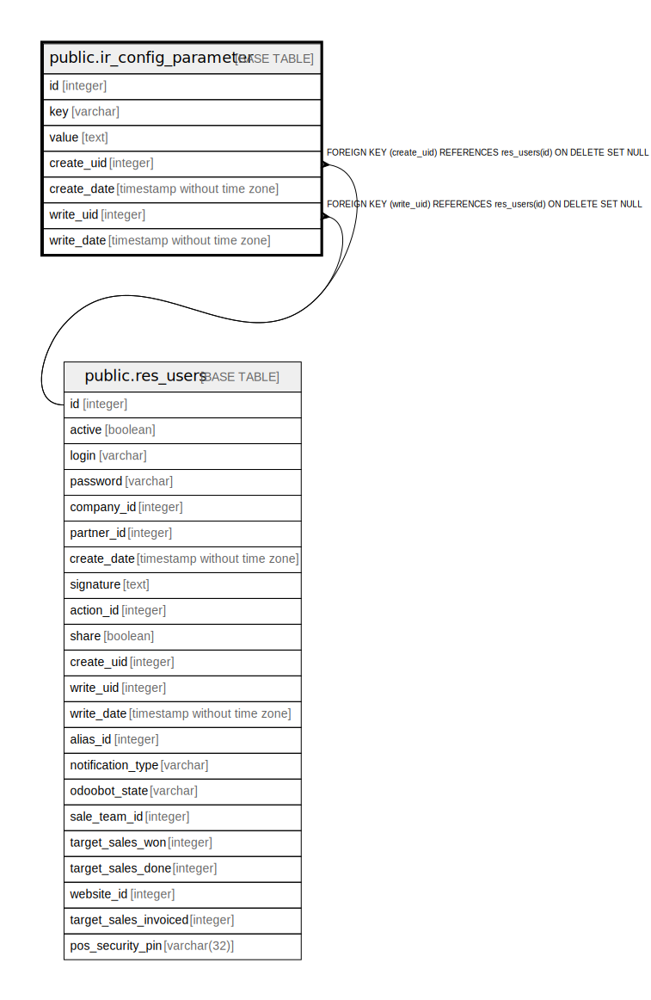

# public.ir_config_parameter

## Description

System Parameter

## Columns

| Name | Type | Default | Nullable | Children | Parents | Comment |
| ---- | ---- | ------- | -------- | -------- | ------- | ------- |
| id | integer | nextval('ir_config_parameter_id_seq'::regclass) | false |  |  |  |
| key | varchar |  | false |  |  | Key |
| value | text |  | false |  |  | Value |
| create_uid | integer |  | true |  | [public.res_users](public.res_users.md) | Created by |
| create_date | timestamp without time zone |  | true |  |  | Created on |
| write_uid | integer |  | true |  | [public.res_users](public.res_users.md) | Last Updated by |
| write_date | timestamp without time zone |  | true |  |  | Last Updated on |

## Constraints

| Name | Type | Definition | Comment |
| ---- | ---- | ---------- | ------- |
| ir_config_parameter_create_uid_fkey | FOREIGN KEY | FOREIGN KEY (create_uid) REFERENCES res_users(id) ON DELETE SET NULL |  |
| ir_config_parameter_write_uid_fkey | FOREIGN KEY | FOREIGN KEY (write_uid) REFERENCES res_users(id) ON DELETE SET NULL |  |
| ir_config_parameter_pkey | PRIMARY KEY | PRIMARY KEY (id) |  |
| ir_config_parameter_key_uniq | UNIQUE | UNIQUE (key) | unique (key) |

## Indexes

| Name | Definition |
| ---- | ---------- |
| ir_config_parameter_pkey | CREATE UNIQUE INDEX ir_config_parameter_pkey ON public.ir_config_parameter USING btree (id) |
| ir_config_parameter_key_index | CREATE INDEX ir_config_parameter_key_index ON public.ir_config_parameter USING btree (key) |
| ir_config_parameter_key_uniq | CREATE UNIQUE INDEX ir_config_parameter_key_uniq ON public.ir_config_parameter USING btree (key) |

## Relations

---

> Generated by [tbls](https://github.com/k1LoW/tbls)
