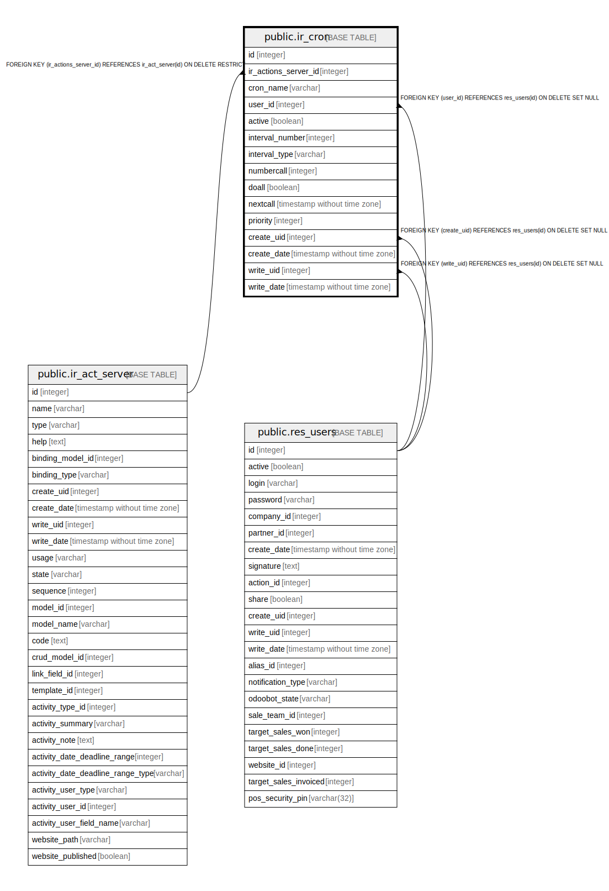

# public.ir_cron

## Description

Scheduled Actions

## Columns

| Name | Type | Default | Nullable | Children | Parents | Comment |
| ---- | ---- | ------- | -------- | -------- | ------- | ------- |
| id | integer | nextval('ir_cron_id_seq'::regclass) | false |  |  |  |
| ir_actions_server_id | integer |  | false |  | [public.ir_act_server](public.ir_act_server.md) | Server action |
| cron_name | varchar |  | true |  |  | Name |
| user_id | integer |  | false |  | [public.res_users](public.res_users.md) | Scheduler User |
| active | boolean |  | true |  |  | Active |
| interval_number | integer |  | true |  |  | Interval Number |
| interval_type | varchar |  | true |  |  | Interval Unit |
| numbercall | integer |  | true |  |  | Number of Calls |
| doall | boolean |  | true |  |  | Repeat Missed |
| nextcall | timestamp without time zone |  | false |  |  | Next Execution Date |
| priority | integer |  | true |  |  | Priority |
| create_uid | integer |  | true |  | [public.res_users](public.res_users.md) | Created by |
| create_date | timestamp without time zone |  | true |  |  | Created on |
| write_uid | integer |  | true |  | [public.res_users](public.res_users.md) | Last Updated by |
| write_date | timestamp without time zone |  | true |  |  | Last Updated on |

## Constraints

| Name | Type | Definition |
| ---- | ---- | ---------- |
| ir_cron_ir_actions_server_id_fkey | FOREIGN KEY | FOREIGN KEY (ir_actions_server_id) REFERENCES ir_act_server(id) ON DELETE RESTRICT |
| ir_cron_create_uid_fkey | FOREIGN KEY | FOREIGN KEY (create_uid) REFERENCES res_users(id) ON DELETE SET NULL |
| ir_cron_user_id_fkey | FOREIGN KEY | FOREIGN KEY (user_id) REFERENCES res_users(id) ON DELETE SET NULL |
| ir_cron_write_uid_fkey | FOREIGN KEY | FOREIGN KEY (write_uid) REFERENCES res_users(id) ON DELETE SET NULL |
| ir_cron_pkey | PRIMARY KEY | PRIMARY KEY (id) |

## Indexes

| Name | Definition |
| ---- | ---------- |
| ir_cron_pkey | CREATE UNIQUE INDEX ir_cron_pkey ON public.ir_cron USING btree (id) |

## Relations

---

> Generated by [tbls](https://github.com/k1LoW/tbls)
