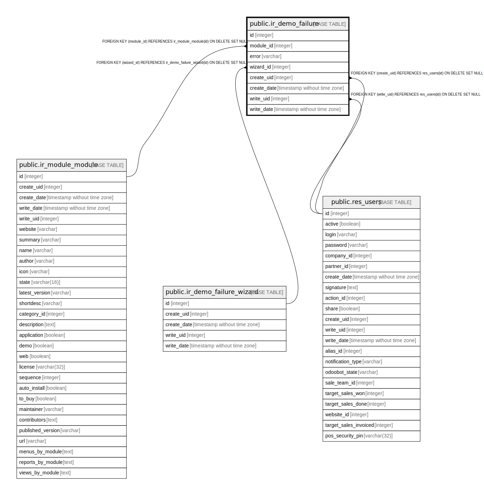

# public.ir_demo_failure

## Description

Demo failure

## Columns

| Name | Type | Default | Nullable | Children | Parents | Comment |
| ---- | ---- | ------- | -------- | -------- | ------- | ------- |
| id | integer | nextval('ir_demo_failure_id_seq'::regclass) | false |  |  |  |
| module_id | integer |  | false |  | [public.ir_module_module](public.ir_module_module.md) | Module |
| error | varchar |  | true |  |  | Error |
| wizard_id | integer |  | true |  | [public.ir_demo_failure_wizard](public.ir_demo_failure_wizard.md) | Wizard |
| create_uid | integer |  | true |  | [public.res_users](public.res_users.md) | Created by |
| create_date | timestamp without time zone |  | true |  |  | Created on |
| write_uid | integer |  | true |  | [public.res_users](public.res_users.md) | Last Updated by |
| write_date | timestamp without time zone |  | true |  |  | Last Updated on |

## Constraints

| Name | Type | Definition |
| ---- | ---- | ---------- |
| ir_demo_failure_create_uid_fkey | FOREIGN KEY | FOREIGN KEY (create_uid) REFERENCES res_users(id) ON DELETE SET NULL |
| ir_demo_failure_write_uid_fkey | FOREIGN KEY | FOREIGN KEY (write_uid) REFERENCES res_users(id) ON DELETE SET NULL |
| ir_demo_failure_module_id_fkey | FOREIGN KEY | FOREIGN KEY (module_id) REFERENCES ir_module_module(id) ON DELETE SET NULL |
| ir_demo_failure_pkey | PRIMARY KEY | PRIMARY KEY (id) |
| ir_demo_failure_wizard_id_fkey | FOREIGN KEY | FOREIGN KEY (wizard_id) REFERENCES ir_demo_failure_wizard(id) ON DELETE SET NULL |

## Indexes

| Name | Definition |
| ---- | ---------- |
| ir_demo_failure_pkey | CREATE UNIQUE INDEX ir_demo_failure_pkey ON public.ir_demo_failure USING btree (id) |

## Relations

---

> Generated by [tbls](https://github.com/k1LoW/tbls)
