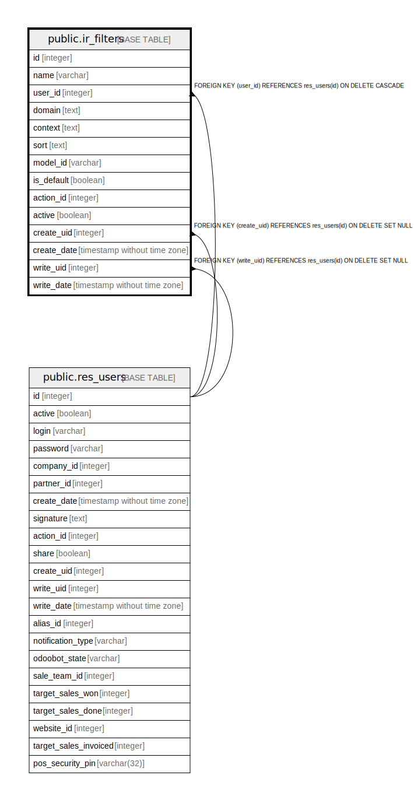

# public.ir_filters

## Description

Filters

## Columns

| Name | Type | Default | Nullable | Children | Parents | Comment |
| ---- | ---- | ------- | -------- | -------- | ------- | ------- |
| id | integer | nextval('ir_filters_id_seq'::regclass) | false |  |  |  |
| name | varchar |  | false |  |  | Filter Name |
| user_id | integer |  | true |  | [public.res_users](public.res_users.md) | User |
| domain | text |  | false |  |  | Domain |
| context | text |  | false |  |  | Context |
| sort | text |  | false |  |  | Sort |
| model_id | varchar |  | false |  |  | Model |
| is_default | boolean |  | true |  |  | Default Filter |
| action_id | integer |  | true |  |  | Action |
| active | boolean |  | true |  |  | Active |
| create_uid | integer |  | true |  | [public.res_users](public.res_users.md) | Created by |
| create_date | timestamp without time zone |  | true |  |  | Created on |
| write_uid | integer |  | true |  | [public.res_users](public.res_users.md) | Last Updated by |
| write_date | timestamp without time zone |  | true |  |  | Last Updated on |

## Constraints

| Name | Type | Definition | Comment |
| ---- | ---- | ---------- | ------- |
| ir_filters_create_uid_fkey | FOREIGN KEY | FOREIGN KEY (create_uid) REFERENCES res_users(id) ON DELETE SET NULL |  |
| ir_filters_user_id_fkey | FOREIGN KEY | FOREIGN KEY (user_id) REFERENCES res_users(id) ON DELETE CASCADE |  |
| ir_filters_write_uid_fkey | FOREIGN KEY | FOREIGN KEY (write_uid) REFERENCES res_users(id) ON DELETE SET NULL |  |
| ir_filters_pkey | PRIMARY KEY | PRIMARY KEY (id) |  |
| ir_filters_name_model_uid_unique | UNIQUE | UNIQUE (name, model_id, user_id, action_id) | unique (name, model_id, user_id, action_id) |

## Indexes

| Name | Definition |
| ---- | ---------- |
| ir_filters_pkey | CREATE UNIQUE INDEX ir_filters_pkey ON public.ir_filters USING btree (id) |
| ir_filters_name_model_uid_unique | CREATE UNIQUE INDEX ir_filters_name_model_uid_unique ON public.ir_filters USING btree (name, model_id, user_id, action_id) |
| ir_filters_name_model_uid_unique_action_index | CREATE UNIQUE INDEX ir_filters_name_model_uid_unique_action_index ON public.ir_filters USING btree (lower((name)::text), model_id, COALESCE(user_id, '-1'::integer), COALESCE(action_id, '-1'::integer)) |

## Relations

---

> Generated by [tbls](https://github.com/k1LoW/tbls)
