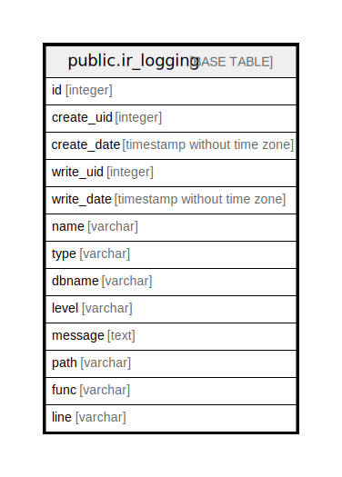

# public.ir_logging

## Description

Logging

## Columns

| Name | Type | Default | Nullable | Children | Parents | Comment |
| ---- | ---- | ------- | -------- | -------- | ------- | ------- |
| id | integer | nextval('ir_logging_id_seq'::regclass) | false |  |  |  |
| create_uid | integer |  | true |  |  | Created by |
| create_date | timestamp without time zone |  | true |  |  | Created on |
| write_uid | integer |  | true |  |  | Last Updated by |
| write_date | timestamp without time zone |  | true |  |  | Last Updated on |
| name | varchar |  | false |  |  | Name |
| type | varchar |  | false |  |  | Type |
| dbname | varchar |  | true |  |  | Database Name |
| level | varchar |  | true |  |  | Level |
| message | text |  | false |  |  | Message |
| path | varchar |  | false |  |  | Path |
| func | varchar |  | false |  |  | Function |
| line | varchar |  | false |  |  | Line |

## Constraints

| Name | Type | Definition |
| ---- | ---- | ---------- |
| ir_logging_pkey | PRIMARY KEY | PRIMARY KEY (id) |

## Indexes

| Name | Definition |
| ---- | ---------- |
| ir_logging_pkey | CREATE UNIQUE INDEX ir_logging_pkey ON public.ir_logging USING btree (id) |
| ir_logging_type_index | CREATE INDEX ir_logging_type_index ON public.ir_logging USING btree (type) |
| ir_logging_dbname_index | CREATE INDEX ir_logging_dbname_index ON public.ir_logging USING btree (dbname) |
| ir_logging_level_index | CREATE INDEX ir_logging_level_index ON public.ir_logging USING btree (level) |

## Relations

---

> Generated by [tbls](https://github.com/k1LoW/tbls)
