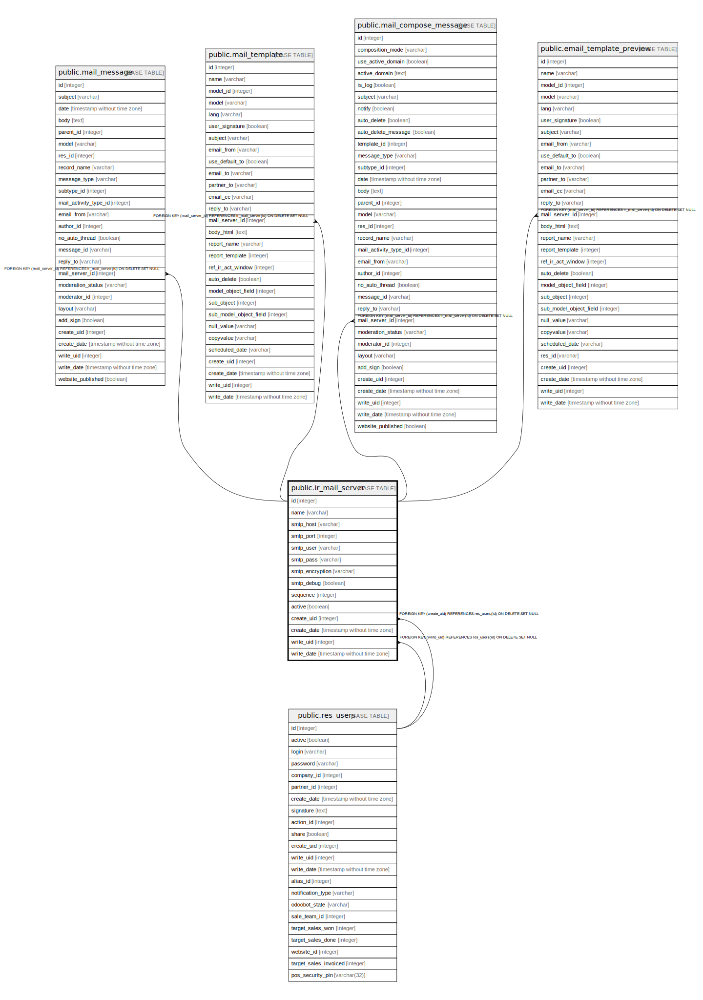

# public.ir_mail_server

## Description

Mail Server

## Columns

| Name | Type | Default | Nullable | Children | Parents | Comment |
| ---- | ---- | ------- | -------- | -------- | ------- | ------- |
| id | integer | nextval('ir_mail_server_id_seq'::regclass) | false | [public.mail_message](public.mail_message.md) [public.mail_template](public.mail_template.md) [public.mail_compose_message](public.mail_compose_message.md) [public.email_template_preview](public.email_template_preview.md) |  |  |
| name | varchar |  | false |  |  | Description |
| smtp_host | varchar |  | false |  |  | SMTP Server |
| smtp_port | integer |  | false |  |  | SMTP Port |
| smtp_user | varchar |  | true |  |  | Username |
| smtp_pass | varchar |  | true |  |  | Password |
| smtp_encryption | varchar |  | false |  |  | Connection Security |
| smtp_debug | boolean |  | true |  |  | Debugging |
| sequence | integer |  | true |  |  | Priority |
| active | boolean |  | true |  |  | Active |
| create_uid | integer |  | true |  | [public.res_users](public.res_users.md) | Created by |
| create_date | timestamp without time zone |  | true |  |  | Created on |
| write_uid | integer |  | true |  | [public.res_users](public.res_users.md) | Last Updated by |
| write_date | timestamp without time zone |  | true |  |  | Last Updated on |

## Constraints

| Name | Type | Definition |
| ---- | ---- | ---------- |
| ir_mail_server_create_uid_fkey | FOREIGN KEY | FOREIGN KEY (create_uid) REFERENCES res_users(id) ON DELETE SET NULL |
| ir_mail_server_write_uid_fkey | FOREIGN KEY | FOREIGN KEY (write_uid) REFERENCES res_users(id) ON DELETE SET NULL |
| ir_mail_server_pkey | PRIMARY KEY | PRIMARY KEY (id) |

## Indexes

| Name | Definition |
| ---- | ---------- |
| ir_mail_server_pkey | CREATE UNIQUE INDEX ir_mail_server_pkey ON public.ir_mail_server USING btree (id) |
| ir_mail_server_name_index | CREATE INDEX ir_mail_server_name_index ON public.ir_mail_server USING btree (name) |

## Relations

---

> Generated by [tbls](https://github.com/k1LoW/tbls)
