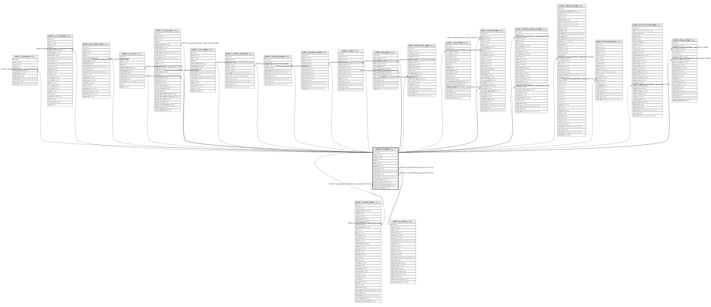

# public.ir_model

## Description

Models

## Columns

| Name | Type | Default | Nullable | Children | Parents | Comment |
| ---- | ---- | ------- | -------- | -------- | ------- | ------- |
| id | integer | nextval('ir_model_id_seq'::regclass) | false | [public.ir_actions](public.ir_actions.md) [public.ir_act_window](public.ir_act_window.md) [public.ir_act_report_xml](public.ir_act_report_xml.md) [public.ir_act_url](public.ir_act_url.md) [public.ir_act_server](public.ir_act_server.md) [public.ir_act_client](public.ir_act_client.md) [public.ir_model_fields](public.ir_model_fields.md) [public.ir_model_constraint](public.ir_model_constraint.md) [public.ir_model_relation](public.ir_model_relation.md) [public.ir_model_access](public.ir_model_access.md) [public.ir_rule](public.ir_rule.md) [public.mail_alias](public.mail_alias.md) [public.mail_activity_type](public.mail_activity_type.md) [public.mail_activity](public.mail_activity.md) [public.mail_template](public.mail_template.md) [public.email_template_preview](public.email_template_preview.md) [public.calendar_event](public.calendar_event.md) [public.fetchmail_server](public.fetchmail_server.md) [public.payment_transaction](public.payment_transaction.md) [public.rating_rating](public.rating_rating.md) |  |  |
| name | varchar |  | false |  |  | Model Description |
| model | varchar |  | false |  |  | Model |
| info | text |  | true |  |  | Information |
| state | varchar |  | true |  |  | Type |
| transient | boolean |  | true |  |  | Transient Model |
| create_uid | integer |  | true |  | [public.res_users](public.res_users.md) | Created by |
| create_date | timestamp without time zone |  | true |  |  | Created on |
| write_uid | integer |  | true |  | [public.res_users](public.res_users.md) | Last Updated by |
| write_date | timestamp without time zone |  | true |  |  | Last Updated on |
| is_mail_thread | boolean |  | true |  |  | Mail Thread |
| website_form_access | boolean |  | true |  |  | Allowed to use in forms |
| website_form_default_field_id | integer |  | true |  | [public.ir_model_fields](public.ir_model_fields.md) | Field for custom form data |
| website_form_label | varchar |  | true |  |  | Label for form action |

## Constraints

| Name | Type | Definition | Comment |
| ---- | ---- | ---------- | ------- |
| ir_model_create_uid_fkey | FOREIGN KEY | FOREIGN KEY (create_uid) REFERENCES res_users(id) ON DELETE SET NULL |  |
| ir_model_write_uid_fkey | FOREIGN KEY | FOREIGN KEY (write_uid) REFERENCES res_users(id) ON DELETE SET NULL |  |
| ir_model_pkey | PRIMARY KEY | PRIMARY KEY (id) |  |
| ir_model_obj_name_uniq | UNIQUE | UNIQUE (model) | unique (model) |
| ir_model_website_form_default_field_id_fkey | FOREIGN KEY | FOREIGN KEY (website_form_default_field_id) REFERENCES ir_model_fields(id) ON DELETE SET NULL |  |

## Indexes

| Name | Definition |
| ---- | ---------- |
| ir_model_pkey | CREATE UNIQUE INDEX ir_model_pkey ON public.ir_model USING btree (id) |
| ir_model_model_index | CREATE INDEX ir_model_model_index ON public.ir_model USING btree (model) |
| ir_model_obj_name_uniq | CREATE UNIQUE INDEX ir_model_obj_name_uniq ON public.ir_model USING btree (model) |

## Relations

---

> Generated by [tbls](https://github.com/k1LoW/tbls)
