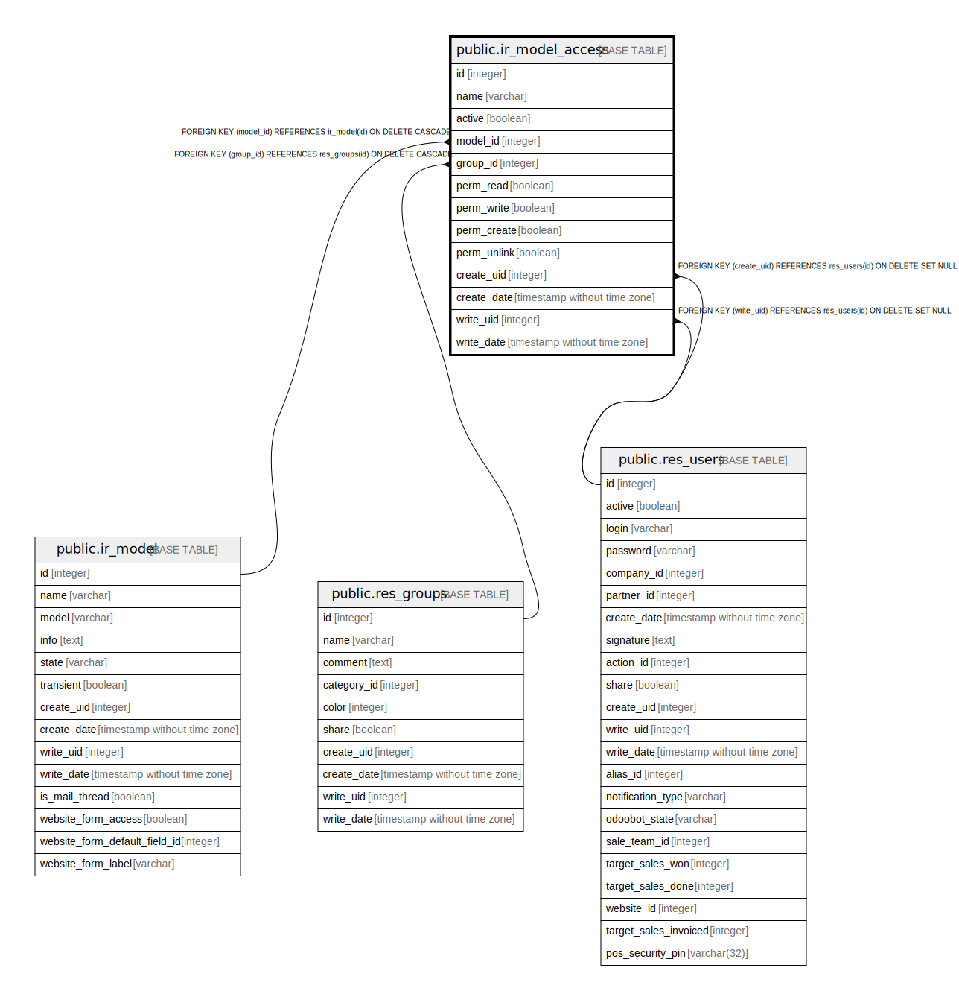

# public.ir_model_access

## Description

Model Access

## Columns

| Name | Type | Default | Nullable | Children | Parents | Comment |
| ---- | ---- | ------- | -------- | -------- | ------- | ------- |
| id | integer | nextval('ir_model_access_id_seq'::regclass) | false |  |  |  |
| name | varchar |  | false |  |  | Name |
| active | boolean |  | true |  |  | Active |
| model_id | integer |  | false |  | [public.ir_model](public.ir_model.md) | Object |
| group_id | integer |  | true |  | [public.res_groups](public.res_groups.md) | Group |
| perm_read | boolean |  | true |  |  | Read Access |
| perm_write | boolean |  | true |  |  | Write Access |
| perm_create | boolean |  | true |  |  | Create Access |
| perm_unlink | boolean |  | true |  |  | Delete Access |
| create_uid | integer |  | true |  | [public.res_users](public.res_users.md) | Created by |
| create_date | timestamp without time zone |  | true |  |  | Created on |
| write_uid | integer |  | true |  | [public.res_users](public.res_users.md) | Last Updated by |
| write_date | timestamp without time zone |  | true |  |  | Last Updated on |

## Constraints

| Name | Type | Definition |
| ---- | ---- | ---------- |
| ir_model_access_create_uid_fkey | FOREIGN KEY | FOREIGN KEY (create_uid) REFERENCES res_users(id) ON DELETE SET NULL |
| ir_model_access_write_uid_fkey | FOREIGN KEY | FOREIGN KEY (write_uid) REFERENCES res_users(id) ON DELETE SET NULL |
| ir_model_access_group_id_fkey | FOREIGN KEY | FOREIGN KEY (group_id) REFERENCES res_groups(id) ON DELETE CASCADE |
| ir_model_access_model_id_fkey | FOREIGN KEY | FOREIGN KEY (model_id) REFERENCES ir_model(id) ON DELETE CASCADE |
| ir_model_access_pkey | PRIMARY KEY | PRIMARY KEY (id) |

## Indexes

| Name | Definition |
| ---- | ---------- |
| ir_model_access_pkey | CREATE UNIQUE INDEX ir_model_access_pkey ON public.ir_model_access USING btree (id) |
| ir_model_access_name_index | CREATE INDEX ir_model_access_name_index ON public.ir_model_access USING btree (name) |
| ir_model_access_model_id_index | CREATE INDEX ir_model_access_model_id_index ON public.ir_model_access USING btree (model_id) |
| ir_model_access_group_id_index | CREATE INDEX ir_model_access_group_id_index ON public.ir_model_access USING btree (group_id) |

## Relations

---

> Generated by [tbls](https://github.com/k1LoW/tbls)
