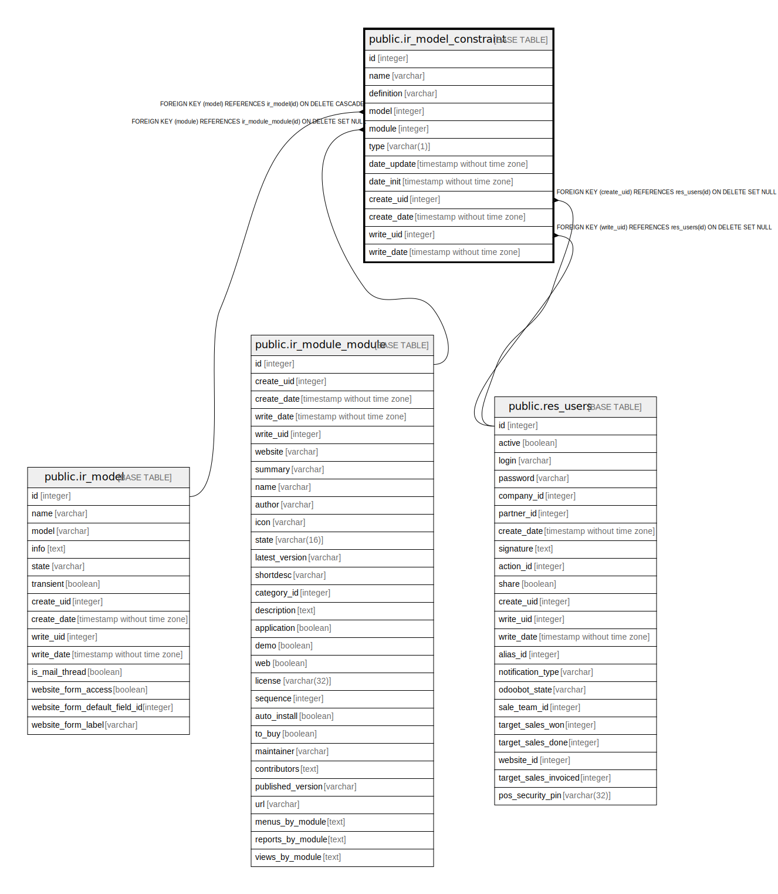

# public.ir_model_constraint

## Description

Model Constraint

## Columns

| Name | Type | Default | Nullable | Children | Parents | Comment |
| ---- | ---- | ------- | -------- | -------- | ------- | ------- |
| id | integer | nextval('ir_model_constraint_id_seq'::regclass) | false |  |  |  |
| name | varchar |  | false |  |  | Constraint |
| definition | varchar |  | true |  |  | Definition |
| model | integer |  | false |  | [public.ir_model](public.ir_model.md) | Model |
| module | integer |  | false |  | [public.ir_module_module](public.ir_module_module.md) | Module |
| type | varchar(1) |  | false |  |  | Constraint Type |
| date_update | timestamp without time zone |  | true |  |  | Update Date |
| date_init | timestamp without time zone |  | true |  |  | Initialization Date |
| create_uid | integer |  | true |  | [public.res_users](public.res_users.md) | Created by |
| create_date | timestamp without time zone |  | true |  |  | Created on |
| write_uid | integer |  | true |  | [public.res_users](public.res_users.md) | Last Updated by |
| write_date | timestamp without time zone |  | true |  |  | Last Updated on |

## Constraints

| Name | Type | Definition | Comment |
| ---- | ---- | ---------- | ------- |
| ir_model_constraint_create_uid_fkey | FOREIGN KEY | FOREIGN KEY (create_uid) REFERENCES res_users(id) ON DELETE SET NULL |  |
| ir_model_constraint_write_uid_fkey | FOREIGN KEY | FOREIGN KEY (write_uid) REFERENCES res_users(id) ON DELETE SET NULL |  |
| ir_model_constraint_module_fkey | FOREIGN KEY | FOREIGN KEY (module) REFERENCES ir_module_module(id) ON DELETE SET NULL |  |
| ir_model_constraint_model_fkey | FOREIGN KEY | FOREIGN KEY (model) REFERENCES ir_model(id) ON DELETE CASCADE |  |
| ir_model_constraint_pkey | PRIMARY KEY | PRIMARY KEY (id) |  |
| ir_model_constraint_module_name_uniq | UNIQUE | UNIQUE (name, module) | unique(name, module) |

## Indexes

| Name | Definition |
| ---- | ---------- |
| ir_model_constraint_pkey | CREATE UNIQUE INDEX ir_model_constraint_pkey ON public.ir_model_constraint USING btree (id) |
| ir_model_constraint_name_index | CREATE INDEX ir_model_constraint_name_index ON public.ir_model_constraint USING btree (name) |
| ir_model_constraint_model_index | CREATE INDEX ir_model_constraint_model_index ON public.ir_model_constraint USING btree (model) |
| ir_model_constraint_module_index | CREATE INDEX ir_model_constraint_module_index ON public.ir_model_constraint USING btree (module) |
| ir_model_constraint_type_index | CREATE INDEX ir_model_constraint_type_index ON public.ir_model_constraint USING btree (type) |
| ir_model_constraint_module_name_uniq | CREATE UNIQUE INDEX ir_model_constraint_module_name_uniq ON public.ir_model_constraint USING btree (name, module) |

## Relations

---

> Generated by [tbls](https://github.com/k1LoW/tbls)
