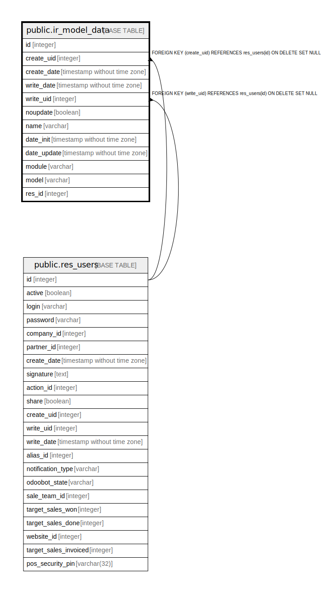

# public.ir_model_data

## Description

## Columns

| Name | Type | Default | Nullable | Children | Parents | Comment |
| ---- | ---- | ------- | -------- | -------- | ------- | ------- |
| id | integer | nextval('ir_model_data_id_seq'::regclass) | false |  |  |  |
| create_uid | integer |  | true |  | [public.res_users](public.res_users.md) |  |
| create_date | timestamp without time zone |  | true |  |  |  |
| write_date | timestamp without time zone |  | true |  |  |  |
| write_uid | integer |  | true |  | [public.res_users](public.res_users.md) |  |
| noupdate | boolean |  | true |  |  |  |
| name | varchar |  | false |  |  |  |
| date_init | timestamp without time zone |  | true |  |  |  |
| date_update | timestamp without time zone |  | true |  |  |  |
| module | varchar |  | false |  |  |  |
| model | varchar |  | false |  |  |  |
| res_id | integer |  | true |  |  |  |

## Constraints

| Name | Type | Definition |
| ---- | ---- | ---------- |
| ir_model_data_create_uid_fkey | FOREIGN KEY | FOREIGN KEY (create_uid) REFERENCES res_users(id) ON DELETE SET NULL |
| ir_model_data_write_uid_fkey | FOREIGN KEY | FOREIGN KEY (write_uid) REFERENCES res_users(id) ON DELETE SET NULL |
| ir_model_data_pkey | PRIMARY KEY | PRIMARY KEY (id) |

## Indexes

| Name | Definition |
| ---- | ---------- |
| ir_model_data_pkey | CREATE UNIQUE INDEX ir_model_data_pkey ON public.ir_model_data USING btree (id) |
| ir_model_data_module_name_uniq_index | CREATE UNIQUE INDEX ir_model_data_module_name_uniq_index ON public.ir_model_data USING btree (module, name) |
| ir_model_data_model_res_id_index | CREATE INDEX ir_model_data_model_res_id_index ON public.ir_model_data USING btree (model, res_id) |

## Relations

---

> Generated by [tbls](https://github.com/k1LoW/tbls)
