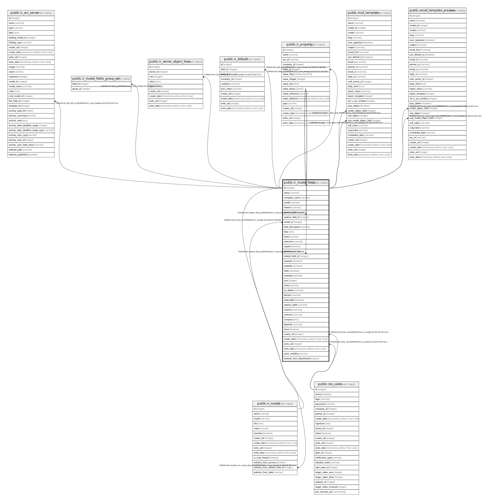

# public.ir_model_fields

## Description

Fields

## Columns

| Name | Type | Default | Nullable | Children | Parents | Comment |
| ---- | ---- | ------- | -------- | -------- | ------- | ------- |
| id | integer | nextval('ir_model_fields_id_seq'::regclass) | false | [public.ir_act_server](public.ir_act_server.md) [public.ir_model](public.ir_model.md) [public.ir_model_fields](public.ir_model_fields.md) [public.ir_model_fields_group_rel](public.ir_model_fields_group_rel.md) [public.ir_server_object_lines](public.ir_server_object_lines.md) [public.ir_default](public.ir_default.md) [public.ir_property](public.ir_property.md) [public.mail_template](public.mail_template.md) [public.email_template_preview](public.email_template_preview.md) |  |  |
| name | varchar |  | false |  |  | Field Name |
| complete_name | varchar |  | true |  |  | Complete Name |
| model | varchar |  | false |  |  | Object Name |
| relation | varchar |  | true |  |  | Object Relation |
| relation_field | varchar |  | true |  |  | Relation Field |
| relation_field_id | integer |  | true |  | [public.ir_model_fields](public.ir_model_fields.md) | Relation field |
| model_id | integer |  | false |  | [public.ir_model](public.ir_model.md) | Model |
| field_description | varchar |  | false |  |  | Field Label |
| help | text |  | true |  |  | Field Help |
| ttype | varchar |  | false |  |  | Field Type |
| selection | varchar |  | true |  |  | Selection Options |
| copied | boolean |  | true |  |  | Copied |
| related | varchar |  | true |  |  | Related Field |
| related_field_id | integer |  | true |  | [public.ir_model_fields](public.ir_model_fields.md) | Related field |
| required | boolean |  | true |  |  | Required |
| readonly | boolean |  | true |  |  | Readonly |
| index | boolean |  | true |  |  | Indexed |
| translate | boolean |  | true |  |  | Translatable |
| size | integer |  | true |  |  | Size |
| state | varchar |  | false |  |  | Type |
| on_delete | varchar |  | true |  |  | On Delete |
| domain | varchar |  | true |  |  | Domain |
| selectable | boolean |  | true |  |  | Selectable |
| relation_table | varchar |  | true |  |  | Relation Table |
| column1 | varchar |  | true |  |  | Column 1 |
| column2 | varchar |  | true |  |  | Column 2 |
| compute | text |  | true |  |  | Compute |
| depends | varchar |  | true |  |  | Dependencies |
| store | boolean |  | true |  |  | Stored |
| create_uid | integer |  | true |  | [public.res_users](public.res_users.md) | Created by |
| create_date | timestamp without time zone |  | true |  |  | Created on |
| write_uid | integer |  | true |  | [public.res_users](public.res_users.md) | Last Updated by |
| write_date | timestamp without time zone |  | true |  |  | Last Updated on |
| track_visibility | varchar |  | true |  |  | Tracking |
| website_form_blacklisted | boolean | true | true |  |  | Blacklisted in web forms |

## Constraints

| Name | Type | Definition | Comment |
| ---- | ---- | ---------- | ------- |
| ir_model_fields_size_gt_zero | CHECK | CHECK ((size >= 0)) | CHECK (size>=0) |
| ir_model_fields_create_uid_fkey | FOREIGN KEY | FOREIGN KEY (create_uid) REFERENCES res_users(id) ON DELETE SET NULL |  |
| ir_model_fields_write_uid_fkey | FOREIGN KEY | FOREIGN KEY (write_uid) REFERENCES res_users(id) ON DELETE SET NULL |  |
| ir_model_fields_model_id_fkey | FOREIGN KEY | FOREIGN KEY (model_id) REFERENCES ir_model(id) ON DELETE CASCADE |  |
| ir_model_fields_pkey | PRIMARY KEY | PRIMARY KEY (id) |  |
| ir_model_fields_related_field_id_fkey | FOREIGN KEY | FOREIGN KEY (related_field_id) REFERENCES ir_model_fields(id) ON DELETE CASCADE |  |
| ir_model_fields_relation_field_id_fkey | FOREIGN KEY | FOREIGN KEY (relation_field_id) REFERENCES ir_model_fields(id) ON DELETE CASCADE |  |
| ir_model_fields_name_unique | UNIQUE | UNIQUE (model, name) | UNIQUE(model, name) |

## Indexes

| Name | Definition |
| ---- | ---------- |
| ir_model_fields_pkey | CREATE UNIQUE INDEX ir_model_fields_pkey ON public.ir_model_fields USING btree (id) |
| ir_model_fields_name_index | CREATE INDEX ir_model_fields_name_index ON public.ir_model_fields USING btree (name) |
| ir_model_fields_complete_name_index | CREATE INDEX ir_model_fields_complete_name_index ON public.ir_model_fields USING btree (complete_name) |
| ir_model_fields_model_index | CREATE INDEX ir_model_fields_model_index ON public.ir_model_fields USING btree (model) |
| ir_model_fields_model_id_index | CREATE INDEX ir_model_fields_model_id_index ON public.ir_model_fields USING btree (model_id) |
| ir_model_fields_state_index | CREATE INDEX ir_model_fields_state_index ON public.ir_model_fields USING btree (state) |
| ir_model_fields_name_unique | CREATE UNIQUE INDEX ir_model_fields_name_unique ON public.ir_model_fields USING btree (model, name) |
| ir_model_fields_website_form_blacklisted_index | CREATE INDEX ir_model_fields_website_form_blacklisted_index ON public.ir_model_fields USING btree (website_form_blacklisted) |

## Relations

---

> Generated by [tbls](https://github.com/k1LoW/tbls)
