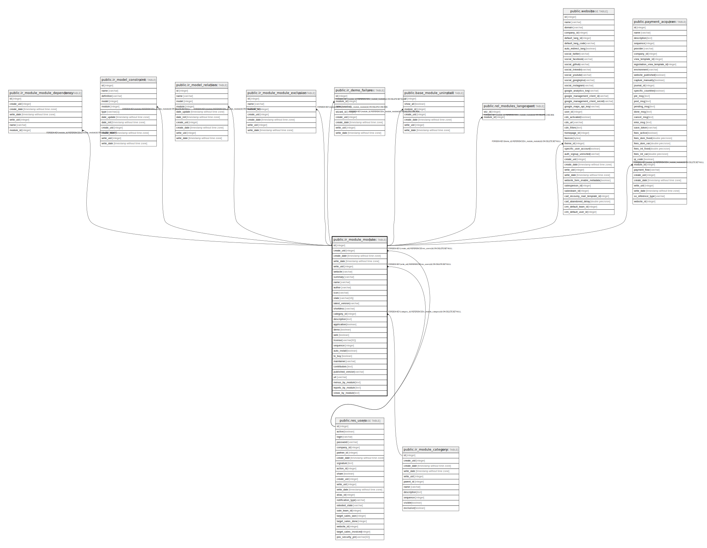

# public.ir_module_module

## Description

## Columns

| Name | Type | Default | Nullable | Children | Parents | Comment |
| ---- | ---- | ------- | -------- | -------- | ------- | ------- |
| id | integer | nextval('ir_module_module_id_seq'::regclass) | false | [public.ir_module_module_dependency](public.ir_module_module_dependency.md) [public.ir_model_constraint](public.ir_model_constraint.md) [public.ir_model_relation](public.ir_model_relation.md) [public.ir_module_module_exclusion](public.ir_module_module_exclusion.md) [public.ir_demo_failure](public.ir_demo_failure.md) [public.base_module_uninstall](public.base_module_uninstall.md) [public.rel_modules_langexport](public.rel_modules_langexport.md) [public.website](public.website.md) [public.payment_acquirer](public.payment_acquirer.md) |  |  |
| create_uid | integer |  | true |  | [public.res_users](public.res_users.md) |  |
| create_date | timestamp without time zone |  | true |  |  |  |
| write_date | timestamp without time zone |  | true |  |  |  |
| write_uid | integer |  | true |  | [public.res_users](public.res_users.md) |  |
| website | varchar |  | true |  |  |  |
| summary | varchar |  | true |  |  |  |
| name | varchar |  | false |  |  |  |
| author | varchar |  | true |  |  |  |
| icon | varchar |  | true |  |  |  |
| state | varchar(16) |  | true |  |  |  |
| latest_version | varchar |  | true |  |  |  |
| shortdesc | varchar |  | true |  |  |  |
| category_id | integer |  | true |  | [public.ir_module_category](public.ir_module_category.md) |  |
| description | text |  | true |  |  |  |
| application | boolean | false | true |  |  |  |
| demo | boolean | false | true |  |  |  |
| web | boolean | false | true |  |  |  |
| license | varchar(32) |  | true |  |  |  |
| sequence | integer | 100 | true |  |  |  |
| auto_install | boolean | false | true |  |  |  |
| to_buy | boolean | false | true |  |  |  |
| maintainer | varchar |  | true |  |  | Maintainer |
| contributors | text |  | true |  |  | Contributors |
| published_version | varchar |  | true |  |  | Published Version |
| url | varchar |  | true |  |  | URL |
| menus_by_module | text |  | true |  |  | Menus |
| reports_by_module | text |  | true |  |  | Reports |
| views_by_module | text |  | true |  |  | Views |

## Constraints

| Name | Type | Definition | Comment |
| ---- | ---- | ---------- | ------- |
| ir_module_module_create_uid_fkey | FOREIGN KEY | FOREIGN KEY (create_uid) REFERENCES res_users(id) ON DELETE SET NULL |  |
| ir_module_module_write_uid_fkey | FOREIGN KEY | FOREIGN KEY (write_uid) REFERENCES res_users(id) ON DELETE SET NULL |  |
| ir_module_module_category_id_fkey | FOREIGN KEY | FOREIGN KEY (category_id) REFERENCES ir_module_category(id) ON DELETE SET NULL |  |
| ir_module_module_pkey | PRIMARY KEY | PRIMARY KEY (id) |  |
| name_uniq | UNIQUE | UNIQUE (name) |  |
| ir_module_module_name_uniq | UNIQUE | UNIQUE (name) | UNIQUE (name) |

## Indexes

| Name | Definition |
| ---- | ---------- |
| ir_module_module_pkey | CREATE UNIQUE INDEX ir_module_module_pkey ON public.ir_module_module USING btree (id) |
| name_uniq | CREATE UNIQUE INDEX name_uniq ON public.ir_module_module USING btree (name) |
| ir_module_module_name_index | CREATE INDEX ir_module_module_name_index ON public.ir_module_module USING btree (name) |
| ir_module_module_category_id_index | CREATE INDEX ir_module_module_category_id_index ON public.ir_module_module USING btree (category_id) |
| ir_module_module_state_index | CREATE INDEX ir_module_module_state_index ON public.ir_module_module USING btree (state) |
| ir_module_module_name_uniq | CREATE UNIQUE INDEX ir_module_module_name_uniq ON public.ir_module_module USING btree (name) |

## Relations

---

> Generated by [tbls](https://github.com/k1LoW/tbls)
