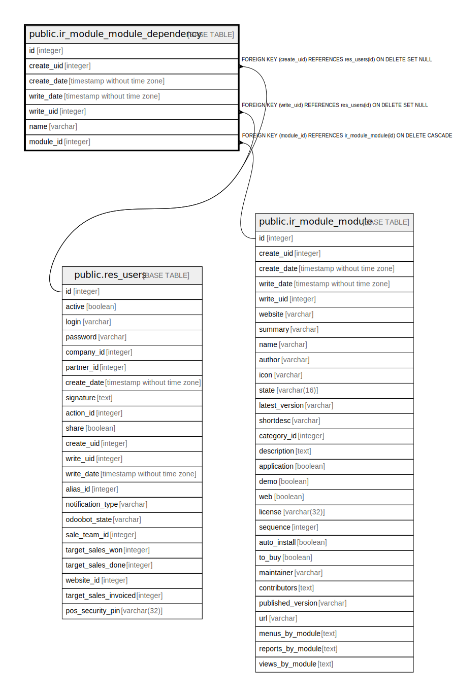

# public.ir_module_module_dependency

## Description

## Columns

| Name | Type | Default | Nullable | Children | Parents | Comment |
| ---- | ---- | ------- | -------- | -------- | ------- | ------- |
| id | integer | nextval('ir_module_module_dependency_id_seq'::regclass) | false |  |  |  |
| create_uid | integer |  | true |  | [public.res_users](public.res_users.md) |  |
| create_date | timestamp without time zone |  | true |  |  |  |
| write_date | timestamp without time zone |  | true |  |  |  |
| write_uid | integer |  | true |  | [public.res_users](public.res_users.md) |  |
| name | varchar |  | true |  |  |  |
| module_id | integer |  | true |  | [public.ir_module_module](public.ir_module_module.md) |  |

## Constraints

| Name | Type | Definition |
| ---- | ---- | ---------- |
| ir_module_module_dependency_create_uid_fkey | FOREIGN KEY | FOREIGN KEY (create_uid) REFERENCES res_users(id) ON DELETE SET NULL |
| ir_module_module_dependency_write_uid_fkey | FOREIGN KEY | FOREIGN KEY (write_uid) REFERENCES res_users(id) ON DELETE SET NULL |
| ir_module_module_dependency_module_id_fkey | FOREIGN KEY | FOREIGN KEY (module_id) REFERENCES ir_module_module(id) ON DELETE CASCADE |
| ir_module_module_dependency_pkey | PRIMARY KEY | PRIMARY KEY (id) |

## Indexes

| Name | Definition |
| ---- | ---------- |
| ir_module_module_dependency_pkey | CREATE UNIQUE INDEX ir_module_module_dependency_pkey ON public.ir_module_module_dependency USING btree (id) |
| ir_module_module_dependency_name_index | CREATE INDEX ir_module_module_dependency_name_index ON public.ir_module_module_dependency USING btree (name) |

## Relations

---

> Generated by [tbls](https://github.com/k1LoW/tbls)
