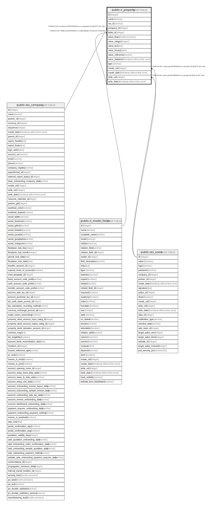

# public.ir_property

## Description

Company Property

## Columns

| Name | Type | Default | Nullable | Children | Parents | Comment |
| ---- | ---- | ------- | -------- | -------- | ------- | ------- |
| id | integer | nextval('ir_property_id_seq'::regclass) | false |  |  |  |
| name | varchar |  | true |  |  | Name |
| res_id | varchar |  | true |  |  | Resource |
| company_id | integer |  | true |  | [public.res_company](public.res_company.md) | Company |
| fields_id | integer |  | false |  | [public.ir_model_fields](public.ir_model_fields.md) | Field |
| value_float | double precision |  | true |  |  | Value Float |
| value_integer | integer |  | true |  |  | Value Integer |
| value_text | text |  | true |  |  | Value Text |
| value_binary | bytea |  | true |  |  | Value Binary |
| value_reference | varchar |  | true |  |  | Value Reference |
| value_datetime | timestamp without time zone |  | true |  |  | Value Datetime |
| type | varchar |  | false |  |  | Type |
| create_uid | integer |  | true |  | [public.res_users](public.res_users.md) | Created by |
| create_date | timestamp without time zone |  | true |  |  | Created on |
| write_uid | integer |  | true |  | [public.res_users](public.res_users.md) | Last Updated by |
| write_date | timestamp without time zone |  | true |  |  | Last Updated on |

## Constraints

| Name | Type | Definition |
| ---- | ---- | ---------- |
| ir_property_create_uid_fkey | FOREIGN KEY | FOREIGN KEY (create_uid) REFERENCES res_users(id) ON DELETE SET NULL |
| ir_property_write_uid_fkey | FOREIGN KEY | FOREIGN KEY (write_uid) REFERENCES res_users(id) ON DELETE SET NULL |
| ir_property_company_id_fkey | FOREIGN KEY | FOREIGN KEY (company_id) REFERENCES res_company(id) ON DELETE SET NULL |
| ir_property_fields_id_fkey | FOREIGN KEY | FOREIGN KEY (fields_id) REFERENCES ir_model_fields(id) ON DELETE CASCADE |
| ir_property_pkey | PRIMARY KEY | PRIMARY KEY (id) |

## Indexes

| Name | Definition |
| ---- | ---------- |
| ir_property_pkey | CREATE UNIQUE INDEX ir_property_pkey ON public.ir_property USING btree (id) |
| ir_property_name_index | CREATE INDEX ir_property_name_index ON public.ir_property USING btree (name) |
| ir_property_res_id_index | CREATE INDEX ir_property_res_id_index ON public.ir_property USING btree (res_id) |
| ir_property_company_id_index | CREATE INDEX ir_property_company_id_index ON public.ir_property USING btree (company_id) |
| ir_property_fields_id_index | CREATE INDEX ir_property_fields_id_index ON public.ir_property USING btree (fields_id) |
| ir_property_type_index | CREATE INDEX ir_property_type_index ON public.ir_property USING btree (type) |

## Relations

---

> Generated by [tbls](https://github.com/k1LoW/tbls)
